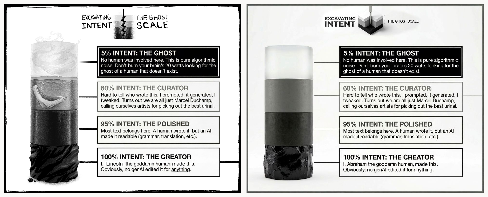

# Ghost Scale Simulation

**An exploratory computational model of cross-agent intent inference, provenance trust, and
preference learning.** It asks whether an observer can recover a maker's latent goals and
persistent profile from artifacts, determine when that inference is reliable enough to update its
own model, and remain appropriately uncertain when provenance is absent, mistaken, or deceptive.

**The repository contains no human or clinical data.** Its contribution is an executable family of
mechanisms, their failure conditions, and testable predictions for later human and embodied-agent
studies. It is the companion code to *Art as an Algorithmic Virus* (Zenodo DOI
[`10.5281/zenodo.19407789`](https://doi.org/10.5281/zenodo.19407789)).



*Left: 100% intent, created by a paid artist. Right: 60%. Same figure, same information.*

> **◐ Curator text from here down to [Install and run](#install-and-run):** a person chose these
> claims, arranged them, and checked them against the committed results files, writing alongside a
> machine. Below that line the prose is ○ Ghost, drafted by a machine from the author's numbers.

## Research question

Human observers do more than classify an artifact's visible features: they infer the decisions,
constraints, competence, effort, and purposes that could have produced it. Ghost Scale Simulation
formalizes a narrow version of that problem:

> Under what conditions can one agent infer another agent's latent purposes or persistent
> preferences from the artifacts it produces, and when should that inference be blocked from
> changing the observer?

The program separates three questions that are often collapsed:

1. **Legibility:** does an artifact contain enough structured evidence to constrain an inference
   about its maker?
2. **Provenance and trust:** does the observer have adequate reason to treat the apparent source
   as the real source?
3. **Learning:** if the inference is sufficiently identified and trustworthy, what, if anything,
   should the observer update about makers, values, or preferred outcomes?

## Documentation map

| Document | Purpose |
|---|---|
| [`README.md`](README.md) | Technical gateway, model boundary, verification, and the complete record |
| [`WALKTHROUGH.md`](WALKTHROUGH.md) | Visual, public-facing narrative of the findings, in reading order |
| [`FINDINGS.md`](FINDINGS.md) | Canonical experiment, method, verdict, and failure ledger |
| [`EVIDENCE.md`](EVIDENCE.md) | Literature archive, classified by evidential relationship to each claim |
| [`docs/theory/READING_INTENT.md`](docs/theory/READING_INTENT.md) | Living hypothesis store for the broader intent-extraction theory |

Supporting material: [`docs/README.md`](docs/README.md) maps the version specs, audit passes, and
exchange records; [`docs/METHODS.md`](docs/METHODS.md) documents the methodology layer.

## What is implemented

The repository contains successive model generations rather than one final validated theory.
Across those generations it implements:

- active-inference readers (discrete pymdp agents, with an exact-inference reference solver)
  operating over artifact features and latent causes;
- explicit provenance signals and trust gates;
- nulls, ablations, architecture randomization, and alternative classifiers that can disqualify
  theory-specific interpretations;
- a reader-side intent gate on a learner's absorption, tested against disguised and adversarial
  content, in V10;
- repeated-artifact inference over a persistent maker profile (w) in V11;
- a measured self-model as the reader's first prior, opportunity records beside artifacts,
  surface-matched reading regimes, the posterior-to-preference bridge, and production under
  many hands, in V12;
- a non-self prior matched on entropy and on distance to the truth, a nested similarity basin, a
  finite attention policy, a six-cause cost model, communicative goals with separate reliability
  and content, a role-relative production graph with an exact shared-brief twin, and a
  twenty-attack matrix, in V13;
- exact and approximate inference paths, construction invariants, source hashes, and committed
  verdicts.

Several attractive claims failed these controls and remain recorded as failures. That is part of
the result, not an exception to it.

## The latest result, and where the model stops

In V14, the maker's intent stops being one object: the reader recovers a plan, an episode goal
and a standing preference from four evidence routes that never share a token, and the value turns
out to live in the factoring, not in the jointness. The exact joint posterior beats independent
per-latent readers by only **+0.011 nats** against a pre-registered bar of 0.02 (the same on
fresh families), and learned route reliability beats equal weighting by +0.009 — two honest
nulls — while *not being fooled by ease* is worth a tenth of a nat, two makers of identical
skill are told apart by how they practiced **99%** of the time from held-out transitions, a
sincere fanatic and a strategic propagandist whose artifacts are identical by construction sit at
exact chance until one off-audience action separates them at **90%**, and a reader's pursuit
(83% of its queries) stays separate from its warrant (a posterior held at 0.21). Learning
progress escapes the noise trap but buys no extra gain and loses by 4 nats when the world's laws
change silently; gain-per-cost with abstention is the piece that exports. The three V13 repairs
ran clean and found nothing — the common-substrate and self-prior claims they were built to
revive stay closed. All 64 cards and 12 attacks landed; twelve criteria failed as recorded
nulls; all four frozen confirmation candidates held. The full account is in the
[V14 results](docs/versions/v14-routed-reader/RESULTS.md).

In V13, the self-first reader's advantage survives a rival that is exactly as local as the self
— matched on entropy *and* on expected distance to the truth — and it is smaller than V12
reported: **+0.26 nats** on the makers nearest the reader after one artifact, **−0.16** on the
farthest, confirmed on an untouched lineage and identical on fresh families; V12's generic rival
had sat closer to the truth than the self prior, and matching that away removes half of V12's
near gain (+0.72 becomes +0.37). What the reader is told costs it most: a claimed group that
only matches by name is worth **−24.5 nats**, a namesake's reputation −1.8. Learned attention
precision is worth +14 nats and survives adversarial salience, but counting the same surface
twice inflates confidence at zero accuracy; a factored cost reader identifies planted cost causes
(79%) and reverses under a wrong cost model; a director and an exact shared-brief twin are told
apart only by the full interaction log (100% against 50% for every artifact-level reader).
Pooling readers made them worse and overconfident. Nine of 132 cards are withheld as instrument
failures, including both that would have read what a common substrate buys. The full account,
including every withheld reading, is in the
[V13 results](docs/versions/v13-common-ground/RESULTS.md).

In V12, a reader that starts from a measured model of itself reads makers like itself far better
than a prior with the same information, and pays for it everywhere else: **+0.60 nats** on the
maker's profile after one artifact for the fifth of makers nearest the reader's own profile,
**−0.09 to −0.20** for the middle fifths, no difference for the farthest, and on average worse
than a plain population prior. A prior with the same entropy and permuted correspondence loses
the whole gain, so what the self prior carries is correspondence, not confidence. The projection
this implies decays with evidence (the mass wrongly placed on the reader's own profile falls from
0.25 to 0.01 across fifty artifacts) and corrects with a four-artifact half-life. Values were
read from what a maker chose against what it could have chosen and at what cost; a reader that
ignores the costs learns nothing beyond the population average. The full account, including the
cards that failed their criteria and the one closed as an instrument failure, is in the
[V12 results](docs/versions/v12-the-other-model/RESULTS.md).

V12 also built the bridge V11 left unbuilt. The posterior over a maker's profile is transformed
into the reader's own preferred outcomes and tested on policy under correct, wrong, uncertain and
shuffled posteriors: the uptake weight moves the policy and the posterior's accuracy decides
whether the movement helps, so reconstruction, trust and uptake are separate levers.

```
q(w | a_1..n)   →   C   →   policy selection
```

All three arrows are now implemented in a constructed world. What the model still does not do:
give the four goal channels any human, prosocial or embodied semantics; test the bridge on
anything but constructed posteriors; or say whether a person has the record of themselves that a
measured self-model requires.

## Relationship to developmental active inference

Developmental active-inference work asks how learned associations can become the preferred
outcomes that guide a later stage of behavior; see
[*Active Inference for Learning and Development in Embodied Neuromorphic Agents*](https://www.mdpi.com/1099-4300/26/7/582)
and the
[Marr-inspired developmental framework for raising "good" robots](https://shura.shu.ac.uk/35137/1/A_Multidimensional_Approach_to_Raising__Good_Robots%20%281%29.pdf).
Ghost Scale Simulation approaches a related problem from the social side: how one agent might
infer another agent's persistent profile from the traces it produces.

| Developmental active inference | Ghost Scale Simulation | Unbuilt bridge |
|---|---|---|
| C: preferred outcomes that affect policy selection | Posterior over a maker profile, q(w), and its transform into preferred outcomes and policy (V12, U01–U08) | Outcome semantics and behavioral consequences outside a constructed world |
| Transfer between developmental stages within one agent | Inference across artifacts produced by another maker | Between-agent developmental transfer |
| Meaningful or prosocial preferences | Four bounded, abstract goal channels | Empirically grounded outcome semantics |
| Embodied learning and action | Symbolic artifact-feature simulation | Sensorimotor traces, morphology, and embodied policy |
| Transparent association parameters | Explicit profiles, likelihoods, posteriors, and gates | Identifiability and calibration in real agents |

This is a research connection, not an equivalence claim. Ghost Scale Simulation currently models
a possible input to preference construction and one constructed bridge from it to policy, not a
complete preference-learning architecture, and
it is a symbolic computational social-inference model, not an embodied one.

## What this repository shows, and what it does not

**It does show:**

- how specified inference architectures behave under controlled synthetic conditions;
- which headline effects survive null models, ablations, solver comparisons, and architecture
  randomization, and which are properties of the architecture rather than the theory;
- failure modes involving missing or deceptive provenance, underdetermined intent, and repeated
  exposure;
- executable hypotheses that can be turned into human-subject or embodied-agent experiments.

**It does not show:**

- that humans or robots use the modeled mechanism;
- that any reported simulation rate estimates a population prevalence or real-world effect size;
- that the model has recovered human values or prosocial preferences;
- that Ghost Scale labeling is an established intervention, the direct label mechanism failed in
  the tested forms (E39, E54);
- that the proposed neural or metabolic account has been empirically established;
- clinical safety, effectiveness, equity, or readiness for healthcare deployment.

Most findings have the form: *given model construction M, M implies Y.* They establish
consequences of assumptions and generate discriminating predictions. They do not by themselves
establish that the assumptions describe people or deployed AI systems.

## Verify the repository in five minutes

```bash
git clone https://github.com/EmotiveAutomaton/ghost-scale-sim
cd ghost-scale-sim

uv sync --frozen          # install the locked, tested environment
uv run pytest -q          # the full suite: unit, invariants, and committed-verdict gates
```

Then one representative V11 run, which regenerates a committed verdict deterministically:

```bash
uv run python runners/run_soundingline.py --only S15
git diff results/validation/soundingline/s15_convergence.json
```

Every number in the regenerated verdict should be identical to the committed one; the only
expected differences are the `produced_by.git_commit` / `git_dirty` provenance fields, which
record the state of the tree at run time. Restore with
`git checkout -- results/validation/soundingline/`.

`run_all.py` runs the original V1 experiment program (E1–E6); it is not a runner for every
experiment or model generation in the repository. Per-version runners are listed under
[Install and run](#install-and-run).

## Three representative findings

| Finding | Interpretation | Boundary |
|---|---|---|
| **Trust changes the response to underdetermination.** False provenance can support confident invention when an artifact poorly constrains intent; an honest provenance signal redirects that confidence toward calibrated uncertainty (E2, E4, E17). | Provenance belongs inside the inference problem, not only in interface metadata. | Demonstrated within specified synthetic architectures; not a measured human effect, and the *confident* half reproduces in 100% of randomly parameterised models of this shape. |
| **A mark works through shared convention.** Partial labeling protects learning only for a reader whose model includes the labeling convention (31% coverage suffices in-model); an uninformed reader needs 74% and never builds a reliable picture below it (E16, E47). | Common knowledge may be more important than the visual mark itself. | The tested Ghost Scale label mechanism did not establish a general intervention (E39, E54); the coverage figures are model-internal lower bounds. |
| **Persistent profiles become more identifiable across artifacts.** V11 recovers increasing information about a bounded maker profile from repeated traces, and prices the assumptions that make recovery possible (S-15). | Artifact sequences may support between-agent preference inference. | The profile is abstract; V12 maps it into a preference vector and policy in a constructed world, where the mapping's accuracy and its weight are separate levers. Prosocial semantics and action outside the simulation remain unmapped. |

See [`FINDINGS.md`](FINDINGS.md) for the complete experiment and methods ledger, including failed
predictions, withheld experiments, solver disagreements, architecture effects, and deviations from
pre-specified criteria.

## Human and AI contribution boundary

Abraham Haskins originated the Ghost Scale framework and is responsible for the research
questions, acceptance of experimental criteria, interpretation of results, and claims made from
them. Generative AI tools were used extensively for implementation, refactoring, test generation,
documentation drafting, and literature triage; commit trailers record that participation.

AI-produced code or synthesis is not treated as independent scientific validation. Verification in
this repository comes from executable tests, construction invariants, null conditions, ablations,
exact-versus-approximate inference comparisons, architecture randomization, source and criterion
hashes, and independent reconstruction where explicitly documented. These checks establish
internal behavior and provenance; they do not substitute for external replication or
human-subject evidence.

The project applies its own tier notation to its documents (◐ Curator for human-directed
synthesis, ○ Ghost for machine drafting from the author's numbers) and scores the
[walkthrough](WALKTHROUGH.md) plate by plate. The markers at the top of this page and before
Install and run carry that notation here.

---

> **○ Ghost text starts here.** Machine-drafted from the author's numbers; every figure still
> traces to a committed verdict file.

## Install and run

```bash
git clone https://github.com/EmotiveAutomaton/ghost-scale-sim
cd ghost-scale-sim

# the locked, tested environment (preferred); `pip install -e .` also works
uv sync --frozen

# run the original V1 experiment program (E1-E6), full scale, parallel
python run_all.py

# one experiment (writes results/eN_*.csv and figures/eN_*.png)
python -m ghostscale.experiments.e1_crash

# the validation pass (writes results/validation/, then VALIDATION.md)
python runners/run_validation.py
python scripts/write_validation_md.py

# the diagnostics pass on the instruments (writes results/diagnostics/, then DIAGNOSTICS.md)
python runners/run_diagnostics.py
python scripts/write_diagnostics_md.py

# the repair pass (writes results/repair/, then REPAIR.md)
python runners/run_repair.py
python scripts/write_repair_md.py

# version 6 (writes results/v6/, then RESULTS_V6.md)
python runners/run_v6.py
python scripts/write_results_v6.py

# version 7 (writes results/v7/, then RESULTS_V7.md)
python runners/run_v7.py
python scripts/write_results_v7.py

# version 8 (writes results/v8/, then RESULTS_V8.md); the severity pass runs last
python runners/run_v8.py
python scripts/write_results_v8.py

# version 9: the minimal-model programme, and the two literature experiments
python runners/run_v9.py

# version 10: the reader as a defence; the severity pass runs last
python runners/run_v10.py

# version 11: the maker. Lock the criteria first, then run the three modules
python -m ghostscale.prereg_v11
python runners/run_soundingline.py --only S12 S14 S15

# redraw every chart from the committed CSVs, without re-running anything
python scripts/make_walkthrough_plates.py
python scripts/rebuild_figures.py
python scripts/make_ghost_scale_pair.py

# tests
pytest -q
```

## How the model works

### The one empirical commitment: opacity means recoverable intent

The four published Ghost Scale tiers, CREATOR / POLISHED / CURATOR / GHOST, are drawn at 100%, 95%,
60% and 5% opacity. The model reads that opacity directly as the fraction of the maker's intent
that survives into the work:

```
alpha = {CREATOR: 1.00, POLISHED: 0.95, CURATOR: 0.60, GHOST: 0.05}
A[0][:, tier, goal, DEEP] = alpha[tier] · sig[goal] + (1 - alpha[tier]) · noise_free_synth
```

This is the load-bearing assumption of the whole framework, so it is in the open rather than buried
in an implementation file. If you think opacity and recoverable intent are not the same quantity,
this is the line to argue with. The validation pass shows the label result survives compressing and
stretching this ramp, so what matters is the ordering rather than the exact published values.

### Machine-made content is structured, and that is the point

`noise_free_synth` is a structured, non-uniform, goal-independent distribution over features, with
entropy well below uniform, asserted in code. Machine-made artifacts in this model are not noise.
They are richly patterned. What they lack is any dependence of that pattern on a goal.

That distinction matters because the obvious strawman, "machine-made content is random noise",
would produce the same crash for the wrong reason. Null N6 exists to separate them. Both are low
information. Only the strawman is high entropy.

**And validation found the sharper version of this.** What the disagreement result actually depends
on is not that the distribution is structured but that it is *goal-symmetric*, sitting equidistant
from every goal the reader holds. Switch the symmetrisation off and the readers still become
confident, but they all become confident about the *same* goal, which is shared error rather than
invention. That was written down as a design decision in version 1 and the pass confirms it is
load-bearing.

### Depth is in the order, not in the histogram

Version 5 models how much *thinking* sits behind a work as the number of levels of the maker's
decision hierarchy that reach the surface. It is built so that a deep work and a shallow one have
**identical** feature histograms, to machine precision: a reader that counts features and ignores
their order cannot tell them apart at all. What distinguishes them is the order. A deep work moves
through stages, and a deeper one moves through them in an order that names what it is for.

That constraint is asserted at every build, and it is what stops "depth" from being a second name
for "legibility", which the model already measures elsewhere.

### What the learner already knows, and why that is a claim

The learner in version 2 does not arrive holding a correct model of what machine-made content looks
like. It has to acquire one from an unlabelled, already-contaminated corpus. What it starts with is
a deliberate theoretical position: it knows the shared goal-to-feature family, and it does not know
how provenance modulates it. Readers share a likelihood family because they share a body plan. What
they do not share, and have to learn, is which sources carry intent.

It is also forced. A genuinely uninformative prior is unidentifiable rather than merely slow
to learn: information between features and goal sits at exactly 0.0000 nats after 400 artifacts and all
four learned columns stay bit-identical. That measurement is kept as a live test, so if it ever
stops being true the decision gets revisited instead of inherited.

### Two solvers, and why that matters

The observer's beliefs can be updated two ways. `inference.exact: false` uses pymdp's variational
solver, which keeps beliefs about different unknowns separately and updates each using an average
over the others. Every committed number in `results/` was produced that way. `inference.exact: true`
uses [`ghostscale/exact.py`](ghostscale/exact.py), which carries the belief over every combination
of unknowns at once with no independence assumption anywhere.

The shortcut is fast and it is known to have been badly wrong once. Version 5 caught it returning
the shallow answer for every artifact, confidently, while exact arithmetic on the same observations
recovered depth correctly. Switching solvers is one config flag and every experiment runs unchanged
under both, which is what made the validation pass a substitution rather than a rewrite.

### The Ψ analogue is a reimplementation, not a port

`metrics.psi_analogue` is a discrete stand-in for the closed-form Ψ of the preprint:

```
psi = [engaged] · (-ln(1 - κ)) · KL( Q(goal | τ) ‖ P0(goal) )
```

The sigmoid gate of the closed form is replaced by the binary engagement decision. This
reimplements the intuition, which is engagement-gated, trust-weighted surprise about the goal. It is
not a port of the equation and no equivalence is claimed.

### The reader acquires a mind of its own (version 8)

Three additions, each of which makes something representable that was not.

**A hierarchy the reader owns.** Until version 8 the *maker* had levels and the reader did not. A
reader can now only recognise as far as it has itself built, which makes "you cannot see what you
have not done" a structural property rather than an assumption, and it is what the human acquisition
test would target.

**A cost for being changed.** Integration is no longer free. Absorbing something is an expenditure,
separate from the expenditure of looking at it, which is what lets attention and uptake come apart
cleanly rather than by stipulation.

**A memory that fades to a residue, not to zero.** Belief decays toward `baseline + floor ×
residual`. The first implementation decayed geometrically to baseline, which is erasure with extra
steps; associations weaken and do not quite disappear, and the model now says so.

### The Intent Extraction Limit, and the three terms that were missing

The published equation is

```
Ψ = sigmoid(k·(ω − θ_E,C(κ))) · [−ln(1−κ)] · D_KL(Q(R|τ) ‖ P₀(R))
     with  θ_E,C(κ) = θ_base(E) + λ·D_KL(Q ‖ P_c)
```

Version 6 read it against the shipped code and found three things absent: **θ_base(E)**, the
metabolic reserve; the **gate gain k**, which makes the gate graded rather than binary; and the
**κ→θ coupling**, which is not an omission but a *disagreement about mechanism*. The code's exploit
works by the label out-arguing the work. The paper's works by trust lowering the guard, and only the
paper's version predicts a reader told the truth, believing it, and absorbing the work anyway.

**ω is two different objects** in the two documents. In the preprint it is the reader's precision
weighting, which is an *output*. In the code it is feature overlap between hypothesis families, which
is an *input*. Anywhere the two are compared, that has to be said first.

### The intent gate (version 10)

The mechanism is one line and no new parameter: the learner's Dirichlet learning rate is set from
the gate, and the commit happens *after* inference resolves. So the reader works out who made the
thing first, and only then decides how much of it comes in, which is the ratchet the version is
built on. Four gates were compared: no filter, a surface-quality filter, a provenance-label filter,
and the intent-gate in three variants (reconstructibility alone, hand-set values, values learned
from what has already been absorbed).

**The reconstructibility-only variant is the proposal**, and it is deliberately value-free: it
rejects what it cannot attribute a maker and a purpose to, and holds no view about what anyone should
want. It never reads the provenance signal, which is asserted by test rather than claimed.

---

## Scope and limits

Stated generously, because the point of a limits section is to be the thing a sceptical reader
reaches for and finds already there.

- **A simulation of a mechanism, not a study of people.** No human data. Nothing here is evidence
  about what real readers do.
- **The specific numbers are properties of this model's dimensions and do not transfer. The shapes
  are the claims.** The independent reimplementation makes this concrete: rebuilt from the prose
  alone, the label effect points the same way and comes out fifteen times smaller. Quote directions
  and orderings. Do not quote multiples.
- **One headline is architecture-dependent.** Inside this model's own two long-standing design
  decisions, 64% of randomly parameterised versions reproduce the label effect, and the effect this
  model produces sits near the middle of what random ones produce. The contribution there is the
  architecture and its constructions, not the settings, and it should be read that way.
- **The central assumption is that Ghost Scale opacity can be read directly as the fraction of a
  maker's intent that survives into the work.** That is a modelling choice, it is stated in the
  open below rather than buried, and it is the line to argue with.
- **The readability axis is downstream of a design decision.** The human and machine feature blocks
  were made disjoint because no such split existed at the original feature count, so the space was
  doubled. Every claim about that axis inherits it. A different split would keep the shape of the
  claim, an interior maximum, and would move the specific location. That is why the prediction card
  is written as a location to be measured rather than a number to be trusted.
- **The labelling-coverage figure is a lower bound.** The convention-aware reader is handed the
  true coverage, which is the most generous assumption available, so a real reader can only do
  worse.
- **The trust-exploit multiple is an upper bound.** The reader in this build cannot doubt the label
  it conditioned on, so a reader who could would be harder to fool.
- **The Ghost Scale's own attention gradient is non-monotone, and in the wrong place.** The tier
  meant to signal "do not spend effort here" is rendered as the visually loudest element on the
  page, while the Curator tier's reduced contrast makes it genuinely easy to skip, and E1 finds
  Curator the most expensive tier for readers. The model and the design disagree, and the design is
  probably right about human behaviour. The 5% tier is close to a logical impossibility besides:
  prompting alone constitutes more selection than 5% implies. **This repository's own charting code
  quietly declined to use the published opacity ramp and substituted a monotone one, which is the
  argument having been made in code before it was made in prose.**
- **Version 5's construct corrections are theoretically motivated and largely untested.** They are
  more defensible than what they replace, which is not the same as being right.
- **Two of V5's four goals share an identical execution chain** (deviation V5-5): the order
  channel contributes nothing to distinguishing that one pair, so order-carried goal identity is
  measured on three effective contrasts rather than four. Emissions still separate the pair at
  full depth; closed versions are not re-run; new work uses the repaired builder.
- **A literature search has been run and it is retrospective.** It happened after the simulations,
  it is reported in its own column, and it informed no design. It is a coherence check.
- **The project has no forward test.** It had one sealed prediction. Its status was withdrawn in
  version 8 because the author does not recognise authoring it, and a commitment nobody remembers
  making is not a forward test. The experiment was run anyway (E52) and its primary held. The
  hash-locked card is still in [VALIDATION.md](docs/audits/a1-validation/RESULTS.md); what it is not is evidence.

## How this was kept honest

- Readers in the model have **zero preference over provenance**. They cannot want work to be human.
  Any effect of a provenance signal has to come through inference, never through wishing. Asserted
  at every construction.
- Every headline effect has a matching **null condition** that has to come out null. There are
  **fifty-one** of them, N1 through N51, across `tests/`. Three of them fail and are reported as
  failing rather than quietly dropped: N21 (depth versus effort), N45 (the intent-gate's
  clean-corpus cost) and N50 (value drift with nothing to detect).
- Acceptance criteria are **pre-specified as executable code and content-hash locked before any
  run**. The written criterion and the applied criterion are the same object, so they cannot drift
  apart. One qualification, stated exactly: where a specification and its results entered the
  public history in the same commit, the repository establishes *that* the criteria were fixed and
  hashed, not an independently timestamped before/after sequence. This is internal
  pre-specification, not external preregistration, and the word "pre-registered" elsewhere in the
  record means exactly this.
- **Every deviation is logged**, including two where a criterion was restated after seeing a
  measurement. In both cases the original criterion is retained, still computed, and reported as
  failing. [VALIDATION.md](docs/audits/a1-validation/RESULTS.md) recomputes every one of them that the committed data
  supports and reports which verdicts would change.
- Some checks exist because the failure they guard against **actually happened** during a build and
  was caught by an assertion rather than by a result. Those are marked as such in the code.
- **The validation pass could return the unwelcome answer, and did.** Its criteria were fixed and
  hash-locked before it ran, its own restated criterion is logged in its own verdict file, and
  five of its nine checks came back against the work. Four came back clean: the robustness sweep,
  the cross-version consistency check, the seed-and-scale check, and the forward prediction, which
  is locked and not yet testable either way.


---

## The complete record

Everything below is the full experiment index and the history of how the record was
audited, the material a reader needs to check a specific claim rather than to get
oriented. [FINDINGS.md](FINDINGS.md) is the canonical ledger; these tables are its
public-face summary and carry every caveat inline.

## What was tested, and what came back

**Numbered in the order they were run. Listed by evidential weight, most load-bearing first.**

Short rows on purpose. Full provenance for any of them is in [FINDINGS.md](FINDINGS.md).

### If these are wrong, the argument is wrong

| # | The question | Where it stands |
|---|---|---|
| E2 | What does lying about who made something do to a reader? | **It moves them the wrong way.** Told the truth, readers stay put. Told a person made it, they build a confident theory about someone who was never there, and end up *further from the truth than they started*. Opposite signs, not different sizes. |
| E19 | Do readers give up on machine-made work? | **No. They keep paying.** Structure they cannot parse holds attention indefinitely, because every look promises an answer that never arrives. This inverted the framework's own prediction. |
| E20 | Where on the readability axis does it break? | **In the middle, not at the empty end.** Around a tenth readable is worst: enough handholds to build a story on, not enough to make the story right. The most robust result here. |
| E37 | Is unreadable machine work a vocabulary problem? | **No, an inversion problem.** Familiar material whose maker cannot be reconstructed produces *legible and empty*, which is the complaint people actually make. The one finding two separate audits both single out as genuinely the theory's. |
| R-8b | Can a reader learn that a source lies to it? | **Not if it trusts labels enough**, at any number of encounters. Spotting a lie means noticing that label and work disagree, and past a threshold the label has already won. |
| E46 | Can you read something, reject it, and be unchanged? | **No, and this is why propaganda works.** Disagreeing means working out what was said, and that means partly running it. The reader who studies something to refute it takes on more than the one who skims. |
| E55 | Can reading intent defend an AI from text written to poison it? | **Yes, and filtering on writing quality does nothing at all.** Against content wearing a false origin, a quality filter leaves a learner as damaged as no filter. Asking who made it and why cuts the damage, restores its grip on human writing, and costs nothing on clean data. |

### What you can and cannot take from another person

| # | The question | Where it stands |
|---|---|---|
| E36 | Does working out what someone was for unlock how they did it? | **Yes.** Inside one reading, a reader picks up far more of the method *after* it settles on the purpose. Intent is the key; method is what it opens. |
| E31 · E30 | Does a master's work transmit anything a scribble does not? | **Yes, but it is the method, not the purpose.** Depth moves how much of the *process* transfers and provably cannot move how much of the *purpose* does. Five versions measured the purpose and found nothing. |
| E56 | Can you take someone's technique without taking their aims? | **That is exactly what a raised guard does, and it is where indoctrination lives.** Guard up before you start and it blocks purpose and values by about half, and method by four percent. Method arrives from the first line, purpose resolves late, and a guard raised early can only block what has not arrived yet. **So the guard's direct protection is small, about five percent on the rescored harm measure (4.7, interval [3.8, 5.4]), and more rides in on the method**, because practised method is where a maker's unspoken commitments are stored. You refuse someone's aims, take their technique, and the aims arrive later anyway. |
| E43 | Can a maker say why they did it? | **Less and less, the better they get.** Practice compresses decisions, and compression is what puts them out of reach of report. |
| E33 | Can a reader know a maker better than the maker knows themselves? | **Yes**, and the margin grows as self-knowledge degrades. Work driven by something its maker cannot see is measurably marked, and no reader can read the mark. |
| E42 | Is paying attention the same as being willing to change? | **No.** A reader can study something closely, read its maker accurately, and let none of it in. |
| E45 | What does imagining a maker actually buy? | **The efficiency half is withdrawn; the zero-shot half stands.** The simulator was built with the world's own emission map, so it needs no examples by definition and that test could not fail. What survives is reading a goal nobody has shown you, which still holds when the map is perturbed halfway to random. |

### What a diet of it does over time

| # | The question | Where it stands |
|---|---|---|
| E6 · E9 | Is there more than one kind of damage? | **Two, and they are separable.** One scales with how much you take in. The other is fully present at zero, because it is caused by walking away. |
| E7 | Can a reader work out on its own which sources are hollow? | **No.** It folds machine structure into its picture of people and loses about a third of its ability to read genuine work. Honest labels: roughly six times faster. |
| E35 | Does the damage accumulate in the reader? | **Yes, and it carries.** A worn-down reader engages far less with a fixed human artifact it has never seen. The direction is solid, the magnitude is not. |
| E16 · E47 | How much labelling is enough? | **About a third, but only for readers who know the convention exists.** Readers who do not know it need about three quarters (the committed thresholds: 31% aware, 74% naive). |
| E10 | Does your own expertise cap what you can recover? | **Yes**, on a corpus with zero machine content anywhere. |

### The label, and what it is worth

| # | The question | Where it stands |
|---|---|---|
| D-1 | What is the trust exploit actually made of? | **Two witnesses that disagree.** Every glance brings evidence from the label and evidence from the work. On a lie they point opposite ways, and which wins is arithmetic with a crossover at 0.54. Every claim of the form *a label does X* is really *a label trusted above 0.54 does X*. |
| A1 · A2 | Is mislabelling symmetric? | **No, sharply.** Human work called machine-made is still read *accurately*, and what is lost is the willingness to look. Machine work called human puts every reader in the top confidence band while performing at chance. |
| E17 | Does invention scale with how little intent survives? | **Yes, graded.** State it as an ordering: four tiers give three steps. |
| E4 | Where does invented meaning start? | **A switch, not a slope.** Below about a fifth trust it largely stops. And the half that gets quoted less: even a fully sceptical reader with no label invents about one time in five. |
| E3 | Does the labelling scheme pay for itself? | **Roughly halves wasted effort**, at one to three points of accuracy on genuinely human work. |
| E5 | Is trust in provenance just decisiveness renamed? | **No.** Only trust produces the human and machine gap. |
| E39 | Can a reader be given permission to stop? | **Not by a hypothesis about the maker**, which is redundant with what it already knows about origin. If the Ghost Scale is to let a brain stand down, it has to act on the gate. |

### Failure modes that are nobody's fault

| # | The question | Where it stands |
|---|---|---|
| E32 | Is unreadable content the same as an unskilled reader? | **Opposites.** At the same deficit the unskilled reader quits and feels settled, while the expert stays and stays lost. The second dimension is whether you can tell you are failing. |
| E40 | What happens when the signal of depth is optimised directly? | **Readers pay more and get less.** Not a crash, not a lie: a reader correctly reading something built to trip its own heuristic. This is the RLHF argument in one line. |
| E38 | Does understanding the machine protect you? | **Yes, by swapping a skill out.** A machine-tuned reader reads machine work perfectly and gives up nearly three-quarters of its accuracy on human work (1.00 → 0.28). A crossover, not an upgrade. |
| E1 | Do readers abandon work made with no intent behind it? | Yes, from plain cost and benefit, with no built-in dislike of machines. *Holds for intent-empty content; under intent-foreign, the better description, they do the opposite.* An unwelcome rider: the tier meant to say *do not spend effort here* is the one readers spend most on. **The model and the design disagree, and the design is probably right.** |
| E51 | Is honest marking self-policing? | **Only above a detection rate of 0.25.** Below that, lying out-earns marking honestly and the scheme eats itself. |

### Results that came back against the framework

*The section a stranger should use to decide whether to trust the rest. Several of these were the
model's own claims, written down before the run, and they died.*

| # | The claim | What happened |
|---|---|---|
| E21 | Confident invention requires modelling the maker as a mind | **False, and the framework withdrew it.** A classifier that counts words reproduces the signature. E45 later established what the maker-model *does* buy, so the withdrawal stands and its scope is narrower than it reads. |
| E54 | A *read this differently* label is the affordance the Ghost Scale needs | **Failed, and the proposal pays for it.** The mechanism is real and it is small. Applied to half a stream it vanishes: **no label beat no label.** Second time this project has gone looking for the Ghost Scale's mechanism and not found one. |
| E53 | Sharper AI detection means more false accusation | **Failed in isolation, and the disagreement behind it was mine.** Detectors misfire *less* as they sharpen. The eye-tracking result it was built to reconcile was never in conflict: this model already reads machine work less than human work, and two different axes had been scored against each other. |
| E57 | *(the correction to E53)* Does that hold once the content fights back? | **No.** With evasion tracking detection, false accusation stops falling and peaks at two thirds of careful human writing. Turn evasion off and the old decline returns exactly, so this is not a different rig giving a different answer. |
| H10.4 | Values ride in on process even through a shut gate | **Withheld, because the instrument failed its own control.** The test arm damaged a learner reading a corpus with no contamination in it, so it measured a broken update rather than a mechanism. In the human reader the effect is real and under its own pre-registered bar. Not refuted, not established. |
| E15 | The competence collapse is a cliff | **A knee.** Width unchanged across sixteen times the data. Worth being exact about whose claim this was: **it was the model's, not the author's.** The author's prediction was about *attentional* collapse being a cliff, which is a different quantity and is not what this tested. |
| E14 | Readers were quitting before they worked it out | **The model's hypothesis, and it died.** Forcing them to keep looking made it worse. |
| E29 | A spike in value divergence separates the gates | **The pre-registration's own prediction, and it died.** Low assumed rationality spikes too. |
| N21 | Depth is not effort | **Still open, and reported as failing.** The pre-registered contrast returns *effort can manufacture depth*. On what actually transfers, depth dominates effort ninety-seven-fold. The estimate is contaminated, the transfer is not. Both reported, and the original decides. |
| E20 | The collapse and the invention peak share one band | **Retired.** The peak is unchanged and is not in question. The co-location held only under a superseded solver; it is gone from this page, and the committed prediction card now carries it only under a superseded marker. |

### What could not be measured, which is a different thing from a null

| # | The question | Where it stands |
|---|---|---|
| E8 | Does the damage compound across generations? | **Withheld three times.** Its honesty check, *with zero contamination show zero damage*, failed every time. This is not *we found no effect*. It is *we could not measure*. The failing test stays in the suite as a visible marker. |
| E12 | Is the generational leak just sampling noise? | **No.** It does not shrink across a hundredfold more material, which is why E8 stays withheld. *Direction-level pending regeneration under the 2026-08-08 harness fix; see results/README.md.* |
| E18 | Was passing one reader's estimate forward the whole problem? | **No.** Fixing that channel left the damage where it was. A second contributor exists and has not been found. |
| E13 | Are the freeze and the leak two different defects? | **One shared axis.** Notable for how it was scored: the criterion produced a usable-looking number and was thrown away, because it lacked a precondition it needed. |
| E11 | Is belief distance a poor proxy for harm? | **Better than predicted.** A measurement result, not a hit on the theory. |
| E34 | Where does real generated content sit on the readability axis? | **Not answerable in simulation, and that is the point.** Written as a prediction card a human study can use. |

*An eleventh version ran after these tables were arranged: the maker build, which gives the world
a persistent value profile and answers three questions the tables above could not ask: whether
values converge across many works by one maker (they do, and the price of the shared hypothesis
family is now a number), whether an absent drive is readable (under commission, yes), and whether
the field's depth-profile instrument can distinguish a three-locus structure from its consensus
mid peak (it cannot; the residual instrument can). Rows in [FINDINGS.md](FINDINGS.md) and
[docs/theory/READING_INTENT.md](docs/theory/READING_INTENT.md) §9.*

---

### Where the literature landed afterwards

A retrospective search, run *after* the simulations, informing no design. **The full table is
[EVIDENCE.md](EVIDENCE.md)**, one row per experiment, with links, and disagreements italicised.

The short version. Six independent agreements, one of them in participants' own words: readers
describe AI text as *"well-written... but it lacked a soul"*, which is E37's legible-and-empty
prediction verbatim. And four places the world pushes back:

- **Eye-tracking finds *less* attention on AI content, not more.** That contradicts E19, supports
  E1, and effectively scores the E34 prediction card against the newer of the two accounts.
  *Version 10 partly dissolved this one: E57 shows the disagreement was between two different
  axes rather than two different answers.*
- **The implied-authenticity effect** gives partial labelling an asymmetry E16 does not contain:
  labelled content loses trust *and unlabelled content gains it*. **The two results are
  complementary rather than opposed, and this is the one place the project may have something to
  add rather than something to concede.** The published effect identifies a *cost* of partial
  adoption. E16 and E47 supply the other half, which the literature does not: the **coverage at
  which the scheme starts paying**, about a third, and only for readers who know the convention
  exists. Together they describe a scheme that is worse than nothing at low coverage and better
  than nothing above a threshold. *Stated carefully: this is a simulated threshold, E16's figure
  is a lower bound by construction because the aware reader is handed the true coverage, and no
  human study has located it. It is a prediction worth testing, not a finding to cite.*
- **Counterarguing research** says engaging carefully with something you reject produces *more*
  resistance, not less. E46 sides with the sleeper-effect minority.
- **Signalling theory abandoned the handicap principle.** The framework reaches its security
  argument through Zahavian signalling, in which honesty is stable because the honest signal is
  *wasteful*.
  Modern work holds that honesty is maintained by **trade-offs**: what matters is that deception is
  costly relative to what it gains. E51 finds a detection-rate threshold, which *is* a trade-off
  account. **The simulation landed on the current position without being aimed at it**, so the
  conclusion survives and the stated mechanism should be updated.

---

## The six hypotheses the paper proposed, and where each one now stands

*The preprint put forward six empirical hypotheses. Four of them need human subjects and one needs
a training run, so most of what follows is unfinished by design. Recorded here because a framework
that quietly stops mentioning its own predictions is not one anybody should trust.*

| | what it predicted | where it stands |
|---|---|---|
| **H1** | Told a thing is AI, engagement drops within seconds, as an abrupt autonomic step rather than a slow aesthetic reassessment | **Not rejected. Complicated, and the complication is good news.** The drop is real when the reader **successfully identifies** the content as machine-made, and the eye-tracking literature agrees. **That drop is protective**: disengaging is exactly the right response to material with nothing recoverable behind it, and it is what shields a reader from adversarial noise. The problem is not the drop. **The problem is that the reader's own detector is not good enough to trigger it reliably**, and when the label is wrong or absent the reader does the opposite and keeps paying (E19), which is where the damage happens. So H1 describes a working defence that fires too rarely. |
| **H2** | Asked to reverse-engineer the goal, raters will disagree far more about AI artifacts than human ones | **Supported, and importantly relocated.** The variance explosion is real and large, but it is driven by the **label rather than the origin**: honestly labelled machine work produces little disagreement, while machine work passed off as human produces near-maximum disagreement with every reader confident (E2, A1, A2). The mechanism the paper gave for it needs a careful statement, because the withdrawal has been read too broadly. E21 showed a word-counting classifier reproduces the signature, so this framework **cannot prove** that modelling the maker as a mind is required. That is not the same as disproving it. Within a simulation whose reader is built out of the very machinery in question, the necessity of theory of mind is **not a question this apparatus can settle in either direction**, and it remains open. |
| **H3** | Trained readers show a dose-dependent metabolic trade-off across Ghost Scale tiers | **Not simulated, and the model disagrees with the design.** The tier meant to say *do not spend effort here* is the one readers spend most on (E1's rider). That is a direct conflict between the proposal and the mechanism, and **the design is probably right about people.** Needs human subjects. |
| **H4** | Artists who copy AI geometry lose biomechanical fluidity afterwards | **Not simulated. The nearest analogue holds.** A reader worn down by content that holds attention and gives nothing back engages far less with a *fixed human artifact it has never seen* (E35), which is the same shape of claim one level up. The human version is the **acquisition test**, named as the top external priority and deliberately not simulated because simulating it would only restate a rule already written. |
| **H5** | Reward models trained on high-decision-density human work will match on benchmarks but show less sycophancy and better preference generalisation | **This is the one version 10 actually ran, and it is the closest thing here to a confirmation.** Separating surface quality from intent density is exactly what E55 does, and the result is sharper than the hypothesis: filtering on surface quality does **nothing at all** against content wearing a false origin, while reconstructing the maker cuts the damage and costs nothing on clean data. *The gap that remains is large and should be said plainly: this is a simulated learner, not a reward model, and the real test is an intent-gate in an actual training pipeline on real corpora.* **Work is ongoing.** A proof of concept called **Sounding Line** is being built to close exactly that gap: the same idea pointed at real artifacts rather than simulated ones. |
| **H6** | Bypass the disgust firewall and AI content is written straight to predictive models | **Partly answered, and the answer is worse than the hypothesis.** You do not need hypnosis. The firewall is **porous by default**: rejected material still moves a reader, and the one who studies something carefully in order to refute it takes on more than the one who skims (E46). Raising the guard before you start helps, and helps by about five percent (4.7 on the rescored harm measure), which is not a firewall (E54, E56). Untested in humans, and **this is now a higher priority than it was.** If the firewall is this weak, then unlabelled machine content is not merely wasting a reader's attention, it is being written into their model of people while they believe they are refusing it. That moves H6 from a curiosity about hypnosis to the question of what unmarked content does to an ordinary reader who thinks they are being careful. |

**What the six add up to.** One is effectively confirmed in simulation, needs a real training
run to mean anything, and is now being built (H5). One is supported but relocated onto the label
rather than the origin, with its stated mechanism left genuinely open rather than refuted (H2). One
turns out to describe a defence that works when it fires and fires too rarely (H1). One is answered
in the wrong direction, in that the protection the paper assumed exists turns out to be weak, which
raises its priority rather than lowering it (H6). Two have not been touched because they need people
and money (H3, H4).

**None of the six has been refuted.** Two were sharpened, one was relocated, one was left open, and
two are unbuilt. That is a better record than the framework had any right to expect, and it is worth
reading next to the fact that ten separate results elsewhere in this project came back against it.

**The gap that matters most is still H4's**, because the acquisition test is the sharpest available
check on whether any of this describes humans, and nothing in ten versions substitutes for it.


---

## The record, pass by pass

**All of this is exploratory and theory-derived.** Every prediction came from one prior theory. The
simulations write that theory down as code and check whether its parts fit together, so agreement
between the model and the theory is the expected outcome rather than evidence for it. That framing
is stated once, here, and then not relitigated. It is the accurate description of the work.

**A validation pass has been run over the whole body of results**, at 60 simulated readers and 16
random seeds per cell with 600 random-model draws, against criteria that were fixed and hash-locked
before it started. Five of its nine checks came back against the work. Three of those matter most,
and they are stated here rather than buried: one headline is a property of the model's
*architecture* rather than of the theory, two verdicts were produced by a shortcut in the
arithmetic and do not survive its removal, and the one result rebuilt independently from its own
description reproduced the mechanism but not the size of the effect. Details in
[VALIDATION.md](docs/audits/a1-validation/RESULTS.md), and each affected row of the table below carries its own status.

**A second pass then checked the instruments themselves**, which is a different question: not whether
the recorded answers can be trusted, but whether the measurements can answer at all. It found four
things worth knowing before any of this is read closely. **Trust in the label cannot be measured** at
all: no data this model generates locates it, so it is a modelling choice rather than a quantity.
**Reading the label and reading the work are two competing streams of evidence** that arrive at every
glance and disagree on a lie, and which one wins is decided by an inequality with a crossover at trust
0.54, so the trust exploit is a claim about labels trusted above that rather than about labels.
**The amount a reader takes on is U-shaped in how well it read the work**, because a confidently
wrong reader has moved as far from its starting point as a correct one, which is a better explanation
of one flat result than the one on record. And **the disagreement figure cannot be read on its own**,
because confident readers who differ and unsure readers who are guessing produce the same number. All
of it is in [DIAGNOSTICS.md](docs/audits/a2-diagnostics/RESULTS.md).

**A third pass then repaired what could be repaired**, under one rule: every change either makes
something measurable that was not, or removes something. Four things came out of it. **The measure
of "how much a reader takes on" was a distance, so being fooled counted as much as being right**;
split into a signed measure, the false-label cell reads as strongly *negative*, which sharpens the
headline rather than softening it. **Trust is measurable after all**, over the lower half of its
range, and the earlier verdict was wrong because it was fitted to the wrong data. **A sufficiently
trusting reader can never learn that a source lies**, at any number of encounters, which is a
prediction the fixed-trust model could not make. And the three headline criteria that had no error
bars now have them: two hold, one bounds its effect near zero. All of it is in
[REPAIR.md](docs/audits/a3-repair/RESULTS.md).

**A fourth pass then checked the code against the theory it implements**, which is a different
question again and the first one nobody had asked: the three earlier passes all took the code's own
account of itself as given. Reading the published equation against the shipped code found **three
terms with no counterpart in the code**. Two were omissions: there was no way for a reader to get
tired, and no way for it to be partly engaged. The third was not: **the paper and the code explain
the trust exploit by different mechanisms**, and the paper's version predicts something the code
structurally cannot produce, a reader that is told the truth, believes it, and absorbs the work
anyway. That version also settled the project's longest-running open question, by noticing that its
criterion had been pointed at the one quantity the design holds constant. All of it is in
[RESULTS_V6.md](docs/versions/v06-code-against-equation/RESULTS.md).

**A fifth pass closed what the fourth would not draw, and went back at the withdrawn claim.** Four
results had been held out of the visual walkthrough because each carried an open question. Three are
now settled and one is **retired**: the claim that the collapse and the invention peak occupy one
band does not survive exact arithmetic, and it has been removed from this page and from the
prediction card. And the experiment that made this project withdraw its central claim was attacked
on the axis it had never been tested on. It asked whether a reader *without* a model of the maker
can produce the confident, contradictory signature, it can. It never asked what the maker-model
buys. **Half of that answer has since been withdrawn.** The efficiency comparison handed the
simulating reader the world's own emission map, so it needed no examples by construction rather than
by merit and the test could not fail; at the counter's full training budget the gap is five points.
**What survives is the sharper half: it reads an intent it has never encountered, where the counter
sits at chance no matter how much data it is given, and that advantage holds when its map is
perturbed halfway to random.** The withdrawal stands; its scope was much
narrower than it has been read. All of it is in [RESULTS_V7.md](docs/versions/v07-the-closures/RESULTS.md).

**A sixth pass asked how much of any of this was ever the theory**, which is the question nobody
wants to ask about their own work. Keep the model's *shape*, throw its *settings* away, redraw them
at random, and count how often the finding still appears. **Two of the three headlines tested
reproduce every single time.** They are properties of building a reader this shape at all, which
*is* the theory, but is the part shared with any account built the same way, so they do not
distinguish this framework from a competitor. One result survives at zero. The same pass collected
the project's **forking-paths ledger**: the places where a design or a criterion was changed after
seeing a result. That version also put the security argument into code for the first time and found
honest marking self-policing **only above a detection rate of 0.25**. All of it is in
[the severity pass](docs/versions/v08-the-severity-pass/RESULTS.md).

**A seventh pass asked which part of the shape.** Severity says how much of a result is
architectural; it does not say *which* commitment is doing the work. So the complement: keep the
settings, strip the shape, and remove one structural commitment at a time. **Every surviving finding
dies the moment the reader stops modelling a maker and starts classifying a surface.** Hierarchy and
costly attention turn out to be free, no finding needs them. And *legible and empty* is the only
finding that requires the reader to hold a **distribution** rather than a best guess, which is
exactly right, because the finding *is* a claim about the shape of an uncertainty. It is also the
only finding with a 0% false-positive rate: two unrelated audits, pointing at the same result. All
of it is in [minimal models](docs/versions/v09-minimal-models/RESULTS.md).

**The tenth version asked whether any of this is good for anything.** Nine versions describe how
reading intent goes wrong. The tenth asks whether reading intent is itself a **defence**, against a
threat that is documented rather than hypothetical: networks publishing at industrial scale
specifically to be absorbed by models rather than read by people. Against content carrying real
structure under a false claim of origin, **filtering on surface quality leaves a learner exactly as
damaged as no filter at all**, which is what this project's own RLHF result predicts, since surface
quality is the attacker's objective. Reconstructing the maker cuts the damage, restores the
learner's reading of genuine human work, costs nothing on a clean corpus, and **never reads the
label**. It also **withheld its own most attractive hypothesis**, because that arm failed the
clean-corpus control. All of it is in [reader as defence](docs/versions/v10-reader-as-defence/RESULTS.md).

**The eleventh gave the world a maker.** Every earlier version varied the reader while the maker
stayed a fresh goal drawn per artifact; the sibling project's theory says the hardest quantity,
a maker's standing **values**, is only defined *across* works, and this model's own verdict files
recorded that the vertex would have to be built before it could be measured. Version 11 built it: a
persistent value profile, drawn from a small shared family, plus a drive that can be genuinely
absent rather than merely unused. Three results, criteria hash-locked first: **recovering a
maker's values converges with more works and the leftover ambiguity is small, unless the reader
loses the shared hypothesis family, which costs twenty-five times the residual** (the first
measured price of the "convergent midbrains" assumption; the matching expertise half of that
criterion *failed* as pre-registered and is reported as failing). **An absent drive is readable,
but only in commissioned work**, because instruction can only amplify a drive that exists, so the
maker who lacks one routes around it and the routing shows. And **the standard depth-profile
instrument smears a three-locus structure into the field's consensus mid peak in every run**,
while a residual instrument separates the two, with its operating limits measured and attached.
All of it is in [the maker](docs/versions/v11-the-maker/RESULTS.md).

**The twelfth gave the reader itself.** The sibling's theory says a reader's first model of any
maker is its own generative organization, and that it estimates a difference from a measured
self-model rather than starting from nothing. Version 12 built the measured self-model, a
similarity ruler, priors matched on information, opportunity records beside artifacts, reading
regimes matched on every surface statistic, the bridge from a maker posterior to the reader's own
preferences, and artifacts made by many hands, and ran sixty-two pre-registered cards against
them. **Starting from oneself wins near oneself and loses everywhere else**: +0.60 nats on the
nearest fifth of makers, −0.09 to −0.20 on the middle fifths, worse than a population prior on
average; the gain is correspondence, not confidence, and it corrects with a four-artifact
half-life. **Values are legible only against what was on offer**; the count reader learns
nothing. **Assuming cooperation costs ten nats against a concealer and buys one against a bard.**
**Supply gains are symmetric for an exact reader**, so every "purpose first, then method" result
in this record is a claim about readers, not about information. **Upstream control survives a
full rewrite where the local hand falls to chance.** And the part closest to the essay, actively
choosing what to look at, bought almost nothing, because the artifacts already carried what a
probe would ask for; that card closed as an instrument failure and says so. All of it is in
[the other model](docs/versions/v12-the-other-model/RESULTS.md).

## How much of this is the theory?

**The most important number in this repository is not a result. It is a rate.**

The model has a *shape*, a reader inferring a hidden purpose from what it sees, under a cost, and
it has *settings*: which features mean which goals, how transparent each tier is. The theory
specifies the settings. The shape is closer to how anyone would build a model like this.

So: keep the shape, throw the settings away, redraw them at random, and count how often the finding
survives. If it survives every time, the finding came from the shape.

| finding | reproduces in randomly parameterised models |
|---|---|
| A false label moves you away from the truth | **100%** |
| Depth moves the method, not the purpose | **98%** |
| Confident belief under a false label *(validation pass)* | **64%** |
| The gate blocks purpose and passes method *(V10)* | **100%** |
| Intent-gating beats surface filtering on disguised content *(V10)* | **83%** |
| A stale detector fails asymmetrically *(V10)* | **75%** |
| **The wall is a distinct failure** | **0%** |

**This does not throw any result out.** Every one is true and reproducible. What changes is the
sentence you may write after it.

A high rate means the result comes from the theory's **structural** commitment, reading intent
under a metabolic budget, which *is* the theory, but is the part shared with any account of the
same shape. It does not distinguish this framework from a competitor built the same way.

A low rate means the theory's **specific** commitments are doing the work. **On the evidence so far
that is one tested result: the wall.** That is a narrower foundation than this document used to
imply, and it is also a much clearer target.

### And what is each finding actually made of?

That rate says how much of a result is architectural. It does not say **which part** of the
architecture. So the complementary pass: keep the settings, strip the *shape*: remove one
structural commitment at a time and see what dies. Each of the six is a decision about what a reader
*is*; none is a parameter.

| finding | dies without | doesn't need |
|---|---|---|
| A false label moves you away from the truth | modelling a maker · a shared body plan | costly attention · provenance-as-state · hierarchy · holding a distribution |
| **The wall is a distinct failure** | modelling a maker · **holding a distribution** | costly attention · provenance-as-state · hierarchy · a shared body plan |
| Depth moves the method, not the purpose | modelling a maker · a shared body plan | costly attention · provenance-as-state · hierarchy · holding a distribution |

**Every finding dies when the reader stops modelling a maker and starts classifying a surface.**
That is the one commitment the whole project rests on, the one E21 attacked and E45 defended.

And the wall is the odd one out twice over. It is the only finding that needs the reader to hold a
*distribution* rather than a best guess, which is exactly right: the finding **is** a claim about
the shape of a posterior, and a reader keeping only its best guess cannot notice it read every word
and found nobody there. It is also the only finding with a 0% false-positive rate. Two passes from
opposite directions agree on which result is genuinely about the theory.

Full grid, and the row that could not be read: [RESULTS_V9.md](docs/versions/v09-minimal-models/RESULTS.md).

---

## Every version at a glance

*Numbered in run order, named for what each was about. Specs were written before the code and never
edited after; results were written after and never edited either. Full material in
[docs/versions/](docs/versions/).*

| | name | built | asked | came back | nulls |
|---|---|---|---|---|---|
| **1** | The Mechanism | cost, inference, zero provenance preference | can this be a model at all? | three results, two still standing | N1–N7 |
| **2** | The Learner | a reader that must acquire machine content's shape | what if the reader has to learn? | heterogeneity is in the likelihood, not the prior | N8–N12 |
| **3** | The Refuted Repair | a fix for the generational leak | is the leak sampling noise? | **its own gate said no**; experiment stayed withheld | N13–N15 |
| **4** | Foreign Intent | goal-foreign replaces goal-empty | what *is* machine content? | **a headline inverted**: readers keep paying | N16–N20 |
| **4.5** | Three Gates | a three-gate reader, a counting classifier | does invention need a theory of mind? | **no**; claim withdrawn | — |
| **5** | Depth Over Effort | depth as a hierarchy the reader infers | effort, or compressed practice? | depth; and the fast solver was caught misreading it | N21 |
| **6** | Code Against Equation | depletion, graded gate, κ→θ coupling, process recovery | is the code the same object as the theory? | **three terms had no counterpart in the code** | N22–N30 |
| **7** | The Closures | evidence-efficiency and zero-shot tests | what does a maker-model buy? | efficiency half withdrawn as an oracle; reads an unseen goal | N31–N34 |
| **8** | The Severity Pass | reader hierarchy, integration cost, decaying belief, a lying maker | how often does a *random* model do it too? | **100% / 98% / 0%** | N35–N40 |
| **9** | Minimal Models | six structural ablations | which commitment is each finding made of? | **all die without the maker-model** | N41–N44 |
| **10** | Reader As Defence | an intent-gate on a learner's absorption | is reading intent a *defence*? | yes, where surface filtering does nothing | N45–N51 |
| **11** | The Maker | a persistent value profile, a drive that can be absent, two emitters | can a maker's *values* be recovered across works? | converges; the shared family is worth 0.24 L1; the expertise half **failed as locked** | — |
| **12** | The Other Model | a measured self-model, information-matched priors, opportunity records, matched regimes, the q(w)→C→policy bridge, many hands | is the reader's own organization its first model of a maker, and what does that buy? | **wins near itself, loses elsewhere**; values read from opportunities, not counts; supply gains symmetric; upstream control survives rewriting; active probing bought nothing (Q02 closed) | — |

**Three audit passes** sit alongside, in [docs/audits/](docs/audits/): validation (five of nine
checks came back against the work), diagnostics (four limits on what the instruments can answer),
and repair (the uptake measure gained a sign, and the headline reversed with it).


---

## A claim this repository withdrew

The framework used to say that producing confident, mutually contradictory readings of empty
content requires a reader that models the maker as a mind. **That is false, and the experiment that
killed it is in here.**

A naive Bayes classifier, trained by counting on 200 examples, never representing a creator or a
purpose or an intention, reproduces the effect: within-reader certainty 0.126 and between-reader
disagreement 1.379, against the full model's 0.108 and 1.377. The mechanism turns out to be
finite-sample overfitting, not theory of mind. (E21)

Two results survive that comparison, and no baseline reproduces either. One is the label-induced
switch: the same content read as uncertain (1.335 nats of doubt) or certain (0.108) depending only
on what the label says. The other is sustained futile attention on content whose structure is real
but foreign, which only a reader that keeps *expecting* to learn something can produce.

Those are the two the framework actually uses. The withdrawn claim is marked at every point it was
made.

## The distinction everyone gets wrong

Four different things get confused constantly. They are not the same and they make different
predictions. *(In the code these are `goal_empty`, `goal_foreign`, the value gate, and the
non-invertible family; the theory's words are used here.)*

- **Intent-empty is wood grain.** Structure with nothing behind it, because nothing was deciding.
  Versions 1 to 3 modelled machine-made content this way.
- **Intent-foreign is a page in a script you cannot read.** Real intent, pursued by a real process,
  expressed in a vocabulary your reading apparatus has no entry for. Version 4 replaced
  intent-empty with this, because it is a better description of a generative model, trained on
  purposeful human output and inheriting its shape.
- **Intent-unrecoverable is every word familiar and nobody there.** The vocabulary is yours; the
  route back from the surface to a state you could occupy does not exist, because many maker-states
  produce the same surface. Version 6 added this, and it is the one that matches what people
  actually report about generated text.
- **Value divergence is a person who wants something you do not want.** A fourth thing again, not
  what any of the above describes, and the model keeps it in its own parameter.

None of the four is "the intent is repugnant". That is a fifth thing and the model does not contain
it.

**The switch from intent-empty to intent-foreign inverted a headline result.** Under intent-empty,
readers disengage: nothing is identifiable, so paying attention stops being worth it. Under
intent-foreign they do the opposite. They keep looking, keep paying, and never get anywhere. The
failure to read intent survives and gets worse. The saving of effort does not.

Both cannot be right, and which one holds depends on a fact about real machine-made content that a
simulation cannot settle: **how much human-shaped structure it actually carries.** That question is
written up as [E34](results/e34_prediction_card.csv), a prediction card a human study can use to
locate real content on the axis rather than argue about it.

---

## What was removed

Two experiments were run against a version of the model that was later found to be wrong, and are
**uninterpretable rather than embarrassing.** Reading them requires holding an assumption we now
know to be false, which makes the numbers meaningless rather than inconvenient.

- **A test of whether "how hard the maker was trying" gates uptake.** The construct was wrong. What
  gates uptake is not effort but the depth of thinking behind the work, which is a different
  quantity: a fully committed shallow effort and a master's offhand sketch sit on opposite corners.
  Superseded by the depth test in the table.
- **A test of whether three separate gates behave differently.** One of the three gates was the
  mis-specified effort construct, so the design was testing something that does not exist. Re-run
  correctly, with two gates, as the same-mechanism test in the table.

**Kept deliberately:** every result that came back against the framework. The counting-classifier
result that withdrew a claim, the knee that weakened a stronger framing, the prediction that missed
once all four variants were run rather than only the flattering one. Those are unflattering and
interpretable, which is the distinction being drawn.

## What died

Nine ideas were tested and killed, and the list is in the table above under
[the results that came back against the framework](#the-results-that-came-back-against-the-framework).
Three of them were the author's own, one was the framework's claim about its own necessity, and one
was the proposal this whole project is named after.

One died to a test the author approved knowing it had two possible outcomes: his claim survives, or
his claim weakens. There was no version where it got stronger.

**The last two are the ones to read if you only read two.** E53 killed a reconciliation the author
proposed and found the disagreement it was built on had been a comparison error. E54 killed the
mechanism by which the Ghost Scale was supposed to work, the effect is real, and too small to carry
a label.

### How the scoreboard is counted

"Held" means the prediction was written down before the run, in a spec or a hash-locked
pre-registration, and the measured outcome met the criterion **as stated**. Not "broadly went the
right way". Anything that needed the criterion softened, the framing widened or the outcome
reinterpreted is not counted as held.

| outcome | count | which |
|---|---|---|
| held | 30 | E1–E7, E9, E10, E16–E20, E31–E33, E35–E38, E40–E43, E48, E50, E51, E55, E56 |
| held in part | 10 | E21, E28, E29, E30, E39, E49, E52, E53, E54, E57 |
| did not hold | 6 | E11, E12, E14, E15, E18, N21 |
| retired after a later pass | 1 | E20's crash/peak co-location |
| classification refused | 1 | E13 |
| withheld, never passed its own control | 2 | E8, H10.4 (values riding in on process) |
| not answerable in simulation | 1 | E34 |

*Corrected 2026-08-09: the previous table said "held 28" over a list that enumerated 31, carried
E49 in both the held range and the held-in-part list, and omitted E18 from every bucket. The counts
now match the lists: E49 sits in held-in-part (its bimodality prediction is untested), E18 in did
not hold. Audit-pass results (A1, A2, D-1, R-8b), the sibling-service modules (the T and S series),
and version 11's three results are not pre-registered Ghost Scale predictions and are deliberately
not counted here; V11's own criteria and their one recorded failure are in
[its results document](docs/versions/v11-the-maker/RESULTS.md).*

**Three things this count does not tell you, and they matter more than the count.**

1. **Two of the three headlines tested for it are architectural**; see
   [How much of this is the theory?](#how-much-of-this-is-the-theory). A held prediction whose
   false-positive rate is 100% is still held. It is just not distinguishing evidence.
2. **Across versions 6, 7, 9 and 10 a design or criterion was changed after seeing a result in
   eighteen places**: seven found by the version 8 audit, four added openly by version 9, seven
   more by version 10. Each change is documented where it happened; the version 6–7 ledger is in
   `results/v8/s1_severity.json`, and versions 9 and 10 each carry a deviations table in their own
   results document. A high hit rate with a forking-paths count that size should be read with that
   in mind.
3. **The project has no forward test.** It had one sealed prediction, and its status was withdrawn
   in version 8 because the author does not recognise authoring it. The experiment was run anyway
   (E52) and its primary held; but a commitment nobody remembers making is not a forward test, and
   the record now says the count is zero.

---

## Relationship to existing work

This model fills a named gap in the active-inference literature on Theory of Mind. The honest
mapping:

| this model | corresponding construct | source |
|---|---|---|
| `creator_goal` as a hidden state the reader infers | opponent preference parameters θ_j inferred online | Albarracin et al. 2026, arXiv 2602.20936 |
| the reader's model of the maker | structurally matched other-model M_other | Albarracin et al. 2026 |
| κ as precision on the provenance channel | reliability-gating *r* between learned and static ToM prediction | Albarracin et al. 2026, Eq. 15 |
| engagement policy over attention | epistemic-value term in social EFE | Pitliya et al. 2025, arXiv 2508.00401 |
| Ghost Scale tiers (alpha as opacity) | no existing analogue | |
| a generator with no preferences at all | no existing analogue | |

Two things this model adds, stated narrowly because the value of the contribution is that it fills a
named gap, and that argument gets weaker if it claims more ground than it holds.

1. **What sets the weight.** Albarracin et al. fix the empathy parameter λ from outside the model
   and name "what sets λ" as their central open question. κ, gated on provenance and on value
   divergence, is a candidate answer: the weight you put on another agent's inferred preferences
   should scale with the evidence that those preferences exist at all.
2. **What happens when the other has no preferences.** Existing work assumes the observed other is
   an agent with preferences. This model asks what happens when it is not, and finds the inference
   does not fail gracefully. Under high trust it fabricates. (E2, E4)

### Where version 10 sits, which is a different literature entirely

The training-side result lands next to machine-generated-text detection and to pretraining data
curation, and it does not overlap either.

| that field does | this does instead |
|---|---|
| **surface-statistical detection** (perplexity, burstiness, learned classifiers) | reconstructs the *maker*, not the generator |
| **perturbation methods** (DetectGPT, Binoculars): token-prediction consistency under masking | intent-attribution consistency, which is a different object and will be the first thing a reviewer conflates |
| **supervised classifiers** on labelled human/AI corpora | no origin label anywhere in the gate; asserted by test |
| **quality / reward-model filtering** of pretraining data | scores the inferred **author**, not the artifact |
| **watermarking and source attribution** | requires cooperation from the generator; this requires none |

Two points of contact worth naming because they support the work rather than compete with it. The
detection field's own reviews now report that surface statistics are increasingly insufficient as
models grow more fluent, and that supervised detectors fail to generalise across domains and against
adversarial paraphrasing, **which is this project's own arms-race result, arrived at independently
and published by other people.** That is a coherence check, not a citation of convenience.

Work on inferring latent intent with language models does exist and is active, but it is about
**user** intent in interactive settings: dialogue, agents, recommendation. Artifact-level *author*
intent, used as a corpus instrument, appears unoccupied. **That claim rests on a few search rounds
rather than a literature review**, and a proper one is the first task of any follow-on work, because
finding out cheaply that someone has already done it is a good outcome.

## Repository layout

Every version has a **name** as well as a number, and the name is the theme rather than the
chronology. Directories sort in run order; the names say what each one was for.

```
README.md                       this page
FINDINGS.md                     every question and its CURRENT answer, one row per experiment --
                                the method archive, the wide channel
WALKTHROUGH.md                  25 plates, in the order they are being published
EVIDENCE.md                     what the world has published, next to what this predicted

docs/theory/READING_INTENT.md   the hypothesis store -- every claim under its umbrella
                                hypothesis, with status. The dense channel, and the one page
                                to read for where any claim stands
docs/theory/                    the store's format rules, the essays and preprint this
                                implements, and the code-to-theory vocabulary
docs/HISTORY.md                 ten versions and three audit passes, as one narrative
docs/archive/                   superseded documents, nothing deleted -- currently the
                                V1-V5-era experiment table
docs/assets/SPEC.md             the spec for the public-facing material

docs/versions/                  one directory per version: SPEC.md, RESULTS.md, and where they
                                exist PLAN.md and DECISIONS.md. Specs were written BEFORE the
                                code and are never edited after; results are written after and
                                are never edited either.
  v01-the-mechanism/            the model as code: cost, inference, zero provenance preference
  v02-the-learner/              a reader that must acquire what machine content looks like
  v03-the-refuted-repair/       a fix whose own gate refuted the diagnosis behind it
  v04-foreign-intent/           goal-empty becomes goal-foreign, and a headline inverts
  v04.5-three-gates/            three gates, and the counting classifier that withdrew a claim
  v05-depth-over-effort/        depth replaces effort; the fast solver is caught misreading it
  v06-code-against-equation/    is the simulation the same object as the published theory?
  v07-the-closures/             the four results V6 would not draw, and what a maker-model buys
  v08-the-severity-pass/        the reader gets a mind; how often a random model does it too
  v09-minimal-models/           strip the shape: which commitment is each finding made of?
  v10-reader-as-defence/        can reading intent defend a learner? The last closed version
  v11-the-maker/                a persistent value profile; convergence, the aperture, the smear

docs/audits/                    passes that ask whether existing answers can be trusted. None
                                asks a new question about the world. Their RESULTS.md files are
                                GENERATED from verdict files and never hand-written.
  a1-validation/                nine checks; five came back against the work
  a2-diagnostics/               what the instruments can and cannot answer. Read before quoting
  a3-repair/                    what could be fixed, and what fixing changed

ghostscale/                     generative_model, creators, environment, observer, learning, metrics
  exact.py                      exact joint inference -- the solver validation substitutes in
  fitting.py                    parameter estimation by exact likelihood, for the three
                                parameters that are not hidden states and have no posterior
  v4_model.py                   hypothesis-space overlap; goal-foreign content
  v4_5_model.py                 the three-gate observer
  v5_model.py                   depth as a hierarchy the reader infers
  v6_model.py                   the Intent Extraction Limit: depletion, the graded gate, the
                                trust-to-threshold coupling, process recovery
  v8_model.py                   reader hierarchy, integration cost, decaying belief, density
  latent_goal.py                the goal a maker does not know it has
  plates.py                     the figure house style, and the automatic plate audit
  experiments/                  e1 through e34, each runnable standalone
  v6/ v7/ v8/ v9/ v10/          later versions, each with its own hash-locked criteria
  validation/ diagnostics/      the audit passes, each with a separate lock
  repair/
  prereg_*.py                   acceptance criteria as executable, hash-locked code

runners/                        one entry point per version and per audit pass
run_all.py                      the original experiment programme, E1 to E34
tests/                          model invariants and the null suite -- N1 through N51
config/default.yaml             every parameter, for every version, plus the solver switch

results/                        committed summary CSVs and JSON verdicts. V1-V5 wrote flat into
                                results/; V6 onward use one subdirectory per version. See
                                results/README.md
figures/walkthrough/            the 25 plates WALKTHROUGH.md is built from
ghostscale/validation/soundingline/   THE ONE LIVING PART OF THIS REPO -- see below
notebooks/walkthrough.ipynb     runs E1 and E2 end to end, narrated
scripts/                        chart rebuilders, the document generators, and the independent
                                reimplementation of the two-gates result
```

### The one living part of this repository

**Everything in `ghostscale/v1` through `v10` is closed.** Pre-registered, run, reported, and left
alone. A number in this README should be the same number next year.

`ghostscale/validation/soundingline/` is the exception and is expected to churn. Another project,
Sounding Line, which reads real text and therefore has no ground truth, sends this simulation
questions about **mechanism**, and that directory answers them. Its questions arrive from outside,
new modules appear whenever the next one needs answering, and nothing in it is a Ghost Scale
hypothesis: S-1 asks whether a statistic in somebody else's pipeline is broken, which is a fair use
of a simulator and is not a finding about readers.

Two rules hold there, both learned the hard way here. Nothing may call a versioned `run()`: the
V10 severity pass re-ran real experiments to audit them and overwrote the very verdicts it was
checking. And anything claiming to use an experiment's rollouts must reproduce that experiment's
committed number first, because a harness that re-randomises is running a different experiment
rather than a control.

Read anything under it as work in progress. Read everything else as settled.

Raw per-reader CSVs are not committed, because `e4_raw.csv` alone is 16 MB. Everything a number in
this README or a chart in `figures/` depends on is committed. Regenerate the raw files with
`python run_all.py`.

Several defaults were recalibrated on contact with the implementation. Each is documented under
"Deviations" in the matching write-up, with the evidence that motivated it, so any of them can be
argued with, and [the validation pass](docs/audits/a1-validation/RESULTS.md) recomputes the
originals. The load-bearing constraints have not changed: zero reader preference over provenance,
structured rather than uniform machine-made content, reader heterogeneity, the full null suite, and
the honest crosswalk above.

## Links

- Preprint: *Art as an Algorithmic Virus*, [`10.5281/zenodo.19407789`](https://doi.org/10.5281/zenodo.19407789)
- Plain-language essay: <https://abrahamhaskins.org/art>
- Ghost Scale Figma kit: <https://www.figma.com/community/file/1624141586132218953>

## License and citation

Code is MIT. Prose, figures and data are CC BY 4.0. See [LICENSE](LICENSE).

To cite this repository, see [CITATION.cff](CITATION.cff), or cite the preprint directly.
