# The walkthrough

**Twenty-six pictures, in the order they are being published.** Each one is meant to be readable in
about two seconds. If you get to the end you will know what this project claims, what it withdrew,
and what it still cannot answer.

Every number on every plate is read out of a committed results file, named in the plate's own
footer. Regenerate the whole set with `python scripts/make_walkthrough_plates.py` — which also runs
an automatic audit that fails any plate with text running off the canvas or printed over other text,
because both of those happened here and neither is visible to anything but an eye on the image.

---

## Read the title colour first

**The Ghost Scale is running on these slides, and the plates are scored as artifacts rather than as
claims.**

| what you see | tier | what it means |
|---|---|---|
| **A black title** | **◐ Curator, 60%** | A person chose the claim, wrote the headline, and checked it against the results file. A machine drew everything else. The headline itself is Polished — the words are the author's, the grammar is not. |
| *A grey title* | **○ Ghost, 5%** | A machine wrote the headline from the author's numbers, end to end. **Grey means not yet been through the author. It does not mean less important, and it does not mean less true.** |

Grey plates are still being worked through. Several of them carry the project's strongest results and
are waiting on a headline in the author's own hand, not on better evidence.

---

## Carousel one — *we are aiming detection at the wrong thing*

*Published. Six plates.*

### 1. The one thing here that is actually a defence

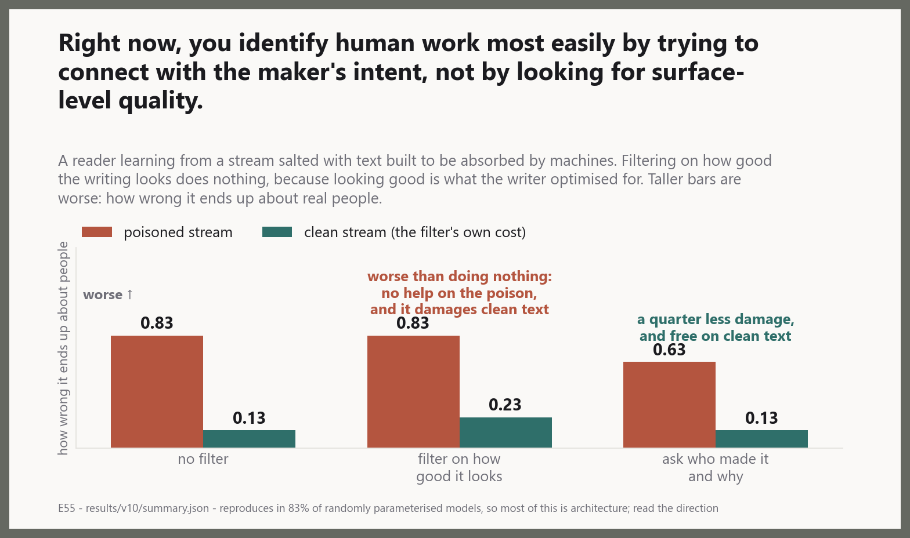

Every result in this project except this one describes something going wrong. This is the only one
that does something about it.

Networks now publish at industrial scale specifically so that **AI systems** will absorb them, not
so that people will read them — 150+ domains, roughly three million articles a year, and almost no
human visitors, which is the tell. Filtering that out by how good the writing looks does **nothing**,
because looking good is the whole objective. It is the same shape as the RLHF result: optimise the
signal and the signal stops carrying information.

Asking *who made this, and why* cuts the damage by about a quarter, restores the learner's reading
of genuine human work, and **costs nothing on a clean stream** — while never once looking at a
label. That last part matters most. The Ghost Scale failed twice as something makers apply. **This is
the same idea as something readers do, and nobody has to agree to it.**

*Read the direction, not the size: 83% of randomly parameterised models of this shape do it too, so
most of this is architecture rather than evidence for the specific theory.*

### 2. What a false label does

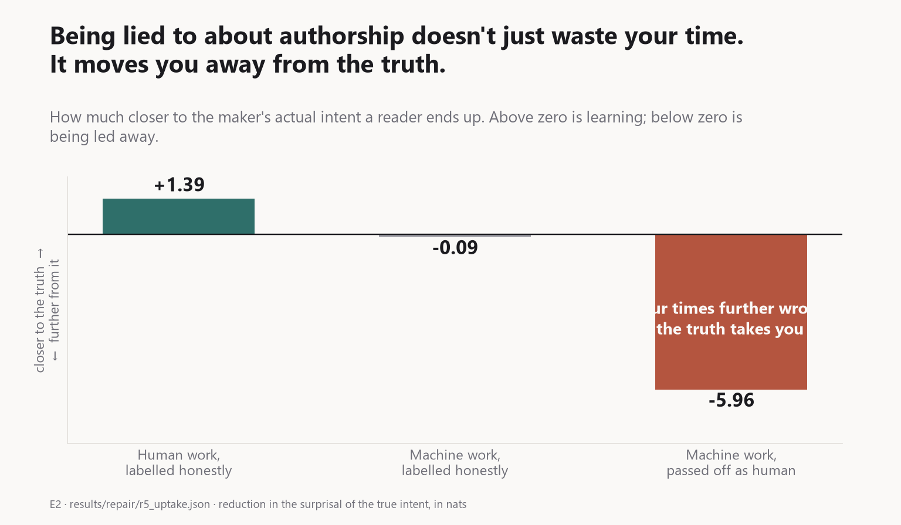

The measure that made this visible is newer than the result. For five versions the model scored
*how far a reader's beliefs travelled*, which cannot tell being convinced from being fooled — a
reader who ends up confidently wrong has moved just as far as one who ends up right. Given a sign,
the three cells stop looking similar and start having opposite signs.

Told honestly that a machine made it, a reader barely moves: **−0.09**. Told a person made it,
**−5.96**. Sixty-six times further, and negative, which means movement *away from* the truth rather
than a failure to learn.

### 3. Where it actually breaks

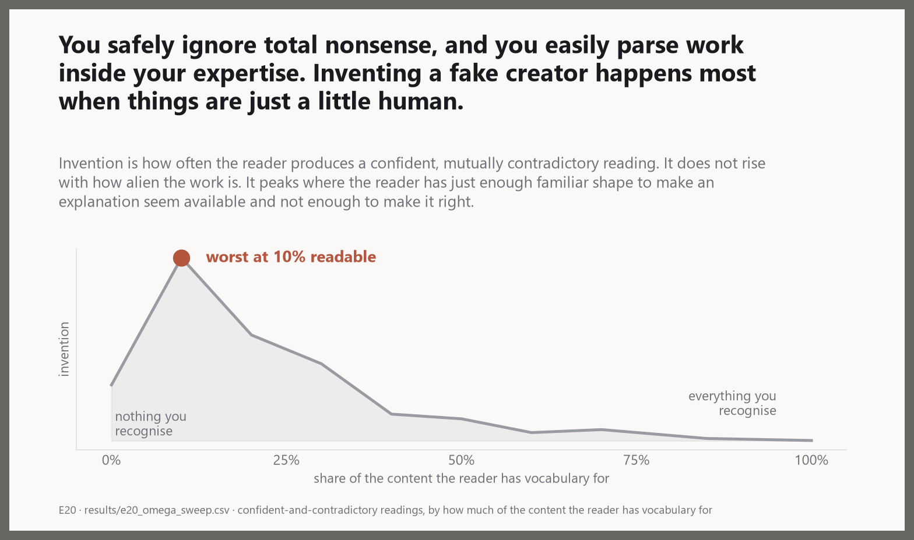

The most robust result in the project: same location under exact arithmetic, on a different seed
block, at double scale, in every cell of the robustness sweep, and in every resampled run. **The
worst place to be is nearly understandable.** Total nonsense is safe; total clarity is safe; the
danger is having just enough handholds to build a story on.

### 4. Not understanding is the safe failure

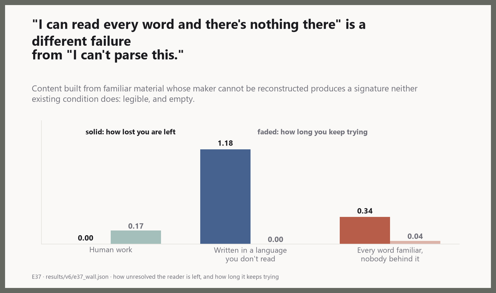

Three paintings, and one measure: how finished you felt walking away.

**The middle one is the control that makes the point.** It is a real maker with a real purpose,
working in a tradition you have no training for. Versions 1 to 5 of this model believed that was
what machine content was. You take almost nothing from it, and the point is that **you know that.**
Being stopped at the door is the protection.

The one on the right is what version 6 built to replace that description, because *legible and
empty* is the complaint people actually make about generated work. Four maker states, only two
distinct surfaces, on material you recognise completely. Nothing is hard to look at, and there is no
route from any of it back to a state you could occupy.

**And you do not come away empty. That is the part worth being alarmed about.** Your belief moves
**1.03** on the AI image against **1.40** on a real painting, so nearly as far, and it moves the
wrong way. You finish at 76% settled, holding a confident answer you constructed yourself about a
maker who was never there. Then you keep it.

The tell is that viewers who all feel finished **disagree with each other** about what they found,
nearly as much as on genuine human work. On the painting nobody could read, nobody disagrees at all,
because nobody committed.

**Failing to understand something protects you. Being satisfied by it is how the false thing gets
in.**

### 5. I threw my own settings away

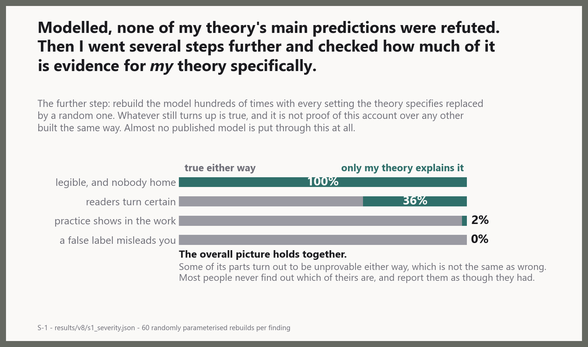

The most important number in this project is not a result. Keep the shape of the model, randomise
everything the theory specifies, and count how often the finding still appears.

**Two of three headlines appear every time.** They are properties of building a reader this shape at
all — which *is* the theory, but is the part shared with any account of the same shape. It does not
distinguish this framework from a competitor built the same way.

One result survives at zero. That is where the specific commitments earn their keep.

### 6. Why detection is a losing race

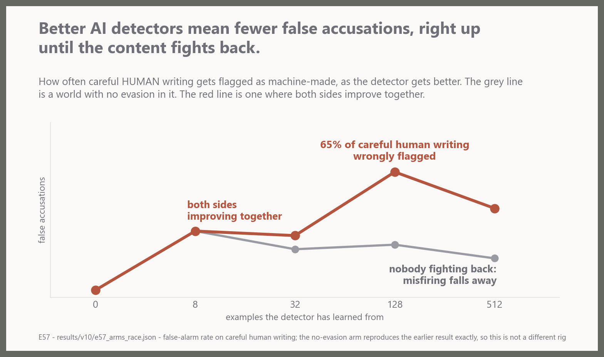

An earlier version of this project found that detectors misfire *less* as they sharpen, and
published that as its own prediction failing. It had measured a world with no adversary in it.

Put evasion in, so that detection and evasion improve together, and the misfiring stops falling and
turns back up: at its worst, **two thirds of careful human writing wrongly flagged.** Switch evasion
off and the clean decline comes straight back, which is what makes this a finding about the world
rather than about a new piece of code.

There is a second half that does not fit on the same picture. A reader whose detector stops updating
does not gradually get fuzzier. Its accusation rate does not move at all while its accuracy drains
away underneath, until it is firing on people and machines at exactly the same rate with exactly the
same confidence. **A coin flip that still believes it is a detector.**

---

## Carousel two — *the case for intent*

*Next out. Five plates. Each one is the objection raised by the one before it.*

### 7. The efficiency claim, withdrawn

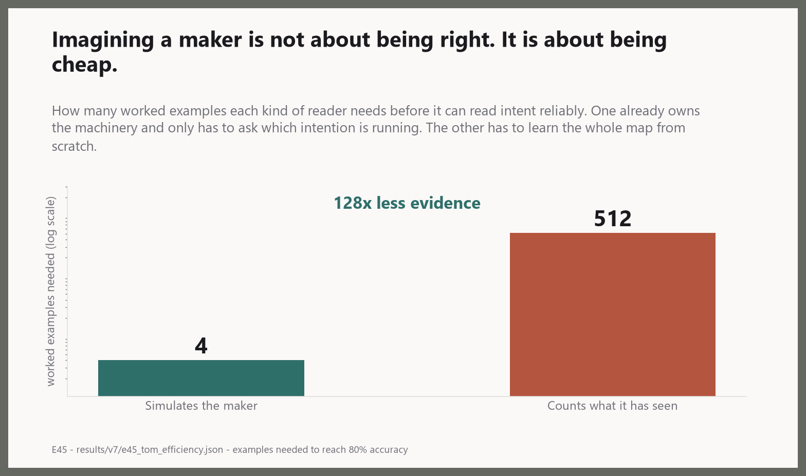

Plate 10 below is the result that made this project withdraw a claim: you do not need to imagine a
maker to end up confidently wrong about one. True, and it stands. E45 was built to ask the narrower
question it left open — not whether a maker-model is *needed* to produce a signature, but what one
*buys*. The answer it gave was that a simulating reader clears the competence bar on far less
evidence than a counting one.

**That answer does not survive contact with the code, and the objection that killed it is the
obvious one: you cannot simulate a maker from nothing.**

    e45_tom_efficiency.py:121   agent = make_agent(gm, d, cfg)            # gm is the world model
    e45_tom_efficiency.py:107   env   = Environment(cfg, gm, rng, ...)    # the SAME gm emits

`build_shared_model` describes itself as ground truth in its own docstring, and `A[0]` is verified
identical between the two. So the simulator's likelihood is not an estimate of the world's emission
map — it *is* the world's emission map, the same array. It needs no worked examples by definition
rather than by measurement, and **no arrangement of this world could have made H7.1 fail.** A test
that cannot fail is not evidence. It is an oracle against a learner.

Three things follow, and all three are now on the plate:

- **The efficiency result is withdrawn.** What is left is the counter's real learning curve, from
  0.53 at one example per goal to 0.81 at 128, against an oracle sitting at about 0.84 throughout.
  **The gap at full training is five points.**
- **"128 times less evidence" was never a finding**, and neither was the "4" that replaced it. The
  ratio was a property of where the sweep starts.
- **The floor of that sweep is degenerate.** Training examples are split across goals and clamped at
  one each, so with four goals n_train of 1, 2, 3 and 4 are the *same condition* and return
  byte-identical accuracy. The smallest distinct training size on this plate is 8.

The plate is kept rather than deleted. The hypothesis may well be true — a reader that shares the
maker's body plan should need less evidence — but this experiment assumed it instead of testing it,
and that distinction is the whole point of the two audits further down.

### 8. Reading a goal nobody has shown you

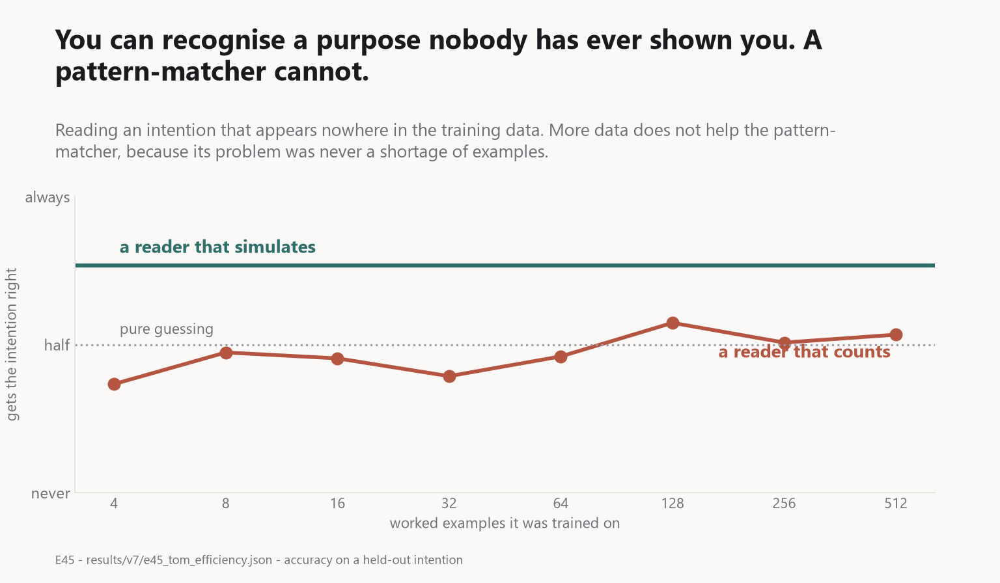

The obvious objection to the plate above is *that is just a prior — give the counter more data.* So:
a goal held out of training entirely.

A reader that can **run** the generator has the whole space available. A reader that has to
**observe** the space only ever has the part it happened to see — and more examples do not fix that,
because its problem was never a shortage of examples. The simulator gets it right **0.82** of the
time, pooled over the eight measurements. The counter sits at guessing across a 128-fold increase
in training data and never leaves.

**The simulator's line is not flat, and it should not have looked flat.** The verdict used to
publish a single number for it — the first of eight, which happened to be the lowest — and the
plate drew that one number straight across the axis, asserting a stability nothing had measured.
The eight real values run 0.77 to 0.85. That spread is noise: chi-square 5.94 on 7 degrees of
freedom against a critical value of 14.07, at n=150 per point.

What *is* true is that the simulator has no learning curve at all, because training size is
consumed by the counter's classifier and by nothing else. Its eight values move only because
building that classifier draws a size-dependent number of values from the generator the artifacts
come from next. Give the classifier its own generator and the simulator returns **0.8467 at every
one of the eight sizes**, identically. Both facts are now on the plate.

**Why this hypothesis survives the audit that withdrew the one above it.** The oracle objection
applies here too — the simulator holds the world's emission map, including the row for the goal it
has never been shown. So the test that matters is what happens when that map is taken away.
Perturbing the simulator's own signature away from the world's, using the codebase's own
inexpertise parameter, the held-out-goal advantage is still standing at a **half-random likelihood**
(0.71 against the counter's 0.53, chance 0.50), where the efficiency advantage on plate 7 has
already gone to nothing. **The two hypotheses lean on the oracle to very different degrees, and only
one of them falls over when it is removed.** That sweep is a scratch audit and is not yet a
committed experiment; it should become one.

### 9. And what is each finding actually made of?

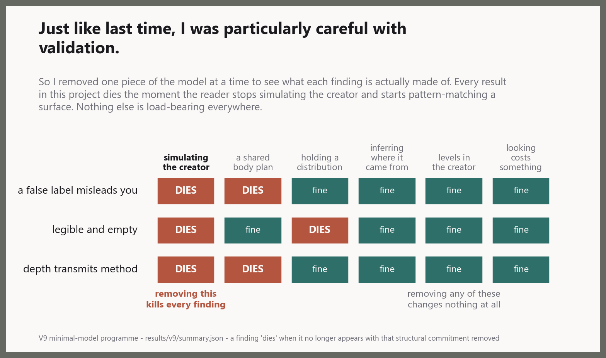

The severity rate on plate 5 says how much of a result is architectural. It does not say **which
part**. So the complement: keep the settings and strip the shape instead — remove one structural
commitment at a time, six of them, each a decision about what a reader *is*.

**Every finding dies the moment the reader stops simulating the creator and starts pattern-matching
a surface.** That is the one load-bearing commitment in the project. The model can lose its
hierarchy, its costly attention, and its separate belief about origin, and keep every result.

And *legible and empty* is the odd one out for the second time. It is the only finding that needs
the reader to hold a **distribution** rather than a best guess — which is exactly right, because
"I read every word and there was nobody there" *is* a statement about the shape of an uncertainty.
It is also the only finding with a 0% false-positive rate. Two unrelated audits, same answer.

*One row is missing from this plate: sustained futile attention did not reproduce in the ablation
harness's own baseline, so it has no answer here rather than a bad one.*

### 10. You don't need a mind to invent one

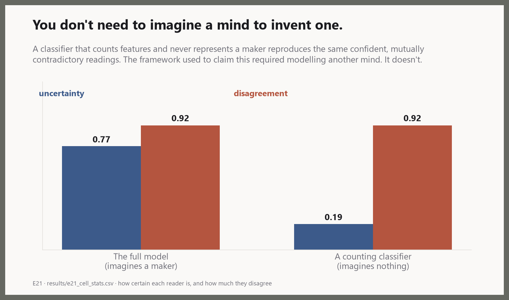

**The framework used to claim that confident, mutually contradictory readings of empty content
require a reader that models the maker as a mind. That is false, and the experiment that killed it
is in this repository.**

A classifier that counts features and never represents a maker reproduces the pattern, through
nothing more than small-sample overfitting. On empty content carrying a creator's label the two
readers end up **0.92 certain against 0.92, disagreeing 0.99 against 0.99** — the same object, to
two decimal places, on both halves of the signature.

**Then change the label from a lie to the truth.** Told honestly that no person was behind the
work, the maker-modelling reader drops from **0.92 certain to 0.04**. The counter goes from 0.92
to 0.92. It has no channel for the information, because a label is a claim about a maker and it
does not have one. The signature was never the evidence for a maker-model; being able to hear a
label is, and so is being able to keep paying attention to something you cannot resolve.

### 11. Rejection is not protection

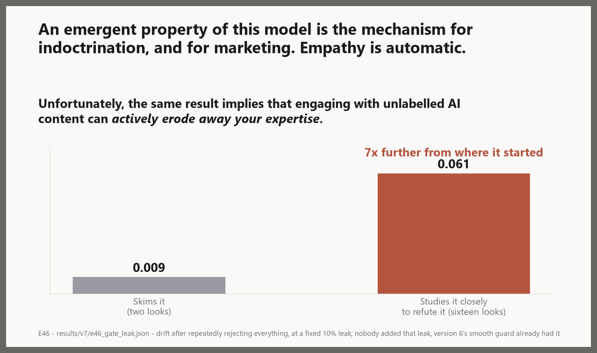

To decide you disagree with something, you first have to work out what it says. Working out what it
says means partly running it. So refusing is itself a small act of taking on, and it compounds.

The theory always contained this term; the code never did. And the second half is worse than the
first, which is why it is the picture rather than a caption on it: **the reader who studies it
carefully in order to refute it drifts seven times more than the one who skims** — same content,
same guard, eight times the looking. The effort you spend disagreeing is the channel.

Seal the guard completely and the drift really does fall to 0.00002. No version of this reader
after version 5 has a guard that seals, because version 6 replaced the binary gate with a sigmoid,
and a sigmoid never reaches zero. Shown content with no creator to recover, the reader invents one
and then absorbs its own invention, and that lands about as hard (0.015) as a real intent does.

---

## Carousel three — *what it costs to be a reader*

*Drafted. Five plates, all still on grey titles.*

### 12. Pays more, gets less

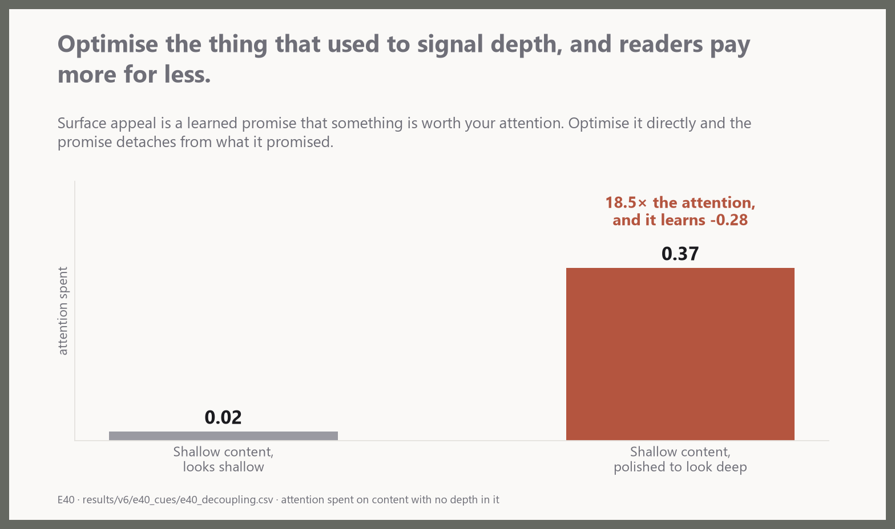

A third failure mode, distinct from the other two. It is not the crash: the reader is fully engaged.
It is not the lie: nobody lied, and the reader is right about where the work came from. It is a
reader correctly reading something built to trip its own heuristic for deciding what is worth
reading.

This is the alignment argument, in miniature, inside the model.

*Attention goes from almost none to more than a third, and the reader learns exactly the same amount
either way — a negative amount. The ratio is off a denominator of 0.02, so quote the direction.*

### 13. Two kinds of damage

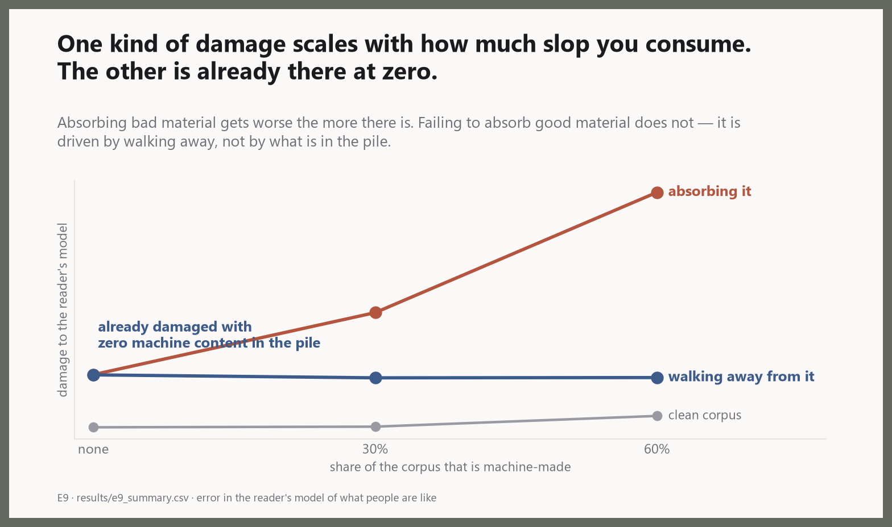

Absorbing bad material gets worse the more of it there is — the obvious kind. The other kind is
driven by *walking away*, so it is fully present in a corpus with no machine content in it at all.
The second has the strongest independent support of anything in this project.

### 14. Expertise substitutes

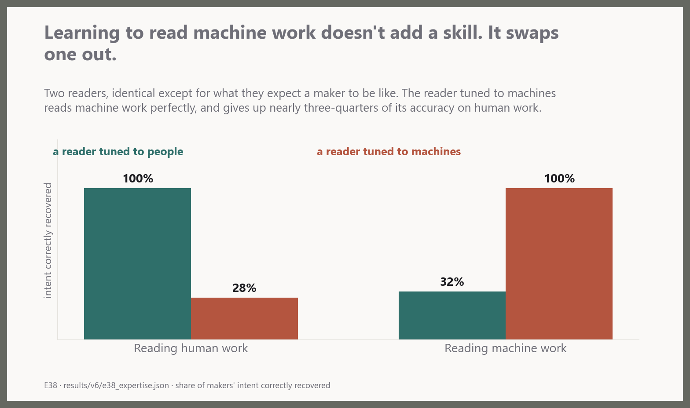

The prediction was that people who understand these systems would be spared the crash. They are —
by trading away the human channel. The adaptation that protects you is the same adaptation that
costs you.

### 15. Reputation blindness

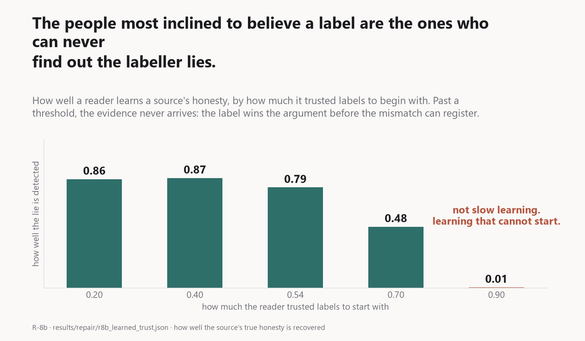

To learn that a source lies you have to notice the label and the work disagreeing — and above the
crossover, the label has already won that argument before the disagreement can register.

Not slow learning. Learning that cannot start.

### 16. Looking is not the same as being changed

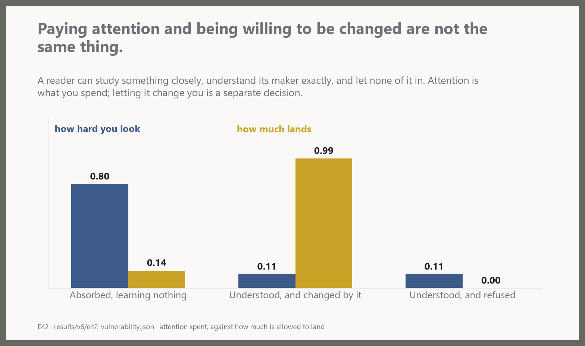

Attention is what you spend. Whether what you find is allowed to change you is a separate decision,
and every combination of the two is reachable. The model always kept them apart; no version had ever
reported them separately. The release valve at the end of an uncomfortable set.

---

## Carousel four — *the ledger*

*Drafted. Runs immediately before any demo, because it is what buys the demo a hearing. Two of its
five slides are text plates that do not exist yet.*

### 17. The experiment that stayed withheld

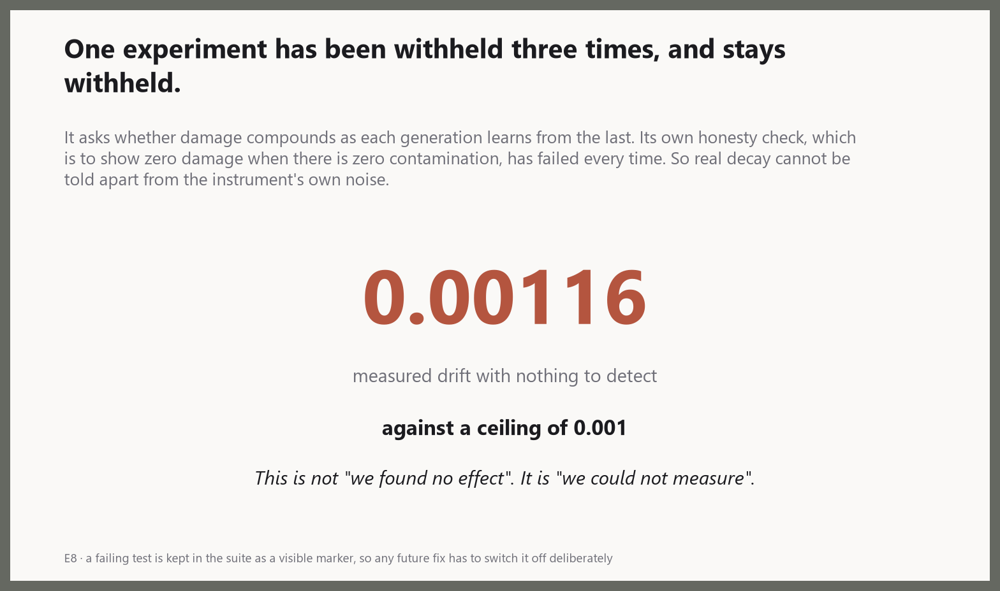

It asks whether damage compounds as each generation learns from the last — the most consequential
question the project has, and the one it cannot answer. Its honesty check has failed three times, so
real decay cannot be told apart from the instrument's own noise.

Narrowly missing is exactly the case a no-exceptions rule exists for.

### 18. A knee, not a cliff

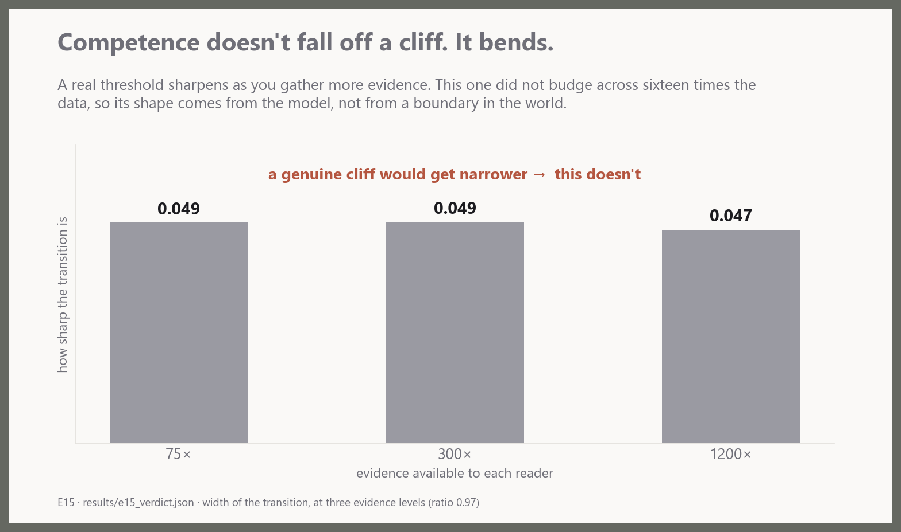

The author's own claim, tested knowing it could only survive or weaken. A genuine threshold gets
sharper as you gather evidence; this one did not move across sixteen times the data, so its shape
comes from the model rather than from a boundary in the world.

There was no version of that test where the claim got stronger.

**Also in this carousel, not yet drawn:** plate 5 reprised as the anchor rather than as a caveat; the
withheld version-10 rider, which damaged a learner reading nothing but honest human writing and was
recorded in advance as the check most expected to fail; and the forking-paths ledger, eighteen places
across four versions where a design or a criterion changed after a result was seen.

---

## Not in a carousel yet

*Single posts and connective tissue. All grey, all still waiting on a headline.*

### 19. The two witnesses

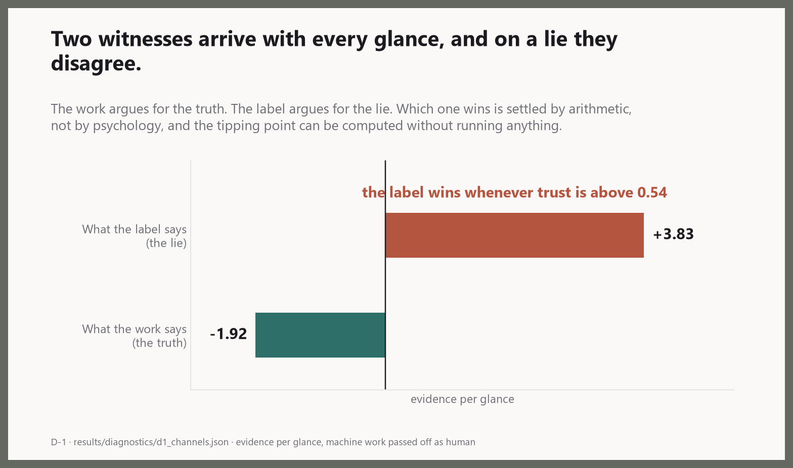

Why the lie works at all. The reader gets two pieces of evidence about origin at every glance: what
the label says, and what the work itself says. On a lie they point in opposite directions, and which
one wins is decided by an inequality you can solve on paper. **This was computed with no simulation
at all, and it predicted the shape of several results that had already been run.**

### 20. Honesty is not always enough

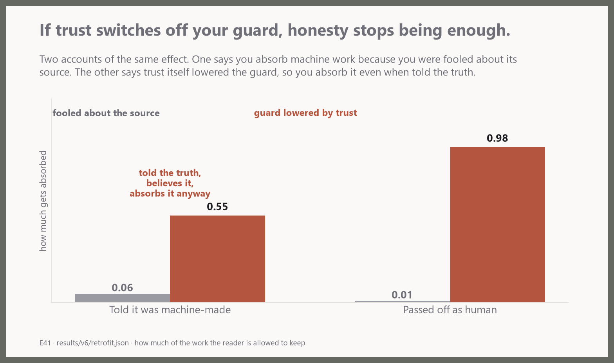

The most consequential thing version 6 found, and it is a disagreement between the published theory
and its own implementation. The code models a **con**: you were lied to, you were fooled, the fix is
disclosure. The paper models something worse: trust *itself* lowers the guard, so a trusted source
gets absorbed **even when it tells you exactly what it is**. Disclosure does not fix that one.

Both accounts produce the famous result. Only one of them survives being told the truth.

### 21. Depth moves the method, not the purpose

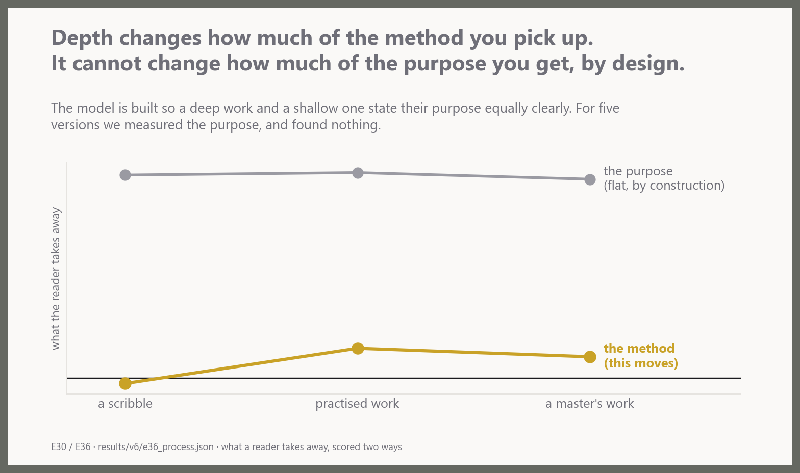

**Five versions looked for an effect in the one place the design guarantees there isn't one.**

Depth here is the Zen master's circle against the child's scribble: what differs is compressed
practice, not effort spent. The construction deliberately makes a deep work and a shallow one state
their purpose *equally clearly* — that is what stops "depth" being "clarity" with a new name.

And then the experiment measured whether depth changes how much of the **purpose** you get. It
couldn't. Not "it didn't" — it *couldn't*. Measured on how much of the **method** transfers, it
moves.

### 22. Intent unlocks the method

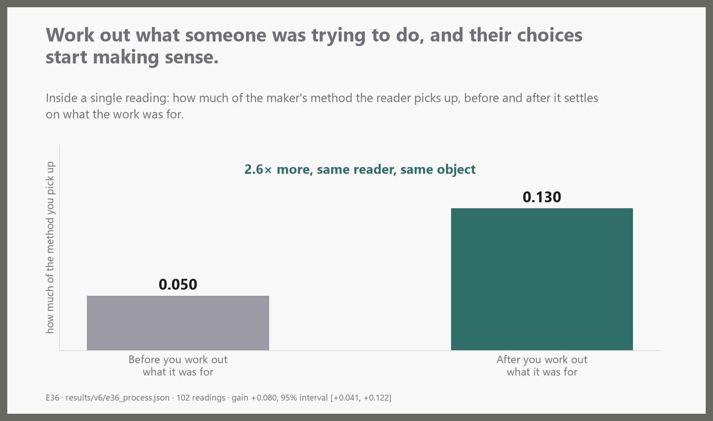

The claim: you work out what someone was *for* first, and that is what makes their choices
readable — every move can then be read as being in service of it.

It is in neither the preprint nor the essay. It came out of a conversation, and it holds — inside a
single reading, on the same object, before and after the reader settles on the purpose.

### 23. The master cannot explain themselves

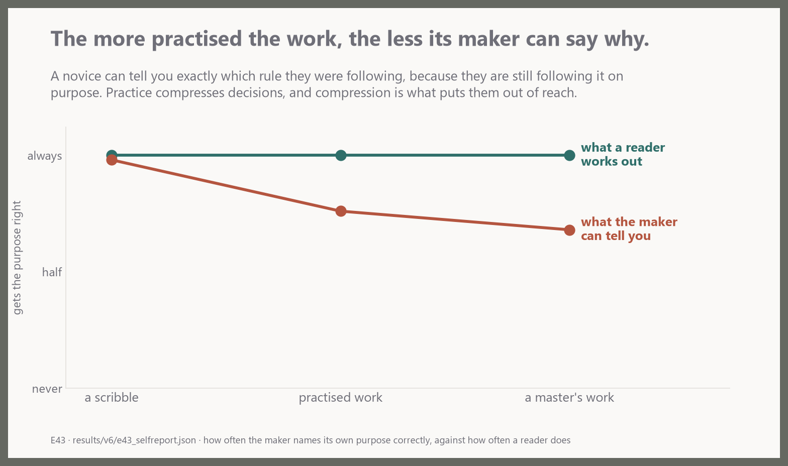

A novice can tell you exactly which rule they were following, because they are still following it on
purpose. Practice compresses decisions into automatic routines, and compression is precisely what
puts them out of reach of report.

Note what is *not* happening here: nobody is setting the maker's self-blindness. Depth sets it.

### 24. Labelling needs a convention

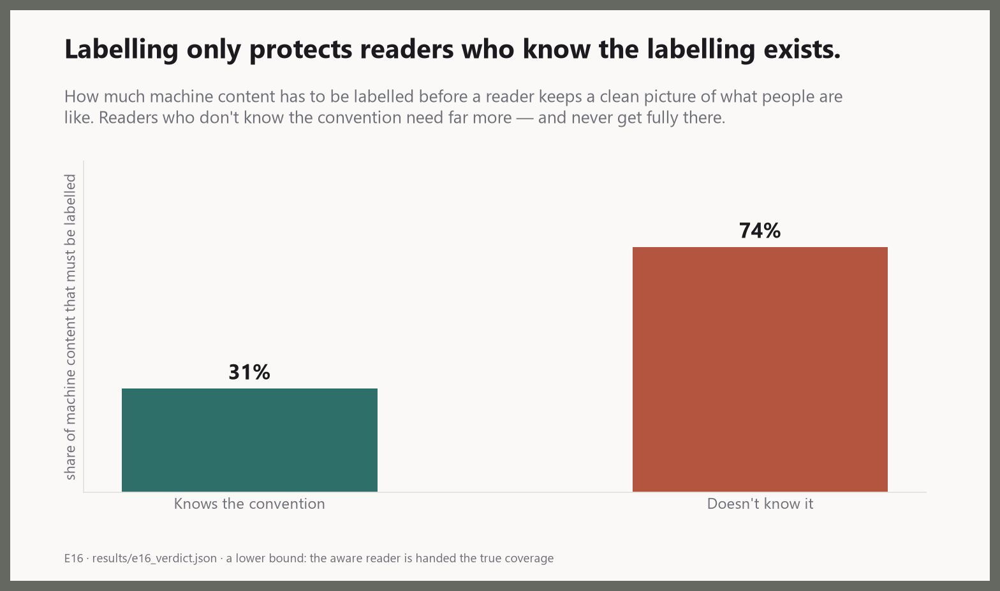

The policy number. And a lower bound, because the aware reader here is handed the true coverage,
which is the most generous assumption available.

### 25. A disagreement that turned out to be a measurement error

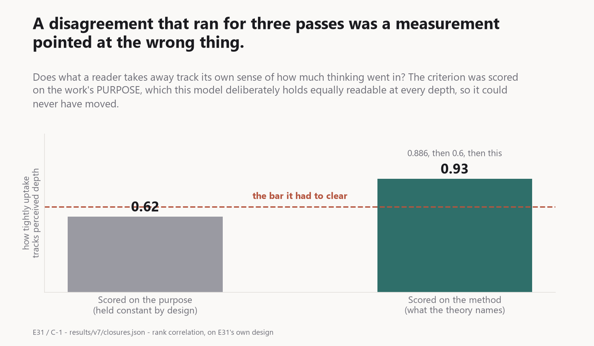

The project's longest-running open question, settled by changing *what* was measured rather than
*how*. The criterion was scored on the work's purpose — which the model deliberately holds equally
readable at every depth, so it could never have moved.

### 26. Honest marking is self-policing, at a price

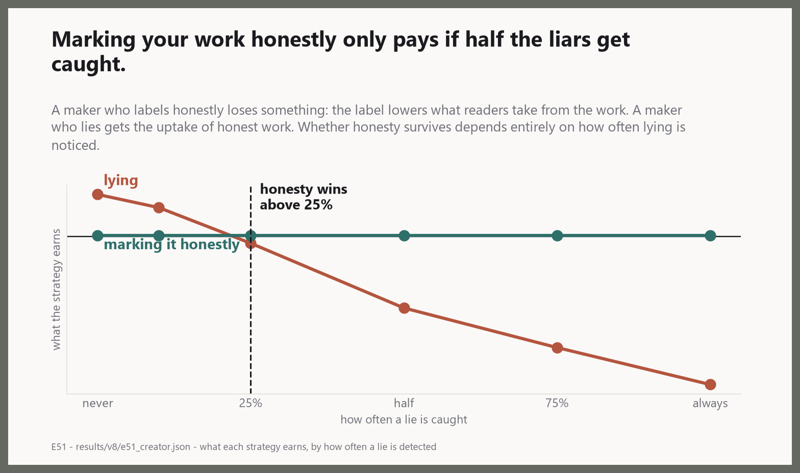

The proposal's answer to bad actors, simulated for the first time in eight versions. It works — and
it comes with a condition rather than a reassurance: **you have to catch half the liars.**

*The framework reaches this through Zahavian signalling, on which honesty is stable because the
honest signal is wasteful. Signalling theory has since moved to a trade-off account, and a
detection-rate threshold is a trade-off result. The simulation landed on the current position
without being aimed at it.*

---

## What is not drawn yet, and why

*The older per-experiment research charts have been removed. They were working figures from versions
1 to 5, drawn before this repository had a house style and never brought up to it, and several of
them meant something different by the end than they did when they were drawn. Every claim they
carried is in the plates above, redrawn from the same committed data.*

A plate makes a claim legible in two seconds, which means it also makes a claim hard to qualify.
Version 6 held four results out of this walkthrough because each carried an open question a plate
would paper over. **Version 7 closed all four** — and one of them closed by being retired.

| result | what happened |
|---|---|
| **The two-gates criterion** | **Settled, and drawn** (plate 25). Re-run on E31's own design and scored on the method: 0.93, with the interval excluding the bar. |
| **Depletion carrying to unseen work** | **Settled.** At thirty encounters the probe falls essentially to nothing, monotone at −0.98. The direction was never in doubt; the pre-registered magnitude clause was the wrong *shape* of criterion and is reported as such. |
| **Depth versus effort** | **Still open, and reported as failing.** The pre-registered contrast still returns *effort can manufacture depth*. On what actually transfers, depth dominates effort ninety-fold — so the reader's *estimate* of depth is contaminated by effort while the *transfer* is not. Not drawn, because a plate cannot carry that split. |
| **The collapse and the invention peak sharing one band** | **Retired.** The peak is unchanged and is not in question. The co-location held only under a superseded solver, and it has been removed from the README and from the prediction card. |

One result stays undrawable, and it is the honest kind: **N21's split**. Two measures disagree about
the same manipulation, one of them is the pre-registered one, and it fails. That is a paragraph, not
a picture.

---

## What the whole thing does not do

- **It is a simulation of a mechanism, not a study of people.** There is no human data anywhere in
  it and nothing here is evidence about what real readers do.
- **The shapes are the claims; the numbers are properties of this model's dimensions.** Rebuilt from
  the prose alone by someone with no access to the code, the central effect points the same way and
  comes out fifteen times smaller. Quote directions. Do not quote multiples.
- **There is no forward test.** There was one sealed prediction and its status was withdrawn in
  version 8, because the author does not recognise authoring it. This is a theory checked carefully
  against itself.
- **The proposal it is named after has no demonstrated mechanism.** Twice this project has gone
  looking for how a Ghost Scale label would actually protect a reader, and twice it has come back
  without one — E39 and E54. The proposal is not refuted. It is unsupported, which is a different
  thing and should be said in its own sentence.
