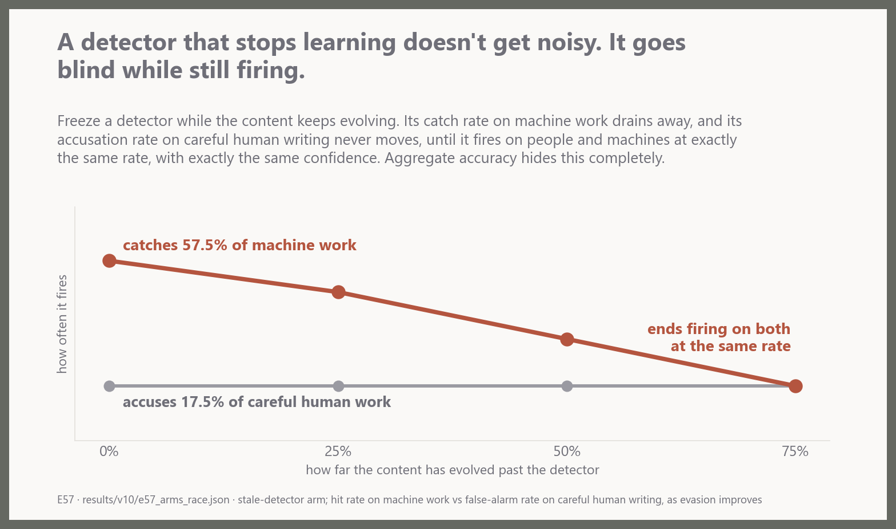
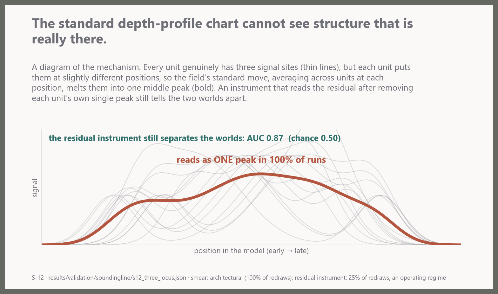
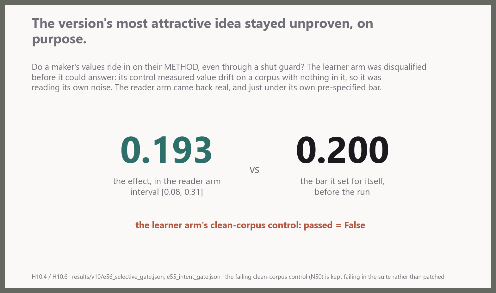
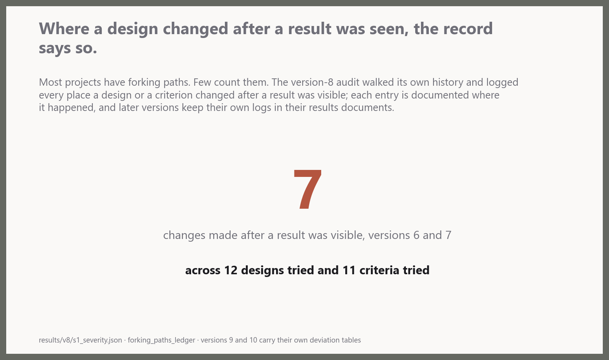

# The walkthrough

We tested whether full local-goal forecasts distinguish native dependencies that their marginals merge. All 366 deterministic outputs match the original and both complete replays. Independent numerical acceptance remains pending. This is a constructed-method diagnostic; historical process correspondence and human intent remain unestablished.

V19 remains active with 73 independently accepted scientific batches. Joint-versus-marginal partition execution and both complete replays are verified; the admitted independent checker owns the next numerical review. Retrospective full-simplex and reachable-posterior updating remain prepared, unimplemented alternatives. [Report](docs/versions/v19-local-maker/JOINT_PARTITION_REPORT.md).

We tested whether identical frozen local-goal forecasts conceal different native target distributions. At 2,048 labels, the predictive bank distinguishes all 704 public frames, while the frequency baseline merges them into 121–124 forecast groups. Remaining bank target variation is across laws, not across frames within a law. Independent reconstruction, all 4,464 paired estimates and both complete replays verify this constructed-method result; historical process correspondence and human intent remain unestablished.

V19 remains active with 73 independently accepted scientific batches. The exact joint-versus-marginal partition comparison passed 53 isolated controls and ran through the existing serial queue. Native completion receipts exist for the original and both replays; their completion events own integrity and numerical review. Retrospective full-simplex and reachable-posterior updating remain prepared alternatives. [Contract](docs/versions/v19-local-maker/JOINT_FORECAST_PARTITION_ADMISSION.md).

We tested whether averaging within probability bins hides frame-level absolute errors. At 2,048 labels, even twenty bins conceal 7.7–13.3% of the predictive bank’s absolute probability error across positions under native weighting. Independent reconstruction, all 5,508 paired estimates and both complete replays verify this constructed-method diagnostic. Historical goal correspondence and human intent remain unestablished.

V19 remains active with 72 independently accepted scientific batches. Absolute-error envelopes are independently verified; the source-frozen exact forecast-collision comparison is executing, with both full replays queued. [Report](docs/versions/v19-local-maker/GOAL_ABSOLUTE_ENVELOPE_REPORT.md).

We tested whether small average errors inside probability bins conceal larger frame-level errors. At 2,048 labels, variation within ten bins accounts for 24.6–46.6% of the predictive bank’s squared probability error across positions under native weighting. Independent reconstruction, all 2,772 paired estimates and both complete replays verify this constructed-method diagnostic. Historical goal correspondence and human intent remain unestablished.

V19 remains active with 71 independently accepted scientific batches. Squared-error decomposition has independent numerical acceptance. Absolute-error envelope passed 84 isolated controls and was observed executing through the existing serial queue, with both complete replays queued. Its numerical acceptance is pending. Retrospective updating and exact forecast-collision uncertainty remain prepared, unimplemented independent alternatives. [Report](docs/versions/v19-local-maker/GOAL_SQUARED_DECOMPOSITION_REPORT.md).

We tested whether finer probability bins expose hidden local-goal forecast errors. At 2,048 labels, moving from ten to twenty bins reveals up to 0.31400 additional percentage points of absolute discrepancy for the predictive bank under native weighting. Independent reconstruction, all 4,392 paired estimates and both complete replays verify this constructed-method diagnostic. No practical-impact threshold was specified; historical goal correspondence and human intent remain unestablished.

V19 remains active with 70 independently accepted scientific batches. Fixed-bin resolution has independent numerical acceptance. Squared-error decomposition passed 55 isolated controls and was observed executing through the existing serial queue, with both complete replays queued. Its numerical acceptance is pending. Retrospective updating and an unbinned absolute-error envelope remain prepared, unimplemented independent alternatives. [Report](docs/versions/v19-local-maker/GOAL_BIN_RESOLUTION_REPORT.md).

We tested whether pooling public task requests hides opposing errors in local-goal probabilities. At 2,048 labels, request pooling hides up to 0.11078 percentage points of absolute calibration discrepancy in the predictive bank under native weighting. Independent reconstruction, all 2,196 paired estimates and both complete replays verify this constructed-method diagnostic. No practical-impact threshold was specified; historical goal correspondence and human intent remain unestablished.

V19 remains active with 69 independently accepted scientific batches. Public-request calibration has independent numerical acceptance. The fixed 5/10/20-bin diagnostic passed 79 isolated controls. Original execution and both complete replays now report completion through the existing serial queue; their separate events own integrity and numerical review. Retrospective updating and squared-error decomposition remain prepared, unimplemented independent alternatives. [Report](docs/versions/v19-local-maker/GOAL_PURPOSE_CALIBRATION_REPORT.md).

We tested whether pooling visible endpoint artifacts hides opposing errors in local-goal probabilities. At 2,048 labels, endpoint pooling hides up to 0.23066 percentage points of absolute calibration discrepancy in the predictive bank under native weighting. Independent reconstruction, all 2,196 paired estimates and both complete replays verify this constructed-method diagnostic. No practical-impact threshold was specified; historical goal correspondence and human intent remain unestablished.

V19 remains active with 68 independently accepted scientific batches. Endpoint-artifact calibration has independent numerical acceptance. Public requested-purpose calibration passed 58 isolated controls. Original execution and both complete replays now report completion through the existing serial queue; their separate events own integrity and numerical review. Retrospective updating and fixed-bin resolution sensitivity remain prepared, unimplemented alternatives. [Report](docs/versions/v19-local-maker/GOAL_ARTIFACT_CALIBRATION_REPORT.md).

We tested whether pooling witnessed operations hides opposing errors in local-goal probabilities. At 2,048 labels, pooling hides 0.00927–0.01149 percentage points of absolute calibration discrepancy at the first two positions; the third shows none beyond rounding. Independent reconstruction, all 2,196 paired estimates and both complete replays verify this constructed-method diagnostic. Historical goal correspondence and human intent remain unestablished.

V19 remains active with 67 independently accepted scientific batches. Operation-conditioned calibration has independent numerical acceptance. Endpoint-artifact calibration passed 57 isolated controls and was observed executing through the existing serial queue, with both complete replays queued. Numerical acceptance remains pending independent reconstruction. Retrospective updating and declared-purpose calibration remain prepared, unimplemented alternatives. [Report](docs/versions/v19-local-maker/GOAL_OPERATION_CALIBRATION_REPORT.md).

We tested whether confidence in a selected local goal hides errors in the other goal probabilities. At 2,048 labels, the predictive bank's full three-goal squared probability error is 0.00645–0.01385 across positions under native weighting. Independent reconstruction, all 2,700 paired estimates and both complete replays verify this constructed-method diagnostic. Selected-goal confidence alone does not measure this error; historical goal correspondence and human intent remain unestablished.

V19 remains active with 66 independently accepted scientific batches. Complete class-wise reliability has independent numerical acceptance. Operation-conditioned goal reliability passed 56 isolated controls and was observed executing through the existing serial queue, with both complete replays queued. Numerical acceptance remains pending independent reconstruction. Retrospective updating and endpoint-artifact reliability remain prepared, unimplemented alternatives. [Report](docs/versions/v19-local-maker/GOAL_CLASS_RELIABILITY_REPORT.md).

We tested whether confidence in local-goal reports matches their native expected correctness. At 2,048 labels, the predictive bank overstates correctness by 1.73–2.97 percentage points across the three positions under native weighting. Independent reconstruction, all 900 paired estimates and both complete replays verify this constructed-method calibration finding. Historical goal correspondence and human intent remain unestablished.

V19 remains active with 65 independently accepted scientific batches. Goal-confidence calibration has independent numerical acceptance. Complete class-wise goal reliability passed 55 isolated controls and a separate uniform-probability check. The source-admitted job was observed executing through the existing serial queue, with both complete replays queued. Numerical acceptance requires independent scalar reconstruction and paired regrouping. Retrospective updating and operation-conditioned goal reliability remain prepared, unimplemented alternatives. [Report](docs/versions/v19-local-maker/GOAL_CALIBRATION_REPORT.md).

We tested whether broader local-goal reports improve accuracy while retaining less specificity. At 2,048 labels, the predictive bank's three binary goal vocabularies lower always-reported step error from 13.45% to 4.60–9.94%, while retaining 1.64–1.79 fine alternatives per claim. Independent reconstruction, all 9,600 paired estimates and both complete replays verify this constructed-method reporting tradeoff. Fine-goal forecasts are unchanged; historical correspondence and human intent remain unestablished.

V19 remains active with 64 independently accepted scientific batches. Goal coarsening has independent numerical acceptance. Fixed-bin goal-confidence calibration and retrospective updating remain independent alternatives. [Report](docs/versions/v19-local-maker/GOAL_COARSENING_REPORT.md).

We tested whether declining uncertain local-goal reports reduces errors at useful coverage. At 2,048 labels and an abstention cost of 0.1, separate-step reporting retains 76.43% coverage and lowers the predictive bank's error among reported steps from 13.45% to 0.12%. Independent reconstruction, all 1,920 paired estimates and both complete replays verify this constructed-method tradeoff. The forecast is unchanged; historical goal correspondence and human intent remain unestablished.

V19 remains active with 63 independently accepted scientific batches. Goal abstention has independent numerical acceptance. Less specific goal reports and retrospective updating remain independent alternatives. [Report](docs/versions/v19-local-maker/GOAL_ABSTENTION_REPORT.md).

We tested whether choosing a whole goal path sacrifices stepwise accuracy with the forecast held fixed. At 2,048 labels, separate step decisions lower the predictive bank's native-weighted step accuracy by 0.08349 percentage points despite improving its own forecast objective. Independent reconstruction, all 240 paired estimates and both complete replays verify this constructed-method reversal. It does not establish historical goal correspondence or human intent.

V19 remains active with 62 independently accepted scientific batches. Goal decisions are numerically verified: optimizing a forecast objective need not improve native accuracy. Retrospective updating and goal-report abstention remain independent alternatives. [Report](docs/versions/v19-local-maker/GOAL_DECISION_REPORT.md).

We tested whether redistributing probability between goal paths seen and unseen in training explains the gain after all operations are witnessed. At 2,048 labels, redistribution lowers the predictive bank’s logarithmic loss by 0.10244 nats; changing probabilities within those groups adds a 0.04608-nat reduction. Independent reconstruction, all 40 paired estimates and both complete replays verify this constructed-method decomposition. It does not establish historical goal correspondence or human intent.

V19 remains active with 61 independently accepted scientific batches. Conditional-goal mass redistribution explains part, but not all, of the product gain. Goal-decision decoding and retrospective updating remain independent alternatives. [Report](docs/versions/v19-local-maker/GOAL_MASS_REPORT.md).

We tested whether dependence among goals improves prediction after all operations are witnessed. Removing it lowers the predictive bank’s logarithmic loss by 0.14852 nats at 2,048 labels; matched frequencies improve by 0.15200. Independent reconstruction, all 20 paired estimates and both complete replays verify this constructed-method reversal. The native reference instead loses accuracy, so the learned gain does not establish historical goal correspondence or human intent.

V19 has 60 independently accepted scientific batches; the witnessed-goal result remains accepted. [Report](docs/versions/v19-local-maker/WITNESSED_GOAL_REPORT.md).

We tested whether dependence between steps improves frozen joint-process prediction. Removing it lowers the predictive bank’s logarithmic loss by 0.07256 nats with complete witnesses and 2,048 labels; matched frequencies improve by 0.05747. Independent reconstruction, all 80 paired estimates and both complete replays verify this constructed-method reversal. The native reference instead loses accuracy, so the learned improvement does not establish historical process correspondence or human intent.

V19 remains active with 59 independently accepted scientific batches. Removing temporal dependence improves the frozen learned forecasts while worsening the native reference. Within-step factorization and retrospective updating remain independent alternatives. [Report](docs/versions/v19-local-maker/TEMPORAL_FACTORIZATION_REPORT.md).

We tested whether learned dependence between goal and operation sequences improves joint-process prediction. With complete witnesses and 2,048 labels, removing that dependence increases the predictive bank’s logarithmic loss by 2.30965 nats; the matched-frequency baseline shows a similar penalty. Independent reconstruction, all 80 paired estimates and both complete replays verify this constructed-method advantage. The exact reference needs no such dependence under complete witnesses, so this does not establish recovered historical process or human intent.

V19 remains active with 58 independently accepted scientific batches. Learned sequence dependence improves frozen joint forecasts relative to their own marginal products; matched frequencies share the advantage. Temporal factorization and retrospective updating remain independent alternatives. [Report](docs/versions/v19-local-maker/JOINT_FACTORIZATION_REPORT.md).

We tested whether frozen joint-process forecast error comes from operations or from goals conditional on those operations. With complete witnesses and 2,048 labels, the predictive bank assigns 4.68916 nats of loss to operations already determined by the evidence; conditional-goal loss is 0.91337 nats against native uncertainty of 0.68049. Independent reconstruction, all 360 paired estimates and both complete replays verify this constructed-method diagnostic; it does not establish historical process correspondence or human intent.

V19 remains active with 57 independently accepted scientific batches. Joint uncertainty decomposition is numerically verified: operation forecast error and conditional-goal ambiguity are separate. Learned joint factorization is the next prepared diagnostic; retrospective updating remains independent. [Report](docs/versions/v19-local-maker/JOINT_UNCERTAINTY_REPORT.md).

We tested whether public execution constraints improve frozen joint-process readouts. With complete witnesses and 2,048 labels, restriction reduces the predictive bank’s logarithmic loss from 5.60252 to 0.91337 nats; matched frequencies reach 0.90746. Across training budgets, the bank’s advantage over frozen latent state stays below the declared 0.02-nat margin in every evidence tier. Independent reconstruction, all 160 paired estimates and both complete replays verify this constructed-method result; supplied operations do not establish recovered historical goals.

V19 remains active with 56 independently accepted scientific batches. Public-support decoding is numerically verified; the practical predictive-bank advantage over frozen latent state is absent on this fixed roster. Joint uncertainty decomposition is the next prepared diagnostic; retrospective updating remains independent. [Report](docs/versions/v19-local-maker/JOINT_SUPPORT_REPORT.md).

We tested whether endpoint forecasts bound every intermediate reliability of a binary reply. Independent reconstruction verifies all 31,744 conditional certificates and both complete replays. The continuous interval adds no coordinate extrema or total-variation diameter beyond the compatible finite-set endpoints; 4,224 impossible truthful endpoints are excluded. This is a supplied-law constructed-method certificate, not learned access or historical process correspondence.

V19 remains active with 55 independently accepted scientific batches. Continuous-reliability numerical reconstruction and complete replay are verified. Public-evidence support decoding and retrospective updating remain independent prepared alternatives. [Report](docs/versions/v19-local-maker/CONTINUOUS_RELIABILITY_REPORT.md).

We tested whether fixed decisions under unknown reply reliability improve prediction. With random skill replies, equal averaging and the normalized probability envelope increase native forecast loss by 0.00842 and 0.00567 nats versus making no request; with truthful replies they reduce loss by 0.02394 and 0.01654 nats. All 728,064 coding inequalities, 5,760 paired estimates and both complete replays verify. This supplied-law constructed-method tradeoff does not establish a generally superior decision, learned access or historical process correspondence.

[Verified report](docs/versions/v19-local-maker/ROBUST_REPLY_REPORT.md). 54 scientific batches now have independent acceptance.

We tested how much forecast uncertainty remains when reply reliability is unspecified. Under native weighting with 75%-accurate replies, the mean compatible-set diameter for belief reports is 0.08203 on original tools and 0.11160 on changed tools; for skill reports it is 0.04550 under both. Diameter is half the summed absolute probability differences, from zero for agreement to one for disjoint predictions. All 31,744 sets, 336 paired estimates and both complete replays verify this supplied-law constructed-method result; learned access and historical process correspondence remain unestablished.

[Verified report](docs/versions/v19-local-maker/UNCERTAIN_RELIABILITY_REPORT.md). 53 scientific batches now have independent acceptance.

Reliability mismatch is independently verified, bringing the accepted scientific batch count to fifty-two. V19 remains active; finite uncertain-reliability sets are being admitted, with retrospective updating and robust reply decisions prepared independently.

We tested whether a noisy mechanical reply remains useful when its stated reliability is wrong. Treating a random skill reply as 75% reliable increases forecast loss by 0.00839 nats under both tool rules; treating it as certain assigns zero probability to the true endpoint on 2.22% of native reply mass, making total logarithmic loss infinite. Independent reconstruction, all 13,608 paired estimates and both complete replays verify this supplied-law constructed-method result; learned access, historical process correspondence and human intent remain unestablished.

[Verified mismatch report](docs/versions/v19-local-maker/RELIABILITY_MISMATCH_REPORT.md).

We tested whether joint dependence between noisy replies matters when each field has the same marginal reliability. For two 75%-accurate replies sharing one error, accounting for their dependence reduces forecast loss by 0.05482 nats on original tools and 0.08822 on changed tools compared with treating them as independent. Independent reconstruction, all 7,488 paired estimates and both complete replays verify this supplied-law constructed-method result; learned access, historical process correspondence and human intent remain unestablished.

[Verified joint reply report](docs/versions/v19-local-maker/JOINT_REPLY_REPORT.md).

We tested whether repeated noisy replies add predictive information when their sources are independent or copied. Four independent 75%-accurate replies reduce forecast loss by 0.01368–0.04472 nats versus one reply across the two fields and tool rules. Copies add no information; treating four copies as independent instead increases loss by 0.02651–0.09358 nats. Independent reconstruction, all 29,952 paired estimates and both complete replays verify this supplied-law constructed-method result; learned access, historical process correspondence and human intent remain unestablished.

[Verified repeated reply report](docs/versions/v19-local-maker/REPEATED_DISCLOSURE_REPORT.md).

We tested whether accounting for noisy replies preserves their predictive value. With 75%-accurate replies and supplied native laws, calibrated conditioning reduces forecast loss by 0.01789 nats on original tools and 0.02566 on changed tools. Treating replies as certain assigns zero probability to the true endpoint on 2.53% and 4.00% of native reply mass, making total logarithmic loss infinite. Independent reconstruction, all 14,256 paired estimates and both complete replays verify this constructed-method result; learned access and human intent remain unestablished.

[Verified noisy reply report](docs/versions/v19-local-maker/NOISY_DISCLOSURE_REPORT.md).

We tested whether declining low-value metadata requests improves prediction after request costs. At a stipulated price of 0.1 nats per request, optional requests preserve forced-request forecast loss and reduce cost-adjusted loss by 0.07216 nats on original tools and 0.06626 on changed tools. Independent reconstruction, all 1,944 paired estimates and both complete replays verify this constructed-method advantage; supplied laws and reliable replies do not establish learned access or human intent.

[Verified optional request report](docs/versions/v19-local-maker/OPTIONAL_DISCLOSURE_REPORT.md).

We tested whether choosing which missing mechanic field to request improves endpoint prediction. Under supplied native laws, entropy-based selection reduces logarithmic forecast loss by 0.02823 nats on original tools and 0.04882 nats on changed tools versus equal random requests. Independent reconstruction and both complete replays verify this constructed-method advantage; reliable mechanical replies and law knowledge are supplied, so learned access and human intent remain unestablished.

[Verified disclosure report](docs/versions/v19-local-maker/METADATA_DISCLOSURE_REPORT.md).

We tested whether discarding stale counts improves pooled tool adaptation. With 16 truthful forward-ordered inputs and original training, the mechanically wrong grouping gives the lowest changed-tool forecast loss among the six arms (1.26874 nats) but the highest original-tool loss (1.24071 nats). Correct grouping replacement gives a smaller changed-tool gain and original-tool penalty. Independent reconstruction, all 21,120 paired estimates and both complete replays verify this constructed-method reversal; prediction does not establish learned mechanics, historical process correspondence or human intent.

[Verified replacement report](docs/versions/v19-local-maker/POOLED_REPLACEMENT_REPORT.md).

We tested how much exact endpoint prediction depends on supplied skill and belief. Hiding both creates mechanically ambiguous evidence in 102 of 248 original-tool groups and 120 of 248 changed-tool groups; only 64 and 82 groups have multiple endpoints with positive native support. Independent reconstruction and both complete replays verify this constructed-method input-privilege limit. It does not establish learned access, historical process correspondence or human intent.

[Verified metadata report](docs/versions/v19-local-maker/INPUT_PRIVILEGE_REPORT.md).

We tested whether pooling equivalent tool inputs improves a frozen forward model. Before new feedback, correct pooling improves original-tool forecast loss by 0.05570–0.06116 nats but worsens changed-tool loss by 0.08843–0.08948 nats. Independent reconstruction, all 9,120 paired estimates and both complete replays verify this constructed-method reversal. Supplied equivalence does not establish learned mechanics, historical process correspondence or human intent.

[Verified pooling report](docs/versions/v19-local-maker/PRIMITIVE_POOLING_REPORT.md).

We tested whether observed tool transitions can repair a frozen forward model without harming unchanged queries. With 64 truthful inputs, row replacement improves changed-tool forecasts by 0.19116–0.19524 nats under original training, but worsens unchanged queries by 0.02170–0.02482 nats. Independent reconstruction and both complete replays verify this constructed-method tradeoff; historical process correspondence and human intent remain unestablished.

[Verified feedback report](docs/versions/v19-local-maker/PRIMITIVE_FEEDBACK_REPORT.md).

We tested whether grouping identical remaining maker-state schedules preserves forecasts while reducing storage. All 4,620,288 saved forecast vectors reconstruct within 1e-12, with both complete replays verified. Float64 weights plus shared integer metadata use 23.96% fewer bytes on available checkpoints, or 22.53% fewer including unused requested-checkpoint metadata. This is a constructed-method storage result; online updating, workspace, speed, historical process correspondence and human intent remain unestablished.

[Execution report](docs/versions/v19-local-maker/FUTURE_QUOTIENT_REPORT.md).

We tested whether knowing the maker's current state is enough for later prediction. Equal current states can yield different future endpoint forecasts under all eight supplied laws. Independent enumeration of 113,376,896 hypothesis-pair/time instances and 19,968 forecast summaries, plus both complete replays, verifies this constructed-method counterexample. The witnesses are not established reachable posteriors; historical process correspondence and human intent remain unestablished.

[Full transition result](docs/versions/v19-local-maker/MARGINAL_TRANSITION_REPORT.md).

The learned-forward pilot finds no sampled-rollout advantage over direct endpoint prediction. Exact propagation removes sampling error but leaves an uncertain small advantage at the largest training budget. All native paths, forecasts and scores reconstruct, and both complete replays match. Twenty-six scientific batches are verified; historical process correspondence and the main joint readout remain open.

The omitted-tool experiment separates compatible evidence from complete process coverage. Final artifacts and context never reject the old family, while full witnesses expose the changed rule in 30.39% of its native population. Supplying both rules restores coverage. Twenty-five scientific batches are independently verified; neither cause invention nor human intent is established.

The single alternative transformer site leaves learned factor edits below the practical margin. Original predictions reconstruct exactly within numerical tolerance; the class-mean belief control retains large collateral damage. Twenty-four scientific batches have independent verification and complete replays. No further site search or joint causal-composition admission follows.

The cue-correction comparison verifies source replacement, retraction and duplicate handling. Counting a repeated wrong report as independent adds 1.92615 nats of joint process loss under the neutral prior. Full-joint scores reproduce, while best-process localization is sensitive to numerical ties. Twenty-three scientific batches are verified; supplied report reliability and teacher information remain explicit.

The ridge-probe direction decodes maker factors but changes predictions too little to meet the declared practical margin. A class-mean purpose direction remains a limited candidate; the corresponding belief direction damages stay cases. Independent reconstruction and both complete replays support twenty-two scientific batches. Joint selective access and historical process correspondence remain open.

The native factor fixtures preserve exact stay targets, but whole-state donor replacement imports unwanted skill changes. Both saved readers retain predictive capability; full replacement worsens purpose-change and stay scores while improving belief-change scores. Independent verification and both complete replays support twenty-one scientific batches. Selective access remains a separate experiment.

The equal-size portfolio comparison finds no learned-bank gain: targeted selection recovers the original set, while random and diversity choices worsen learned prediction despite improving exact-bank diagnostics. Independent reconstruction and both full replays verify twenty scientific batches; estimation error, probability repair and training uncertainty remain separate.

The purchase evaluation finds no targeting advantage from centered surprise: it reduces purchases but worsens forecasts when the missing rule is available. Both paid rules lose to the no-purchase mixture on stipulated net-cost scores. Independent reconstruction and both full replays verify nineteen scientific batches; numerical threshold sensitivity and supplied-law privilege remain explicit.

Whole-stream purchase calibration is independently verified. Strict ties prevent identical attained rates, and centered thresholds are sensitive to tiny numerical shifts. Frozen thresholds now support a separate held-out evaluation; calibration alone establishes neither useful targeting nor human intent.

Both tiny sequence readers pass the frozen predictive-capability thresholds in every fit and evidence condition. Independent model and score reconstruction and both complete replays verify the result. Fresh-episode prediction does not establish historical process reconstruction or selective causal access; the latter still needs intervention fixtures.

Persistent count-table learning improves native production, but active acquisition has no demonstrated advantage over demonstrations. Exact ordered replay is identical. Restricting starts leaves the unvisited context at its prior and lowers average success; this is a constructed-method comparison, not intent reconstruction or human expertise.

A fixed public-history reset reduces the rolled-in updater’s large error at 128 observations but does not rescue it: it still loses 3.47050 nats to the reset one-step head. One-step reset effects are small and change sign across source conditions. Independent forecasts, scores and both complete replays verify this bounded constructed-method result; numerical horizon extrapolation remains a rival to accumulated drift.

The single roll-in pass fails to stabilize the updater: independent 32-observation forecast loss increases by 5.74016 nats, with unchanged teacher-refit controls and complete reproducibility. The task study finds no skill-by-objective reversal; a complementary-path symmetry fixes display-on success at 50%, while hiding final evidence loses a small amount of purpose information. These are constructed-method and conditional model results, not human intent or learned expertise.

## V19 entry point

The [optimizer completion review](docs/versions/v19-local-maker/CONVERGENCE_REPORT.md) keeps execution, solver termination and verified scientific conclusions separate. Independent numerical reconstruction and both complete replays now verify the conditional prediction results.

The bounded optimizer comparison verifies an old-world relative bank advantage, local context benefit and strong witnessed-history reversal; none of its fits meets the declared gradient tolerance. The recursive updater preserves useful future predictions, but its modest history advantage reverses at the shorter prefix and its free/teacher gap includes initialization and oracle input privilege. Copied teacher positions are exact pass-throughs. Both results concern constructed methods, not joint historical correspondence or human intent.

The [process-sufficiency proof](docs/versions/v19-local-maker/PROCESS_SUFFICIENCY_REPORT.md) separates predicting a maker from remembering a particular episode. Two visible operation orders give the same persistent-maker posterior, so an exact bank based only on that posterior loses their order.

The [probability-head comparison](docs/versions/v19-local-maker/PROBABILITY_HEAD_REPORT.md) shows that readout training can change the apparent benefit of a representation. Probability validity alone does not establish convergence or process correspondence.

The [jointness and frame review](docs/versions/v19-local-maker/ALTERNATIVES_REPORT.md) explains why separately plausible goals and operations can form an unsupported combined account. Its relation cue adds information; unchanged-evidence frames are identity controls.

The [local-goal screen](docs/versions/v19-local-maker/LOCAL_PRIMARY_REPORT.md) separates goal and operation questions. Bank features help from final artifacts but lose to direct history with full witnesses; the reader archive contains only declared evidence and training teachers.

The [artifact-history screen](docs/versions/v19-local-maker/READOUT_SCOUT_REPORT.md) finds lower loss with bank features than the other fitted readouts. A label-matched mean remains better; this is a limited method finding, with local process recovery still separate.

Follow [current status](results/v19/CURRENT_STATUS.json) for admitted learning and independent alternatives. Admission establishes executable controlled comparisons, not a successful learned result.

The active [V19 commission](docs/versions/v19-local-maker/README.md) starts with
retained-bank reanalysis and a three-unit exact local-maker world. Use its
[opening report](docs/versions/v19-local-maker/OPENING_REPORT.md) for current
evidence and limits, and [replay guide](results/v19/README.md) for portable outputs.
The [A1 result](docs/versions/v19-local-maker/A1_REPORT.md) separates class-dependent decoder error from exact ambiguity and retains the limits of the noise match.
The versioned protocols distinguish public evidence, evaluator truth and supplied
oracle-law references before learned-reader experiments.

## ○ Agent-authored V17 update, 18 September 2026

Can memory, recipient inference and selective effort improve prediction? V17's three
frozen comparisons confirmed useful gains under their constructed conditions, with
costs and reversals; pooled assembly retains an apparatus failure. The campaign is
closed, with the [completed study](docs/versions/v17-adaptive-appreciation/RESULTS.md)
and [verification proofs](results/v17/closeout-1/README.md) filed. Its miniature
architecture remains untested. V16 and V17 now have narrowly scoped fresh confirmations;
the early-record forward-test limitation in the historical plates below describes
those earlier versions. These plates and their curator wording are preserved.

**Thirty-one pictures, arranged as one story.** Read in order, they say what a reader does when
it looks at made work, what machine-made content does to that reading, why lying about origin is
the sharpest damage, what a steady diet costs, what actually protects, and exactly how much of
all that you should believe. Each plate is meant to be readable in about two seconds. If you get
to the end you will know what this project claims, what it withdrew, and what it still cannot
answer.

> **Mixed, and scored plate by plate. The mark sits at the end of each heading.**
> **◐ Curator, 60%: ten plates. ○ Ghost, 5%: twenty-one plates.**
> **This page's own prose is ◐ Curator, 60%.**

Every number on every plate is read out of a committed results file, named in the plate's own
footer. Regenerate the whole set with `python scripts/make_walkthrough_plates.py`, which also runs
an automatic audit that fails any plate with text running off the canvas or printed over other text,
because both of those happened here and neither is visible to anything but an eye on the image.

**The numbering here is reading order, not drawing order.** The image filenames keep the order the
plates were drawn in. Neither ordering changes any number. The story runs in six acts, and the
closing section, *what the whole thing does not do*, is the one to read if you read nothing
else.

---

## Read the title colour first

**The Ghost Scale is running on these slides, and the plates are scored as artifacts rather than as
claims.**

| what you see | tier | what it means |
|---|---|---|
| **A black title** | **◐ Curator, 60%** | A person chose the claim, wrote the headline, and checked it against the results file. A machine drew everything else. The headline itself is Polished, the words are the author's, the grammar is not. |
| *A grey title* | **○ Ghost, 5%** | A machine wrote the headline from the author's numbers, end to end. **Grey means not yet been through the author. It does not mean less important, and it does not mean less true.** |

Grey plates are still being worked through. Several of them carry the project's strongest results and
are waiting on a headline in the author's own hand, not on better evidence.

---

## Act one · *a reader really does recover the maker*

*The premise, before anything breaks: when you look at made work, part of what you do is
reconstruct the person, what they were for, and how they went about it. These four plates are the
evidence that the reconstruction is real, ordered, and sometimes better than the maker's own
memory.*

### 1. The math of empathy ◐

The claim, in plain words: you work out what someone was *for* first, and that is what makes their
choices readable. It is in neither the preprint nor the essay. It came out of a conversation. It
has now been tested four times and the fourth is the one to read.

| form | what it did |
|---|---|
| **pre-registered, between readers** | readers who ended up *right* about the goal against readers who ended up *wrong*, on whole-rollout process recovery. Gap 0.047 against a required 0.15. **Fails, reported as failing.** |
| **temporal, added and declared** | method uptake before the goal settles, 0.050, against after, 0.130. Decisive-looking, with an obvious hole: *after* is simply **later**. |
| **V-11a, placebo split** | cut each reading at a sham point drawn from the settling-time distribution. Survives at **+0.020**, [+0.001, +0.038]. Looked thin. |
| **V-11c, this plate** | the control was eating the signal, and the axis the hypothesis actually names had never been used. |

**Why V-11a understated it.** Settling times bunch hard at the front of a reading: 104 of 320
readings settle at step 2. A sham drawn from that distribution lands within two steps of the truth
about a third of the time, so a third of the "control" readings were themselves post-settling.
Forced four steps clear, the same test returns **+0.031** rather than +0.020.

**Where the information actually arrives.** Align every reading on its own settling step and average
the reader's information about the maker's true execution mode, step by step. It sits at **+0.036**
in the five steps before, and **+0.097** from the arrival step onward. The jump is at lag −1, one
step before the detector fires, which is correct: the observation that drops the goal entropy below
threshold is the observation that carries the information, and the threshold is noticed afterwards.
Fit the pre-event slope and carry it forward and a pure accumulation predicts 0.067. The actual
level is **+0.030 above that line.** It is a step, not a ramp.

**And the axis nobody had used.** Beta is how legible the maker's goal is, and the hypothesis names
it directly: if working out the purpose is what unlocks the method, then the unlock must die when
the purpose cannot be read.

| how readable the purpose is | extra method picked up |
|---|---|
| fully | **+0.123** [+0.079, +0.168] |
| half | **+0.046** [+0.014, +0.080] |
| not at all | **−0.002** [−0.040, +0.034] |

**Monotone, and zero at the bottom.** Elapsed time does not know what beta is. No amount of *it just
accrued* produces that shape.

**And it is understanding rather than commitment.** Readers who settle on the *wrong* goal gain
**+0.007**. Readers who settle on the right one gain **+0.070**, a difference of **+0.064**,
interval [+0.012, +0.116]. It is not that the reader stopped being uncertain. It is what it became
certain *of*.

**On the size.** The whole process signal a reader extracts across an entire reading is about
**0.091 nats**, so the far-sham difference is about **a third of everything the reader ever gets
about how the work was made**, and at full goal legibility the unlock is larger than the average
whole-reading total. The raw numbers look small because nats are small here. Against their own
denominator they are not.

*Declared: V-11a first ran at 40 readings per cell with an interval crossing zero and was re-run at
120. The point estimate barely moved. Raising n after a null is a forking path and it is on the
ledger.*

### 2. Depth moves the method, not the purpose ○

**Five versions looked for an effect in the one place the design guarantees there isn't one.**

Depth here is the Zen master's circle against the child's scribble: what differs is compressed
practice, not effort spent. The construction deliberately makes a deep work and a shallow one state
their purpose *equally clearly*, that is what stops "depth" being "clarity" with a new name.

And then the experiment measured whether depth changes how much of the **purpose** you get. It
couldn't. Not "it didn't", it *couldn't*. Measured on how much of the **method** transfers, it
moves.

### 3. Expertise bakes in, and skills transfer anyway ◐

A novice can tell you exactly which rule they were following, because they are still following it
on purpose. Practice compresses decisions into automatic routines, and compression is precisely
what puts them out of reach of report. The maker names its own purpose correctly **0.98** of the
time on a scribble and **0.68** on a master's work, while how much of their **method** a reader
lifts off the work rises from **0.27 to 0.47**. Two lines crossing.

Note what is *not* happening: nobody is setting the maker's self-blindness. **Depth sets it**,
which is a stronger and different claim from E33, where self-blindness was a knob.

**The second sentence of the title was an extension, and V-11b went and tested it.** Nothing in E43
puts the maker in the reader's seat, it compares a maker's declared accuracy against a *separate*
reader's. So: take the artifact a maker produced, hand it to an observer with that maker's own body
plan and a flat prior over goals, the same person, with no memory of which intention was running,
and see what it recovers.

The statistic that decides it is an **interaction**, not a level, because on a scribble the maker
*should* win: a novice can simply tell you what they were doing. And that is what happens. Reading
your own work loses by **0.16** on a scribble and wins by **0.16** on a master's work, a tipping of
**+0.32, interval [+0.18, +0.45]** at 120 readings per depth.

**Past a certain depth, your own work is a better record of what you meant than your memory of it.**
That is *happy little accidents*, and it is now measured rather than asserted.

*What it still cannot show: self-report is modelled as a probability that falls with depth rather
than derived from the maker's own machinery. This establishes that the artifact carries recoverable
intent at depths where the declared channel is degraded. It does not derive the degradation. E43 is
the same in this respect and says so.*

*A plate that used to stand ahead of the next one has been deleted. E45's
efficiency result turned out to be an oracle against a learner, the simulating
reader was constructed with the world's own emission map, so it needed no training
examples by definition and the test could not fail. The measurement is invalid, so
the plate is gone rather than caveated. What it claimed is recorded in
`results/v7/e45_tom_efficiency.json` under `what_this_cannot_show`, and the check is
committed as `scripts/audit_e45_oracle.py`.*

### 4. Reading a goal nobody has shown you ◐

The obvious objection to the withdrawn plate is *that is just a prior; give the counter more data.*
So: a goal held out of training entirely.

A reader that can **run** the generator has the whole space available. A reader that has to
**observe** the space only ever has the part it happened to see, and more examples do not fix that,
because its problem was never a shortage of examples. The simulator gets it right **0.82** of the
time, pooled over the eight measurements. The counter sits at guessing across a 128-fold increase
in training data and never leaves.

**The simulator's line is not flat, and it should not have looked flat.** The verdict used to
publish a single number for it, the first of eight, which happened to be the lowest, and the
plate drew that one number straight across the axis, asserting a stability nothing had measured.
The eight real values run 0.77 to 0.85. That spread is noise: chi-square 5.94 on 7 degrees of
freedom against a critical value of 14.07, at n=150 per point.

What *is* true is that the simulator has no learning curve at all, because training size is
consumed by the counter's classifier and by nothing else. Its eight values move only because
building that classifier draws a size-dependent number of values from the generator the artifacts
come from next. Give the classifier its own generator and the simulator returns **0.8467 at every
one of the eight sizes**, identically. Both facts are now on the plate.

**Why this hypothesis survives the audit that withdrew the one above it.** The oracle objection
applies here too, the simulator holds the world's emission map, including the row for the goal it
has never been shown. So the test that matters is what happens when that map is taken away.
Perturbing the simulator's own signature away from the world's, using the codebase's own
inexpertise parameter, the held-out-goal advantage is still standing at a **half-random likelihood**
(0.71 against the counter's 0.53, chance 0.50), where the withdrawn efficiency advantage has
already gone to nothing. **The two hypotheses lean on the oracle to very different degrees, and only
one of them falls over when it is removed.** That sweep is a scratch audit and is not yet a
committed experiment; it should become one.

### 5. Values come into focus across a body of work ○

One work tells you what its maker was doing. A body of work tells you what its maker cares
about. Version 11 gave the world a persistent maker, a standing set of priorities behind every
piece, and asked whether a reader can recover it: 53% from a single work, 98% from fifty, and
works shuffled across makers never leave chance. The signal is the person, not the pile.

The honest riders travel with it. Recovery this clean depends on reader and maker drawing from a
shared, bounded space of possible priorities; take that away and the leftover error grows nearly
thirtyfold, which is the first time that assumption has a price. And the matching test of the
reader's expertise came back too cheap to see at this scale, failed its own pre-specified bar,
and is reported as failing.

### 6. An absent drive shows only under commission ○

Can you tell a maker who LACKS a drive from one who simply never uses it? In their ordinary
work, barely: the two read almost alike. Commission work aimed at the missing drive and they
separate completely, because instruction can only amplify a drive that exists. The maker without
it routes through substitutes, and the routing shows.

The control is the point: strip out how the goal is pursued and keep only the commissioned
surface, and the discrimination collapses to an exact coin flip. The reader is reading the
pursuit, nothing else. This is the first working mechanism for work that reads as made under
duress, and it says where to look: commissioned work whose brief demands what its maker does not
have.

---

## Act two · *machine-made work breaks the reading while feeling fine*

*Everything in act one assumed there was a person to find. These four plates are what happens when
there is not. The failure is walking away satisfied,
holding an answer you built yourself.*

### 7. Not understanding is the safe failure ◐

Three paintings, and one measure: how finished you felt walking away.

**The middle one is the control that makes the point.** It is a real maker with a real purpose,
working in a tradition you have no training for. Versions 1 to 5 of this model believed that was
what machine content was. You take almost nothing from it, and the point is that **you know that.**
Being stopped at the door is the protection.

The one on the right is what version 6 built to replace that description, because *legible and
empty* is the complaint people actually make about generated work. Four maker states, only two
distinct surfaces, on material you recognise completely. Nothing is hard to look at, and there is no
route from any of it back to a state you could occupy.

**And you do not come away empty. That is the part worth being alarmed about.** Your belief moves
**1.03** on the AI image against **1.40** on a real painting, so nearly as far, and it moves the
wrong way. You finish at 76% settled, holding a confident answer you constructed yourself about a
maker who was never there. Then you keep it.

The tell is that viewers who all feel finished **disagree with each other** about what they found,
nearly as much as on genuine human work. On the painting nobody could read, nobody disagrees at all,
because nobody committed.

**Failing to understand something protects you. Being satisfied by it is how the false thing gets
in.**

### 8. Where it actually breaks ◐

The most robust result in the project: same location under exact arithmetic, on a different seed
block, at double scale, in every cell of the robustness sweep, and in every resampled run. **The
worst place to be is nearly understandable.** Total nonsense is safe; total clarity is safe; the
danger is having just enough handholds to build a story on.

### 9. Expertise substitutes ○

The prediction was that people who understand these systems would be spared the crash. They are,
by trading away the human channel. The adaptation that protects you is the same adaptation that
costs you.

### 10. Pays more, gets less ○

A third failure mode, distinct from the other two. It is not the crash: the reader is fully engaged.
It is not the lie: nobody lied, and the reader is right about where the work came from. It is a
reader correctly reading something built to trip its own heuristic for deciding what is worth
reading.

This is the alignment argument, in miniature, inside the model.

*Attention goes from almost none to more than a third, and the reader learns exactly the same amount
either way, a negative amount. The ratio is off a denominator of 0.02, so quote the direction.*

---

## Act three · *the label is the weapon*

*Act two's failures need no deception. These six are what deception adds, and the model's central
result lives here: exposure to hollow content wastes your time, but a believed lie about who made
it rewrites you.*

### 11. What a false label does ◐

The measure that made this visible is newer than the result. For five versions the model scored
*how far a reader's beliefs travelled*, which cannot tell being convinced from being fooled: a
reader who ends up confidently wrong has moved just as far as one who ends up right. Given a sign,
the three cells stop looking similar and start having opposite signs.

Told honestly that a machine made it, a reader barely moves: **−0.09**. Told a person made it,
**−5.96**. Sixty-six times further, and negative, which means movement *away from* the truth rather
than a failure to learn.

### 12. The two witnesses ○

Why the lie works at all. The reader gets two pieces of evidence about origin at every glance: what
the label says, and what the work itself says. On a lie they point in opposite directions, and which
one wins is decided by an inequality you can solve on paper. **This was computed with no simulation
at all, and it predicted the shape of several results that had already been run.**

### 13. Reputation blindness ○

To learn that a source lies you have to notice the label and the work disagreeing, and above the
crossover, the label has already won that argument before the disagreement can register.

Not slow learning. Learning that cannot start.

### 14. Honesty is not always enough ○

The most consequential thing version 6 found, and it is a disagreement between the published theory
and its own implementation. The code models a **con**: you were lied to, you were fooled, the fix is
disclosure. The paper models something worse: trust *itself* lowers the guard, so a trusted source
gets absorbed **even when it tells you exactly what it is**. Disclosure does not fix that one.

Both accounts produce the famous result. Only one of them survives being told the truth.

### 15. Rejection is not protection ◐

To decide you disagree with something, you first have to work out what it says. Working out what it
says means partly running it. So refusing is itself a small act of taking on, and it compounds.

The theory always contained this term; the code never did. And the second half is worse than the
first, which is why it is the picture rather than a caption on it: **the reader who studies it
carefully in order to refute it drifts seven times more than the one who skims**: same content,
same guard, eight times the looking. The effort you spend disagreeing is the channel.

Seal the guard completely and the drift really does fall to 0.00002. No version of this reader
after version 5 has a guard that seals, because version 6 replaced the binary gate with a sigmoid,
and a sigmoid never reaches zero. Shown content with no creator to recover, the reader invents one
and then absorbs its own invention, and that lands about as hard (0.015) as a real intent does.

### 16. Looking is not the same as being changed ○

Attention is what you spend. Whether what you find is allowed to change you is a separate decision,
and every combination of the two is reachable. The model always kept them apart; no version had ever
reported them separately. The release valve at the end of an uncomfortable set.

---

## Act four · *what a steady diet does*

*One artifact at a time, the previous acts are recoverable. These three are about volume: what
changes when the contaminated stream is what you live on, and the one question about it this
project refuses to answer rather than answer badly.*

### 17. Two kinds of damage ○

Absorbing bad material gets worse the more of it there is, the obvious kind. The other kind is
driven by *walking away*, so it is fully present in a corpus with no machine content in it at all.
The second has the strongest independent support of anything in this project.

### 18. A knee, not a cliff ○

The author's own claim, tested knowing it could only survive or weaken. A genuine threshold gets
sharper as you gather evidence; this one did not move across sixteen times the data, so its shape
comes from the model rather than from a boundary in the world.

There was no version of that test where the claim got stronger.

### 19. The experiment that stayed withheld ○

It asks whether damage compounds as each generation learns from the last, the most consequential
question the project has, and the one it cannot answer. Its honesty check has failed three times, so
real decay cannot be told apart from the instrument's own noise.

Narrowly missing is exactly the case a no-exceptions rule exists for.

---

## Act five · *what actually protects*

*Given all of the above, what would help? Four plates on the obvious answers: detect it, label
it, punish dishonesty, each of which works less than hoped, and then the one result in the whole
project that is genuinely a defence.*

### 20. Why detection is a losing race ○

An earlier version of this project found that detectors misfire *less* as they sharpen, and
published that as its own prediction failing. It had measured a world with no adversary in it.

Put evasion in, so that detection and evasion improve together, and the misfiring stops falling and
turns back up: at its worst, **two thirds of careful human writing wrongly flagged.** Switch evasion
off and the clean decline comes straight back, which is what makes this a finding about the world
rather than about a new piece of code.

There is a second half that does not fit on the same picture. A reader whose detector stops updating
does not gradually get fuzzier. Its accusation rate does not move at all while its accuracy drains
away underneath, until it is firing on people and machines at exactly the same rate with exactly the
same confidence. **A coin flip that still believes it is a detector.**

### 21. The detector that goes blind, still firing ○

The arms race above assumed the detector keeps learning. Freeze it while the content keeps
evolving and something worse than noise happens: its catch rate on machine work drains from
57.5% to 17.5% while its accusation rate on careful human writing never moves at all. It ends
firing on people and machines at exactly the same rate, with exactly the same confidence, and
any aggregate accuracy number hides the whole slide.

### 22. Labelling needs a convention ○

The policy number. And a lower bound, because the aware reader here is handed the true coverage,
which is the most generous assumption available.

### 23. Honest marking is self-policing, at a price ○

The proposal's answer to bad actors, simulated for the first time in eight versions. It works, and
it comes with a condition rather than a reassurance: **you have to catch a quarter of the liars.**

*The framework reaches this through Zahavian signalling, on which honesty is stable because the
honest signal is wasteful. Signalling theory has since moved to a trade-off account, and a
detection-rate threshold is a trade-off result. The simulation landed on the current position
without being aimed at it.*

### 24. The one thing here that is actually a defence ◐

Every result in this project except this one describes something going wrong. This is the only one
that does something about it.

Networks now publish at industrial scale specifically so that **AI systems** will absorb them, not
so that people will read them: 150+ domains, roughly three million articles a year, and almost no
human visitors, which is the tell. Filtering that out by how good the writing looks does **nothing**,
because looking good is the whole objective. It is the same shape as the RLHF result: optimise the
signal and the signal stops carrying information.

Asking *who made this, and why* cuts the damage by about a quarter, restores the learner's reading
of genuine human work, and **costs nothing on a clean stream**, while never once looking at a
label. That last part matters most. The Ghost Scale failed twice as something makers apply. **This is
the same idea as something readers do, and nobody has to agree to it.**

*Read the direction, not the size: 83% of randomly parameterised models of this shape do it too, so
most of this is architecture rather than evidence for the specific theory.*

---

## Act six · *how much of this to believe*

*The project's habit of auditing itself is the reason to trust anything above. These four plates
are the audits: a withdrawn claim, a randomisation test on the model's own settings, an ablation
of its own commitments, a measurement error found and named, a standard instrument from the wider
field given its first ground truth, and the record's own honesty, plated.*

### 25. You don't need a mind to invent one ○

**The framework used to claim that confident, mutually contradictory readings of empty content
require a reader that models the maker as a mind. That is false, and the experiment that killed it
is in this repository.**

A classifier that counts features and never represents a maker reproduces the pattern, through
nothing more than small-sample overfitting. On empty content carrying a creator's label the two
readers end up **0.92 certain against 0.92, disagreeing 0.99 against 0.99**, the same object, to
two decimal places, on both halves of the signature.

**A version of this plate drew the label response and has been reverted.** It showed my reader
collapsing from 0.92 certain to 0.04 when the same empty artifact is honestly labelled, against a
counter that does not move, which reads as a decisive win and is not a measurement.
`run_no_tom_classifier` computes its posterior from feature counts and the class prior;
`declared_signal` never enters it, and the classifier has no provenance state to put it in. **"It
cannot hear the label" is true by construction**, in exactly the way E45's efficiency result was.

What is left is the withdrawal, and the withdrawal is empirical: it did not have to come out this
way, and it did. The two numbers being dull to look at is a fact about the finding rather than a
reason to go looking for a livelier one.

### 26. I threw my own settings away ◐

The most important number in this project is not a result. Keep the shape of the model, randomise
everything the theory specifies, and count how often the finding still appears.

**Two of three headlines appear in almost every draw, one in all 60, one in 59 of them.** They
are properties of building a reader this shape at all, which *is* the theory, but is the part
shared with any account of the same shape. It does not distinguish this framework from a competitor
built the same way.

One result survives at zero. That is where the specific commitments earn their keep.

### 27. And what is each finding actually made of? ◐

The severity rate on plate 26 says how much of a result is architectural. It does not say **which
part**. So the complement: keep the settings and strip the shape instead: remove one structural
commitment at a time, six of them, each a decision about what a reader *is*.

**Every finding dies the moment the reader stops simulating the creator and starts pattern-matching
a surface.** That is the one load-bearing commitment in the project. The model can lose its
hierarchy, its costly attention, and its separate belief about origin, and keep every result.

And *legible and empty* is the odd one out for the second time. It is the only finding that needs
the reader to hold a **distribution** rather than a best guess, which is exactly right, because
"I read every word and there was nobody there" *is* a statement about the shape of an uncertainty.
It is also the only finding with a 0% false-positive rate. Two unrelated audits, same answer.

*One row is missing from this plate: sustained futile attention did not reproduce in the ablation
harness's own baseline, so it has no answer here rather than a bad one.*

### 28. A disagreement that turned out to be a measurement error ○

The project's longest-running open question, settled by changing *what* was measured rather than
*how*. The criterion was scored on the work's purpose, which the model deliberately holds equally
readable at every depth, so it could never have moved.

### 29. The chart the whole field uses cannot see three sites ○

This one audits an instrument the field uses, not one of ours. Published depth profiles average
across units at each position. Give every unit three genuine signal sites at slightly different
positions, run that standard move, and the three melt into one middle peak in 100% of runs, so
the literature's mid-peak consensus cannot rule the richer structure out. An instrument that
reads the residual, after removing each unit's own single best peak, still separates the two
worlds at AUC 0.87.

Its own severity check keeps it honest twice over. The smear reproduces in every random
re-parameterisation, which is the point: any variable-position world does this to the standard
chart. The residual instrument reproduces in only a quarter of them, so it has an operating
regime, not universal reach, and it should be calibrated before anyone points it at a real
model.

### 30. The idea that stayed unproven, on purpose ○

Do a maker's values ride in on their method, even through a shut guard? It is the most
consequential open question version 10 raised, and the record refuses to answer it either way.
The learner arm was disqualified before it could speak: its own control measured value drift on
a corpus with nothing in it, so it was reading noise, and that failing control stays failing in
the test suite rather than getting patched. The reader arm came back real, at 0.193 against a
pre-specified bar of 0.200. Not refuted, not established, and the thing most worth building
properly.

### 31. Where a design changed after a result, the record says so ○

Most projects have forking paths. Few count them. The version-8 audit walked its own history and
logged every place a design or a criterion changed after a result was visible: seven, across
twelve designs tried and eleven criteria tried, each documented where it happened, with later
versions keeping their own deviation logs. A high hit rate means less next to this number, which
is why the record publishes them side by side.

---

## What is not drawn yet, and why

*The older per-experiment research charts have been removed. They were working figures from versions
1 to 5, drawn before this repository had a house style and never brought up to it, and several of
them meant something different by the end than they did when they were drawn. Every claim they
carried is in the plates above, redrawn from the same committed data.*

A plate makes a claim legible in two seconds, which means it also makes a claim hard to qualify.
Version 6 held four results out of this walkthrough because each carried an open question a plate
would paper over. **Version 7 closed all four**, and one of them closed by being retired.

| result | what happened |
|---|---|
| **The two-gates criterion** | **Settled, and drawn** (plate 28). Re-run on E31's own design and scored on the method: 0.93, with the interval excluding the bar. |
| **Depletion carrying to unseen work** | **Settled.** At thirty encounters the probe falls essentially to nothing, monotone at −0.98. The direction was never in doubt; the pre-registered magnitude clause was the wrong *shape* of criterion and is reported as such. |
| **Depth versus effort** | **Still open, and reported as failing.** The pre-registered contrast still returns *effort can manufacture depth*. On what actually transfers, depth dominates effort ninety-seven-fold, so the reader's *estimate* of depth is contaminated by effort while the *transfer* is not. Not drawn, because a plate cannot carry that split. |
| **The collapse and the invention peak sharing one band** | **Retired.** The peak is unchanged and is not in question. The co-location held only under a superseded solver; it is gone from the README and stands in the committed prediction card only under a SUPERSEDED marker. |

One plate from the ledger remains undrawn: **plate 26 reprised** as an anchor rather than a
caveat.

One result stays undrawable, and it is the honest kind: **N21's split**. Two measures disagree about
the same manipulation, one of them is the pre-registered one, and it fails. That is a paragraph, not
a picture.

---

## What the whole thing does not do

- **It is a simulation of a mechanism, not a study of people.** There is no human data anywhere in
  it and nothing here is evidence about what real readers do.
- **The shapes are the claims; the numbers are properties of this model's dimensions.** Rebuilt from
  the prose alone by someone with no access to the code, the central effect points the same way and
  comes out fifteen times smaller. Quote directions. Do not quote multiples.
- **There is no forward test.** There was one sealed prediction and its status was withdrawn in
  version 8, because the author does not recognise authoring it. This is a theory checked carefully
  against itself.
- **The proposal it is named after has no demonstrated mechanism.** Twice this project has gone
  looking for how a Ghost Scale label would actually protect a reader, and twice it has come back
  without one: E39 and E54. The proposal is not refuted. It is unsupported, which is a different
  thing and should be said in its own sentence.

---

*[← the fastest true picture](README.md) · [every question and its current answer](FINDINGS.md) ·
[what the world published, next to what this predicted](EVIDENCE.md)*

The [recursive-update review](docs/versions/v19-local-maker/UPDATE_REPORT.md) separates remembering useful forecasts from reconstructing past operations, and a supplied exact teacher from a freely updating reader.

The [roll-in failure](docs/versions/v19-local-maker/ROLL_IN_REPORT.md) shows why a locally fitted updater must be checked in free use. The [task symmetry](docs/versions/v19-local-maker/TASK_REPORT.md) shows why disagreement between two success functions need not identify a skill reversal.

The [reset comparison](docs/versions/v19-local-maker/BOUNDED_RESET_REPORT.md) distinguishes reducing a failure from restoring useful prediction. The [practice protocol](docs/versions/v19-local-maker/PRACTICE_PROTOCOL.md) next tests active acquisition against its exact replay and an off-policy demonstrator.

The [practice comparison](docs/versions/v19-local-maker/PRACTICE_REPORT.md) separates learning from acquisition policy: both learned methods improve production, exact replay matches active learning, and the restricted context keeps its prior.

The [tiny-reader pilot](docs/versions/v19-local-maker/TINY_READER_REPORT.md) now supplies capable fresh-episode predictors. It does not yet supply a local-process decoder or a selectively writable internal state.

The [purchase calibration](docs/versions/v19-local-maker/PURCHASE_CALIBRATION_REPORT.md) freezes how to trigger model expansion before a separate evaluation. Its empirical cap and its eventual usefulness are separate questions.

The [held-out purchase evaluation](docs/versions/v19-local-maker/PURCHASE_EVALUATION_REPORT.md) is independently verified. Centering reduces purchases without improving missing-rule targeting; full sensor costs reverse the apparent action benefit.

The [equal-size portfolio comparison](docs/versions/v19-local-maker/PORTFOLIO_REPORT.md) preserves four selection methods at matched deployed bank width. Both full replays and independent reconstruction verify the learned-bank reversal and targeted-set identity.

The [complete joint-process readout](docs/versions/v19-local-maker/JOINT_READOUT_REPORT.md) now has retained output and anonymous reader evidence. The full adjacent replay matches; numerical acceptance awaits independent reconstruction and portable-replay review.

The [routine and current-request revision comparison](docs/versions/v19-local-maker/ROUTINE_REVISION_PROTOCOL.md) has frozen policy choices, costs, observations and source after 14 isolated controls. Its original, both complete replays and independent numerical reconstruction are verified. Transient-state filtering and changed-tool transfer have also completed their independent numerical reviews. Practice-support mixtures now have an implemented handler; off-midpoint filtering and bounded primitive feedback remain prepared alternatives.

The conditional-goal alphabet-mass control passes 61 isolated controls and is source admitted with both complete replays in the existing serial queue. Its conservative four-pass estimate is 721.09 CPU seconds within the inclusive 1,800-second card. The full temporal alphabet-mass comparison remains timing-blocked after one exact vectorization improvement. Retrospective updating and goal-decision decoding remain two independently prepared alternatives.

The goal-decision comparison is source admitted after 34 isolated controls. The existing serial queue dispatched it and both complete replays; native below-normal priority was verified. Its completion events own result review and numerical acceptance remains pending. Retrospective updating and goal-report abstention are two prepared independent alternatives. No new fit or protected lineage is used.

The fixed-cost goal-abstention comparison is source admitted after 47 isolated controls. The existing serial queue dispatched it and both complete replays at verified below-normal priority. Numerical acceptance awaits completion and independent reconstruction. Retrospective evidence updating and less specific goal reporting remain two prepared independent alternatives. No new fit or protected lineage is used.

Goal coarsening now has independent numerical acceptance and both complete replays; the fine-goal forecast remains unchanged.

Goal-confidence calibration passed 55 isolated controls and all three admitted executions completed through the existing serial queue. Reproduction and numerical acceptance await their independent completion-event review. Retrospective updating and complete class-wise goal reliability remain prepared, unimplemented alternatives. No new fit, sample or protected lineage was used.

The exact forecast-collision comparison is source admitted after 48 isolated controls. Its original and both complete replays are queued through the existing serial executor. The first attempt failed before scoring on native probability roundoff; its source, partial evidence and charge are retained. The replacement preserves raw probabilities, exact group membership and scoring. Numerical acceptance requires independent scalar reconstruction and a third law-resampled regroup. Retrospective updating and full joint-goal forecast partitions remain independent prepared alternatives.
