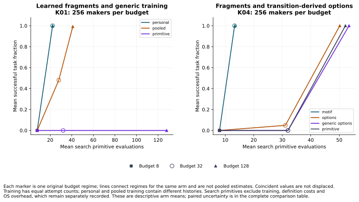
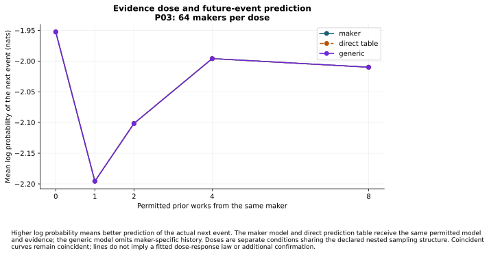
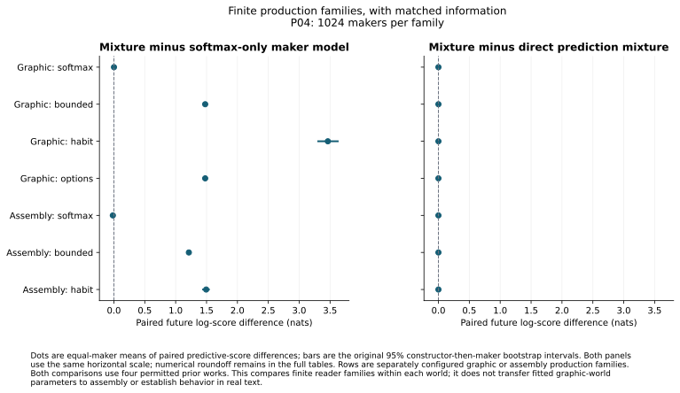

# V16: acquired craft, useful reconstruction and its limits

Can a reader acquire useful craft, reconstruct something executable and learn what
a maker will do next while keeping historical uncertainty explicit?

V16 replaces a purely scored artifact with an executed production record. Its
readers learn reusable fragments from actual trials, submit programs that must
run, buy observations and change later competence. A graphic world and an
independent assembly world make production constraints inspectable. Original
history, successful reconstruction, future prediction, self-correction and learning
are scored separately.

**Constructed mechanism result:** Acquired fragments improved construction at the tested intermediate budget; the advantage depended on the budget and comparator.

**Constructed mechanism result:** Self-model repair was equivalent to complete error monitoring within the declared five-percentage-point margin in both tested memory regimes.

**Constructed mechanism result:** The maker models did not exceed the practical prediction bar against their equally informed direct prediction comparators.

**Method result:** The study separately verified its reported calculations, bounded scientific replay and complete retained raw archive.

These findings concern the constructed worlds and fixed readers. They supply
neither human evidence nor a result about artistic quality, empathy, real-text
intent detection or human values.

## What was confirmed

The finite discovery ladder closed before selection. Three claims, their readers,
conditions, estimands, practical bars, sample sizes and fresh namespaces were
frozen before confirmation data. All three passed the one Holm familywise ledger;
no failed claim was replaced. Other contrasts remain discovery results.

Each row is one frozen primary. A percentage point is 0.01 of the scored fraction.
Construction measures a paired difference in successful task fraction. Repair
measures helpful minus harmful repairs; all four differences jointly compare the
self-model with two complete error monitors across intact and partial memory.
The conservative bounds use each claim's preallocated one-sided alpha of 0.05/3;
the separate Holm decisions control the three-claim family at 0.05.

| Frozen comparison | Independent constructor packets; fresh histories | Paired result and bound | Decision |
|---|---|---|---|
| Personal fragments versus pooled craft, construction budget 32 (K01) | 2,816; 2,816 | +50.000 percentage points; lower bound +46.274, above the +5-point practical bar | Confirmed for this regime |
| Learned motifs versus generic transition-derived options, budget 32 (K04) | 1,408; 1,408 | +99.964 percentage points; lower bound +98.267, above the +5-point bar | Confirmed for this regime |
| Self-model versus Bayes-error and direct-error monitoring, intact/partial memory (S02) | 320; 640 | All four observed mean differences are zero; their simultaneous absolute-mean bound is 2.543 points, below the 5-point equivalence margin | Practical equivalence confirmed jointly |

The construction claims' Holm-adjusted p-values are about 3e-15 at the numerical
inversion limit. The repair claim's is 0.000303. The sample-size calculation was
independently reproduced: construction power is under the explicitly declared
bounded planning law, not a uniform power guarantee; repair power uses the
declared joint-disagreement alternative. Auxiliary training and the two memory
histories in one repair packet are not additional independent constructors.

Primary arithmetic, power, native records and source-control counts were each
checked in separate analysis processes. The complete source-bound selection,
primaries and multiplicity ledger are in the
[confirmation index](../../../results/v16/study-products-1/CONFIRMATION.json).

## What the construction advantage does and does not buy

Personal fragments help where the search budget is sufficient to use them and
too small for the generic alternative to catch up. In discovery, personal minus
pooled success was zero at budget 8, +51.953 points at budget 32, and +0.781 points
at budget 128. Only the intermediate regime met the five-point bar. Motifs likewise
beat generic options at budget 32 and tied them at budgets 8 and 128. The fresh
confirmations above concern the intermediate regime alone.

The two panels show original arm means at the three budgets. Each marker is a
budget regime; connecting lines do not pool it with another. Training uses equal
attempt counts with different personal and pooled histories. Horizontal position
counts search primitive evaluations. Training, definition costs and operating
system overhead remain separately recorded, so this is not a claim of equal
total CPU. Original paired uncertainty is in the complete comparison table.

Acquiring useful fragments did not establish an extra individual-prediction
benefit. K02 failed its 0.02-nat-per-event practical bar against the generic reader;
P03 failed it at every prior-work dose from zero through eight. A nat is a unit of
log probability: higher scores assign more probability to the event that actually
occurs. Equally informed direct prediction tables matched the maker models to
numerical tolerance. These failed positive criteria are not formal equivalence
tests and do not say individual information is absent in every possible world.

The three curves largely coincide. They are descriptive means for separate
evidence-dose conditions; their visible fluctuation is not a fitted learning law.
The maker model and direct table share the permitted evidence/model, while the
generic reader omits maker-specific history. The paired comparisons, rather than
the vertical movement of the common curve, answer whether one reader benefits.

When the purpose changes, continuing old craft can be worse than inhibiting or
relearning it. K03 has six held practical comparisons, ten failed and two
unresolved. Under partial alignment at budget 32, inhibition gains 86.719
percentage points over continuation, with a 95% constructor-then-maker interval
of 80.469–92.188; relearning gains 100.000 points. These are discovery results
from 1,024 makers in 128 constructors per condition. Relearning may train the
exact new purpose, so this adaptation result is not an unseen-composition claim.

The acquisition-attention comparison (K05) also has a boundary. Allocating training
effort to the focal skill improves later transfer in the instructed conditions;
the four uninstructed comparisons fail the five-point bar. Instruction, feedback,
exposure and actual effort remain crossed in the retained conditions. No claim
about attention is obtained by defining effort through its eventual success.

## Executable reconstruction leaves history unresolved

A useful reconstruction need not be the route the maker took. In a selected P01
case, the reader successfully executes a different program while 137 production
routes remain compatible with the artifact. In another, it matches the observed
original while six compatible routes remain. A successful program and an observed
historical match are different from uniquely identified history.

The population construction comparison also changes with budget: the maker reader
beats primitive reconstruction by 20.996 points at budget 8, loses by 7.910 points
at budget 32, and remains unresolved at the five-point bar at budget 128. The
catalogue cases illustrate ambiguity; they do not estimate its population rate.
The registered P02 query comparisons fail their prediction bars. A selected query
that helps one realized future event is not a general intervention benefit.

Accounting for the production family matters. The P04 mixture beats a softmax-only
maker model under the five tested non-softmax families, with mean predictive gains
from 1.214 to 3.464 nats per event. It does not meet the bar in either softmax
anchor. An equally informed direct prediction mixture matches all seven families
to numerical tolerance.

Dots are paired maker means; bars are the original 95% constructor-then-maker
bootstrap intervals. Both panels share one scale. The graphic and assembly rows
are independently configured mechanisms, with four permitted prior works in each
comparison. This tests family misspecification within each world; it does not
transfer fitted graphic-world parameters to assembly or validate real-text use.

## Opportunity, self-correction, inquiry and multiple hands

The capability map records which questions were measured, not a green label for
every capability. Each row below identifies a measured boundary; the linked
condition tables preserve opposite outcomes and unresolved intervals.

| Capability and cards | What the completed comparisons establish | Scope that remains open |
|---|---|---|
| Actual, known and considered opportunities (O01–O04) | Latent consideration beats fixed-menu prediction in all three O03 conditions; its stronger budget-only comparison has two held and one unresolved criterion. O01 and O04 retain mixed probe/belief outcomes | Better solutions under a critic's resources do not identify the maker's inability, ignorance, omission or goal without separating evidence |
| Self-knowledge and returning to work (S01–S05) | Action evidence helps controller inference after partial memory; artifacts improve original-goal recovery where notes are absent. The fresh S02 test confirms equivalence to complete error monitoring | A successful adopted goal is not recovery of the original goal. Improvements over memory-only or direct completion do not establish an advantage over a complete same-evidence monitor |
| Recognition and inquiry (R01–R05) | Recognition-guided practice beats surprise on learning in R01 but does not beat expected-information-gain inquiry. Policy rankings change across ecologies and objectives. Enactment matches observation with equal examples in R05 | Identification is not learning. The value-of-learning policy's saturation benefit is saved cost, with no extra competence gained; no single policy wins every ecology |
| Maker, selection, audience and roles (M01–M04) | Correct source/role information improves some future targets. Audience evidence helps audience success without supplying historical process information; revision and brief records resolve different roles | Every tested same-information direct comparator matches the corresponding latent-maker reader to numerical tolerance; release prediction remains unresolved across all M04 conditions |
| Constructed persistent profiles and trajectories (V01–V03) | Chronology beats weaker context/stability models in some regimes; changing trajectories leave many practical comparisons unresolved. Only four of 36 all-probe versus no-probe prediction criteria hold in V03 | Constructor-defined profiles are not human values. Direct chronological/all-evidence comparators match, and the targeted-probe comparison supplies no held practical advantage |

The main remaining discriminator is whether acquired procedures improve useful
execution or prediction under a genuinely matched information and computation
budget when the production family changes. Exact direct-table matches prevent
crediting a special latent-maker representation for an information effect. This
recommends a future comparison; it does not extend V16 or authorize a new sibling
campaign.

## Coverage, inspectable cases and the reader handoff

The final numerical index covers 30 native cards, 316 registered conditions and
1,020 typed comparisons. Discovery starts with 64 makers and eight constructors
per condition. Twenty-six cards received a 256-maker/32-constructor expansion;
seventeen then reached the final 1,024-maker/128-constructor allocation. These
phases, shared histories, conditions, fixtures and confirmations are not pooled
into one independent sample. Every native card has an explicit final disposition;
no further V16 expansion is allowed.

The [capability index](../../../results/v16/study-products-1/CAPABILITY_MAP.json),
[coverage map](../../../results/v16/study-products-1/COVERAGE.json),
[complete comparisons](../../../results/v16/study-products-1/COMPARISONS_summary.csv)
and [performance/cost table](../../../results/v16/study-products-1/PERFORMANCE_COST_summary.csv)
retain targets, access, denominators, mechanism families, conditions and uncertainty.
See [all native records](../../../results/v16/study-products-1/NATIVE_CARDS.json)
for full shared accounting metadata. A failed positive bar remains distinct from
an inconclusive interval and from a separately established equivalence result.

The explanatory catalogue examined a bounded 2,528 candidates and retained 36
whole cases, including a failure or tie for every native card. All 36 replayed.
Eight of ten operational predicates representing the eight commissioned lenses
were found. Accurate-but-unenactable history and harmful naive self-explanation
were absent within this search, not shown impossible. These selected examples add
no independent scientific observations.

The separate archive-search comparison used eight runs per method, each with
1,356 counted production primitives: 10,848 per method in total. Each run also
records 120 separate verification primitives. Adaptive search found four
recurring case types in each run; the fixed archive found three in six runs and
four in two, averaging 3.25. Recurrence meant at least 18 of 24 follow-up draws
in the relevant frozen condition. It is a descriptive filter, not significance
or population confirmation. The twelve follow-up conditions share 24 constructor/
history draws. The preserved catalogue wording was corrected: six types were
proposed, not six independently validated discoveries.

The [public reader ZIP](../../../results/v16/transfer-handoff-1/reader.zip) contains
the B01 observation interface and standalone consumer. The corrected export has
44 cases and 1,574 tasks, all matching the frozen originals. The actual consumer
also passed private-read denial and its assigned source controls. The original
invalid inquiry export remains preserved. [TRANSFER.md](TRANSFER.md) identifies
the Sounding Line evidence-interface mappings and missing fields. It is an
interface inspection, not an executed real-text reader comparison or amendment to
a Sounding Line lock.

The [scientific replay ZIP](../../../results/v16/replay-bundle-1/replay.zip) serves
a different purpose: it includes selected evaluator truth for reproduction.
It is not the blind public-reader task package. Its internal instructions call
the archive `raw.zip`; the public `replay.zip` download is the same verified bytes.

## Verification, retained failures and final disposition

The [full independent calculation proof](../../../results/v16/aggregate-final-2/RECEIPT.json)
joins eleven separately executed analysis phases, including all native intervals
and denominators, actual source controls, the catalogue and the three frozen
primaries and power calculations. Original native fixtures, transfer exports and
archive-search calculations were independently recounted again at the final join.
The invalid first inquiry remains invalid despite reproduced arithmetic.

Final accounting first refused two omitted commissioned source controls: O04/X06
and V03/X03. The original allocation and the
[failed accounting attempt](../../../results/v16/closeout/accounting-1-failure/FAILURE.json)
remain retained. The [supplemental execution](../../../results/v16/commission-controls-1/COMPLETION.json)
ran the existing known-answer checks on immutable index zero in all 40 affected
final conditions. Its separate recount checked 732 actual source predictions
and 76 known-answer requests. These are calibration executions, not additional
independent makers or a replacement confirmation family. The original control
receipts are not retrospectively relabeled as having executed the omitted checks.

The supplemental controls passed before the first recount failed on JSON's
tuple-to-list conversion. That [failure](../../../results/v16/commission-controls-1/RECOUNT_FAILURE_1.json)
and its frozen verifier remain preserved. A separately frozen verifier compared
canonical persisted JSON, retaining all source, request and witness checks.
The joined aggregate proof adds this recount to the eleven unchanged original
phases. Twenty-one [targeted checks](../../../results/v16/archive-recheck-setup/ADMISSION.json)
passed across supplemental controls, serialization, accounting, archive safety
and bounded parallel hashing. The complete raw archive was then checked again
with the new records and implementation included; both source passes and every
archive member remained required.

The [repair checkpoint CI](../../../results/v16/closeout/ci-checkpoint-3/RECEIPT.json)
reported 1,763 passes, thirteen skips, one expected failure and the same single
V15 C11/M01 gate-test failure. It reported no V16 failure. This Linux inventory
is separate from the earlier full local regression and the final closing-commit check.

The [complete raw-archive proof](../../../results/v16/closeout/raw-archive-2/RECEIPT.json)
verified 2,529,050 required current files (27,890,231,721 bytes)
across 201 retained ZIP chunks. It matched the independently
recalculated raw-input baseline, reread every archive member, and confirmed that
the complete included source snapshot was unchanged on a second pass. The archive
is retained beside the active execution checkout under `raw-archive/`, with
portable member manifests, batch receipts and copied final coverage evidence.
It is a local retained archive, not a public download or a claimed off-machine
backup; ordinary Git carries the compact proofs and bounded handoff ZIPs.

The [scientific replay proof](../../../results/v16/replay-bundle-1/RECEIPT.json) and
[actual extracted-bundle check](../../../results/v16/closeout-setup/final-bundle-portability-1/RECEIPT.json)
establish their separate bounded scopes below. The
[pre-closeout runtime snapshot](../../../results/v16/closeout-setup/final-runtime-snapshot/RECEIPT.json)
retains the terminal scientific owner and queue cursor; the
[documentary proof](../../../results/v16/closeout/documents-2/RECEIPT.json)
binds the final account, theory owners and recorded agent review. Its mechanical
checks do not independently judge the interpretation true.

The bounded replay comprises 196 executed checks over 168 distinct cases. The
final portable ZIP was completely verified and extracted; all 3,046 dependencies
and the 226 source files required by 38 frozen packets passed their checks.
Replaying selected cases does not claim that every campaign rollout was rerun.
Operating-system cost samples remain original measurements; the comparison rules
allow their platform variation while checking scientific state and scores.
Recorded exogenous reader seeds are restored where required; opaque transport
aliases and event timestamps may differ.

The early native, acquisition, reading and behavior scouts used serialized public
arguments inside the evaluator process. Their later access replay matched all
166,018 retained requests across 4,162 unit records in the guarded reader worker,
including fixtures. That verifies reproduced outputs and the guarded interface;
it does not retroactively make the original calls separate-process executions.
The guard concerns trusted fixed scientific code, not arbitrary hostile programs.

The first inquiry instrument failed a physical-recoding control and remains
invalid. Its bounded repair used fresh histories and passed its controls; it is
not a causal before/after estimate. Failed and interrupted attempts, earlier test
failures and superseded source versions remain retained. The final replay
packager's missing test/provenance dependencies were corrected and checked after
extraction before handoff.

The [full repository regression](../../../results/v16/closeout-setup/full-regression-1/RECEIPT.json)
ran 1,781 tests: 1,768 passed, one failed, eleven skipped and one was an expected
failure. All 354 V16 tests in that run passed. The later packaging-only correction
passed four targeted checks, including the new source-closure test; this is not a
claim that a later full 355-test suite ran. The failed full-suite test is the
historical V15 gate check. Final push/CI verification is a separate operational
check and cannot turn that known failure green. The
[post-aggregate checkpoint's Linux CI](../../../results/v16/closeout/ci-checkpoint-2/RECEIPT.json)
also reported only that V15 failure: its progress log records 1,753 passes,
13 skips, one expected failure and one failure. Its optional dependency/platform
collection differs from the local regression; those inventories are not combined. The known V15 C11/M01 gate failures, V15's failed
runtime contract and its incomplete regeneration remain unchanged. V16 makes no
claim of continuous occupancy and does not restart the accepted campaign clock.

The [final 42-card ledger](../../../results/v16/closeout/accounting-2/PROGRESS.json)
keeps execution, instrument validity, criterion, evidence, pursuit and warrant
separate. The [ordinary supervisor's closure](../../../results/v16/CLOSEOUT.json)
joins that accounting with all four distinct proofs.
Only the three exact confirmed comparisons receive confirmatory promotion;
discovery comparisons retain their separate warrant and finite exhaustion.
The transfer recommendation is the validated task interface with these evidence
limits, followed by a matched bounded-reader discriminator, not a global upgrade
of the theory or a synthetic label for missing human ground truth.
