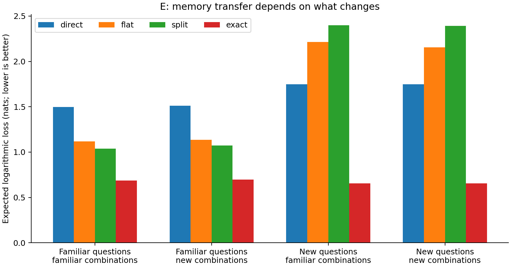
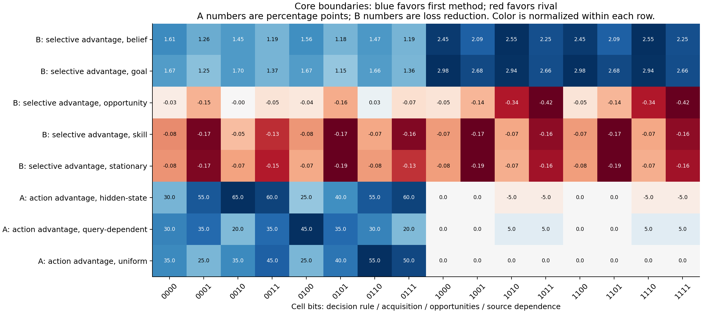
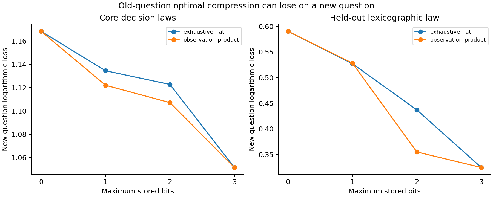
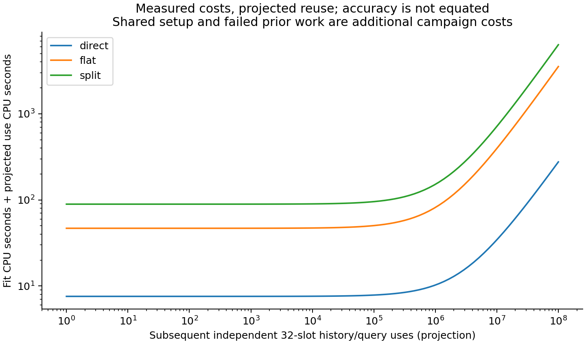

# V18.3: what useful maker models preserve, and where they fail

All eight commissioned research families have executed, including the intervention
and compression studies, the fresh decision-law holdout, historical-role readouts,
and source-dependence follow-ons. The result is a conditional account of useful
memory: evidence, retained distinctions, update rules and training supervision
each matter, and their benefits depend on the reader's purpose.

These are **descriptive constructed-method and mechanism results**. There is no
untouched-reserve confirmation, human result, unique psychological ontology or
general architectural guarantee. Full tables and qualifications are in
[RESULTS.md](RESULTS.md); packet status and verification are in
[COVERAGE.json](../../../../results/v18/research-extension/COVERAGE.json) and
[CLOSEOUT.json](../../../../results/v18/research-extension/CLOSEOUT.json).

## The claim and its boundary

The table summarizes each family. Logarithmic loss measures predictive error in
nats; lower is better. Success percentages measure actual native construction.
Neither quantity stands in for the other.

| Family and question | What the executed comparison found | What limits the conclusion |
|---|---|---|
| A: Which evidence serves the reader's purpose? | At three attempted queries under uniform access, action-focused inquiry succeeds in 45.31% of tasks versus 25.94% for uncertainty-focused inquiry; predictive loss goes the other way, 0.997 versus 0.638. | Selector work and access assumptions matter. Four hidden-access architecture cells reverse the pooled action advantage. |
| B: What should persist when the maker changes? | Selective updating improves goal-change loss, 1.152 versus static 3.299. | It worsens stationary loss, 1.023 versus 0.904, and skill-change loss, 1.058 versus 0.942. Shared native practice does not demonstrate an uptake benefit from better inference. |
| C: When does repetition become false corroboration? | With two roots and six reports each under shared error, naive false confidence is 21.88%; the cautious dependence model has none initially in that slice. | Provenance can itself be wrong. Under the explicit uptake policy, initial cautious and naive success tie; independent corrections separate them. A stronger task checker succeeds without source inference. |
| D: When should an explanation be revised? | Late revision repairs a wrong rule: loss 0.623 versus fixed 3.582. | It worsens a correct family, 0.692 versus 0.613. Candidate averaging is a strong rival. Source-aware follow-ons help some comparisons and hurt others; outside-menu prediction is not law identification. |
| E: Does compact learned memory transfer? | On familiar questions, split recurrent loss is 1.037, flat 1.117 and direct history 1.496. | New questions reverse the ranking: 2.399, 2.214 and 1.749. Exact nominal-family inference remains much stronger. Frozen historical-role probes have restricted decoders and extra supervision. |
| F: Do the effects survive changed mechanics? | A fresh lexicographic law preserves the uniform-access action advantage, 93.75% versus 70.63%, and goal-change predictive improvement. | Stationary costs persist; storage level changes compression rankings. Sixteen fixed factor settings are not a representative sample of architectures. |
| G: Can internal roles support interventions? | Intervention-trained split loss is 1.023 versus behavior-only 1.810, shuffled-target 1.873 and direct-pair 1.680. Equally supervised flat recurrence reaches 1.063. | The intervention law and supervision are supplied. Wrong mappings hurt, but compatible coordinate permutations preserve predictions: useful alignment does not identify unique coordinates. |
| H: Does optimal old-task compression preserve future usefulness? | A selected two-symbol old-optimal code has new-question loss 1.13447 versus a product code's 1.12202. | Multiple old-task codes tie within numerical tolerance yet differ on future questions. The finite objective leaves future usefulness underdetermined; the selected code is not a unique optimum. |

## Evidence failure, memory failure and learning failure are different

Ordinary observations can leave goal and belief indistinguishable even to exact
inference. In the fixed illustrative pair, ordinary artifact distributions are
identical; a supplied signal intervention separates them. More computation cannot
recover a distinction absent from the observations.

The passive predictive bank fails the declared update-closure test in all sixteen
tested worlds. The intervention bank passes those finite checks and matches exact
forecasts. Thus a predictive summary needs adequate tests and closure; simply
calling it a state does not make it sufficient. These checks do not prove closure
for arbitrary worlds or queries.

The learned recurrent readers fail to match the exact nominal-family reference
on new questions, although sufficient finite predictive information is available.
That leaves learning objective, optimization, capacity and sample efficiency as
live explanations. It does not prove that recurrence necessarily destroys the
information. The frozen-memory historical-role diagnostic is likewise a test of
an equally supervised linear readout, not an unrestricted recoverability proof.

*Mean expected loss on familiar/new questions and familiar/new role combinations.
Fit seeds and repeated cells are averaged within coefficient draw. The exact
reference knows the generator family and uses its nominal 24-state prior, including
zero-skill states absent from the balanced skill-positive neural test distribution.*

## The architecture map

The full four-factor design changes decision rule, acquisition interference,
opportunity selection and source dependence. All main contrasts and six pairwise
interactions are retained. The neural reversal is especially consistent within
this design: split beats direct in all sixteen familiar-question cells and loses
in all sixteen new-question cells. Both intervention-trained recurrent readers
beat the direct-pair rival in all sixteen G cells. These are signs of cell means,
not sixteen independent significance tests.

*Blue favors the first named method; red favors its rival. A values are percentage
points of task success; B values are reductions in expected loss. Color is
normalized within rows. Cell bits denote decision rule, acquisition, opportunities
and source dependence, in that order.*

Original D leaves its source factor inactive; the separate 7,680-evaluation
follow-on activates it. H's balanced mixture is invariant to the tested acquisition
change. These zero contrasts are limitations of the particular construction,
not evidence that source dependence or acquisition never matters.

The held-out law adds 1,920 assigned evaluations on fresh coefficient draws. It
is one additional law, not a random architectural population. No benefit from
new seeds is relabeled as a new kind of world.

## Compression has an identifiable limit, but not a unique best future memory

All 4,140 deterministic partitions of eight histories are enumerated. Storage
cardinalities are one, two, four and eight symbols. The optimum certificate is
numerical within this finite class; maximum storage and actual code entropy differ.
The new-query decoder knows the generator and measures information retained,
not a learned reader's ability to discover that decoder.

At two symbols, 88 of 320 core cases have multiple old-task optima within 1e-10;
at four symbols, 124 do. For the core two-symbol cases, averaging each case's best
and worst new-question loss among these ties gives 1.12156 and 1.13454. The
originally selected code gives 1.13447; the product code gives 1.12202. Therefore
the observed ranking depends partly on which equally good old-task code is chosen.
The range is a post-hoc sensitivity diagnostic, not permission to choose a code
using future test outcomes.

At four symbols under the held-out law, 80 of 160 cases have multiple numerical
optima, with corresponding mean best/worst future losses 0.36017 and 0.46044.
The original selections remain unchanged. All 1,920 case/cardinality diagnostics
are retained in [COMPRESSION_TIES.json](../../../../results/v18/research-extension/review/COMPRESSION_TIES.json).

*These curves show the originally selected codes, not the post-hoc best member
of a tied set. Both methods select solely for the old query; the vertical axis
measures expected loss on new queries. The panels use different decision laws.*

## Calibration and numerical validity

Fixed two-query 95% posterior sets cover truth 99.04% under the matched finite
model, 99.33% under hidden-state-dependent access, and 97.41% under the wrong-rule
stress test. Mean set sizes are 9.95, 15.01 and 15.64 of 24 states. This instrument
does not demonstrate pooled undercoverage in these stress tests. Wide conservative
sets, a prior-predictive experiment and a fixed query pair do not establish adaptive
coverage or correct identification outside the family.

For both new questions and new combinations, mean ten-bin expected calibration
gap is 0.205 for direct, 0.289 for flat, 0.277 for split and 0.0227 for exact.
This is predicted top-choice confidence compared with generator-expected correctness,
computed per fit and lineage before aggregation; it is not sampled-label accuracy.
Bins are fixed, not fitted to improve the result.

The validity pass caught floating-point tie breaking that gave equivalent exact
and intervention-summary predictions different role accuracies and calibration
diagnostics. Corrected accuracy uses uniform expected credit over role maxima
within 1e-10; whole-state accuracy multiplies those per-role credits, rather than
claiming joint-posterior MAP accuracy. Calibration also snaps values numerically
on bin boundaries. Native uptake uses one shared seeded tie coin. Original outputs
remain retained; proper losses, observations, weights and forecasts are unchanged.
All 13,312 corrected accuracy rows were independently recalculated.

## Computation, storage and reuse

The installed Sounding Line PyTorch environment ran Ghost-owned CPU children with
one numerical thread. There was no installation, environment synchronization, GPU
execution or modification of Sounding Line. Explicit serialized inputs and
cross-runtime controls separate it from Ghost's NumPy reference environment.

The table gives medians over the three selected E fit seeds. Fitting includes both
capacity candidates; a new use encodes a full 32-slot history and answers one query.
Timings are batched local CPU measurements, not universal latency guarantees.

| Reader | Capacity-search fitting, CPU seconds | New history plus query, microseconds | Cached query, microseconds | Stored state, floats |
|---|---:|---:|---:|---|
| Direct history | 7.58 | 2.69 | 0.73 | 48 |
| Flat recurrent | 46.81 | 34.91 | 0.85 | 24 or 48 |
| Split recurrent | 89.23 | 62.50 | 0.85 | 48 |

Raw fixed-envelope history occupies 1,824 feature floats; the public world needs
17 more. Selected parameter counts are 21,256 for direct, 10,664 or 21,632 for
flat, and 21,680 for split. All methods may cache, including direct history.
Recurrent state permits incremental updates; the direct model recomputes within
its fixed envelope. Incremental timings are retained separately in
[UPDATE_COSTS.json](../../../../results/v18/research-extension/update-costs/UPDATE_COSTS.json),
with a source-bound check that cached updates match full recurrent-state computation.
For the same 64 eight-observation histories, one last-observation update takes
median CPU time 1.95 microseconds for direct recomputation, 1.95 for flat and 4.64
for split. Prior state preparation and subsequent query decoding are excluded.
This small batched workload does not establish an asymptotic advantage.

There is no finite fit-cost break-even for either recurrent method against direct
on the measured independent-full-history workload: both fitting and each new use
cost more. Their familiar-question prediction advantage is an accuracy tradeoff,
not a demonstrated total-cost saving. Cached-query timing also supplies no clear
recurrent advantage here. Exact posterior caching is timed separately in Ghost's
environment, so it is not used as a cross-runtime hardware ranking.

*Measured fit and per-use CPU feed a projection, not an executed hundred-million-use
experiment. Accuracy is not equated. Shared data generation, failed attempts,
verification and serialization add campaign costs beyond these fit-only curves.*

The attempt ledger charges measured CPU, reconciled native CPU and conservative
uncertainty bounds, with child work added and V18.2's 407.515625 seconds carried
forward. The final cumulative figure is in CLOSEOUT.json; it is about 1.7 CPU hours
against the unchanged 18-hour ceiling. Wall time and engineering effort are
separate. A native G observation recorded peak working set at least 1.22 GiB;
that snapshot is a lower bound on its final peak, not comprehensive campaign
peak-memory measurement. Complete peak telemetry was not available for every
short packet.

## Six inspectable cases

These cases were selected mechanically after aggregate exposure. They illustrate
mechanisms and counterexamples; they are not representative samples or fresh
evidence. Full observations, traces, predicates and executions are in
[EXAMPLES.json](../../../../results/v18/research-extension/review/EXAMPLES.json).

| Case and retained identity | What can be inspected |
|---|---|
| Ambiguous history: fixed cell 0, draw 0 | Two goal/belief combinations have identical ordinary predictions. A signal intervention creates total-variation distance 0.906, meaning substantial separation of their outcome probabilities. |
| Enactment without identification: A uniform, cell 0, draw 3 | The action-focused reader completes its native target while assigning less than half its posterior mass to the full true maker state. |
| Goal change retaining skill: B goal, cell 0, draw 2 | At step 15 the goal changes. Selective post-change loss is 1.656 versus static 3.403, while final true-skill probability exceeds 0.8. |
| Copied false corroboration: C shared-error, draw 1 | Repeated reports support the wrong binary account; two independent corrections oppose it. Full source-sensitive posteriors remain available. |
| Failed repair: D outside-menu, late cue, cell 0, draw 4 | Revision loss 0.913 is worse than fixed 0.848; mixture gives 0.892. Coherent repair can make prediction worse. |
| Lost future distinction: H core, cell 8, draw 8 | The selected flat code merges histories 000 and 010; the product code separates them, and their new-query predictions differ. Numerical-optimum sensitivity qualifies the selection. |

## Execution, healing and reproducibility

The current finite evidence comprises **43 packets and 19,136 assigned evaluations**:
9,216 core A-D, 320 H, 1,920 held-out-law F, and 7,680 source-revision follow-ons.
These are evaluations, not independent people, worlds or architectures. Four
superseded A packets add 1,088 retained evaluations. E has 18 current training
fits, its frozen-purpose diagnostic has nine learned-memory readouts plus a
raw-history readout, and G has ten fits. Purpose rescoring and post-hoc analyses
reuse data and add no independent lineages.

All 45 scoped controls pass in isolated sources: 37 in Ghost and eight actual
PyTorch checks in the shared environment. Four optional Torch test modules skip
in Ghost, then execute in the Torch run. Across all 47 current/retained finite
packets, audits check 20,224 units, 76,224 aggregate means and 376 fixed whole-unit
source replays. Neural audits reconstruct every retained mean and replay bounded
forecasts from selected weights; they do not retrain entire trajectories. The
review independently reconstructs 2,934 means and checks 1,920 compression-range
rows. Full raw data, source snapshots, plans, weights, predictions and checksum
manifests accompany the results. Multipart bundles use ordinary ZIP content.

Healing preserves history: A's selector stopping cost was corrected and affected
comparisons rerun under new identities; an E Windows status-sharing failure retains
its partial fits and optimizer checkpoints; the unexecuted original G plan is
retained; purpose scoring and subsequent review diagnostics have separately retained
originals. Nothing converts a failed or unavailable comparison into a pass.

Repository-wide CI still fails its historical verdict-gate test because V15 C11
and M01 retain failed instruments. That debt is separate from the passing V18.3
suite and has not been hidden by changing old verdicts or weakening the test.
The final export-integrity record binds published files and all scientific bundles.
The finite V18.3 queue is closed; unused runtime is not filled with new samples.
